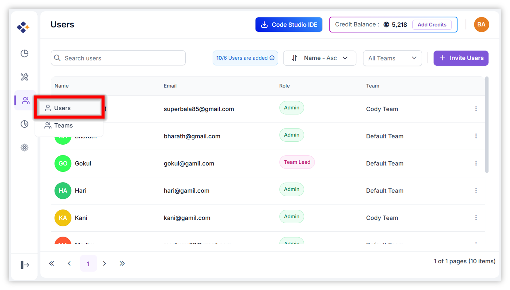
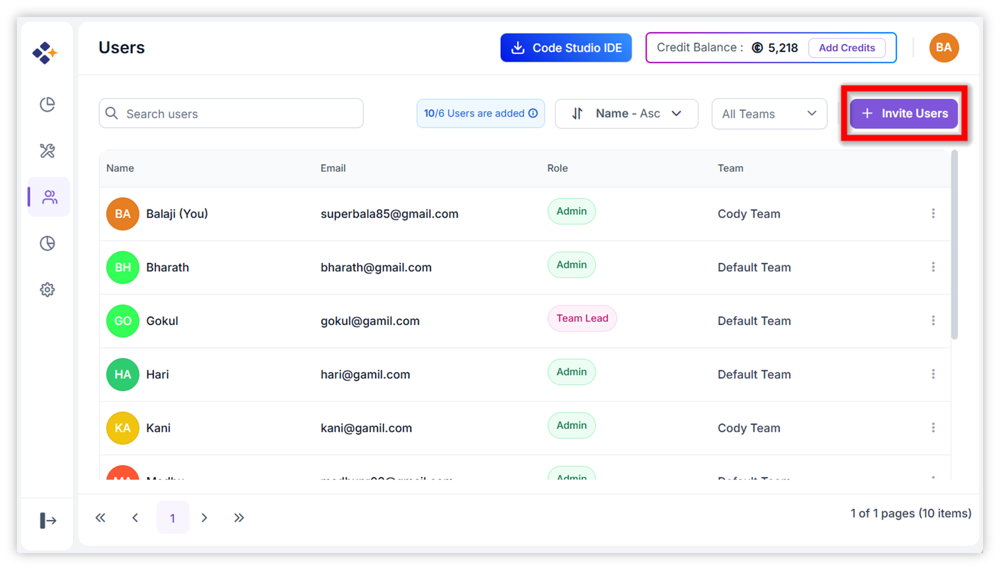
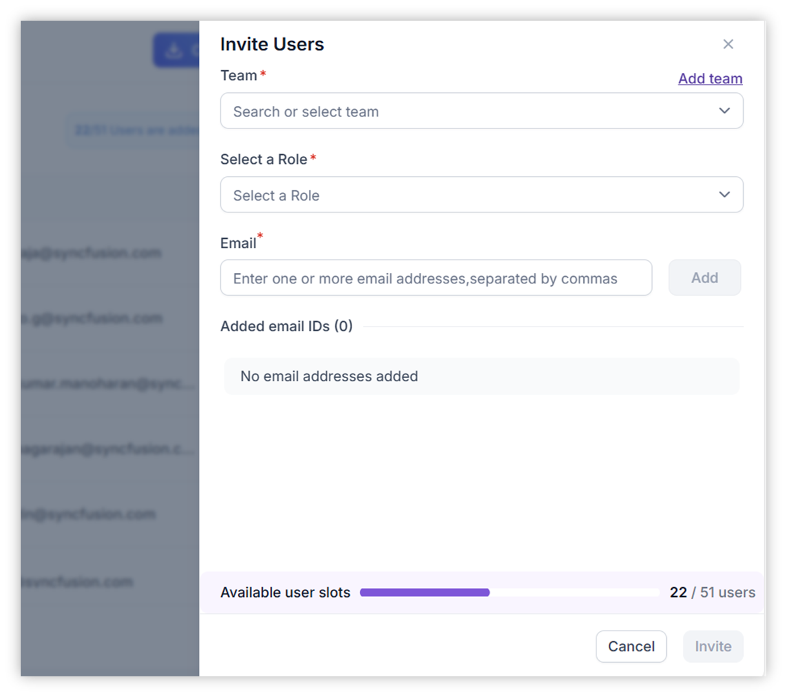
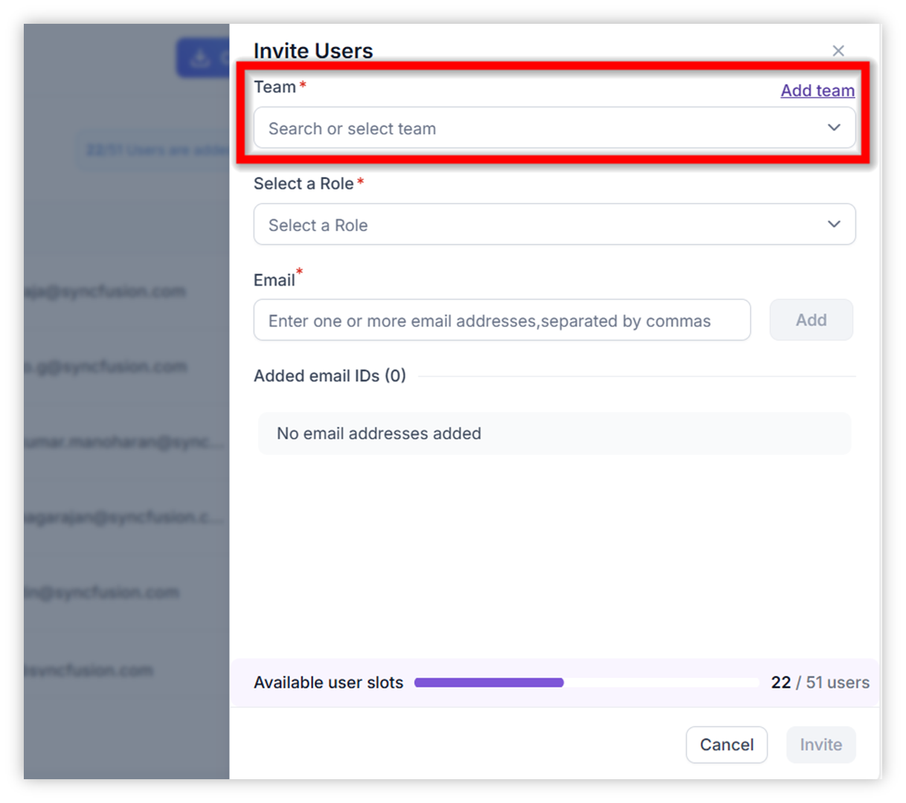
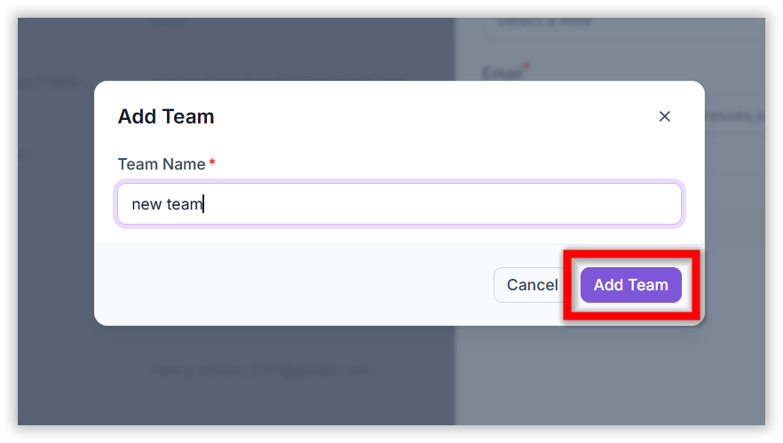
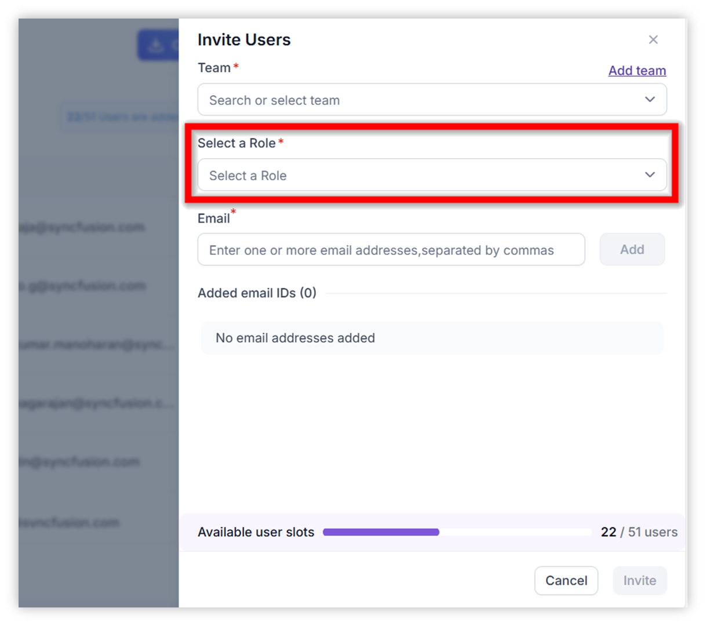
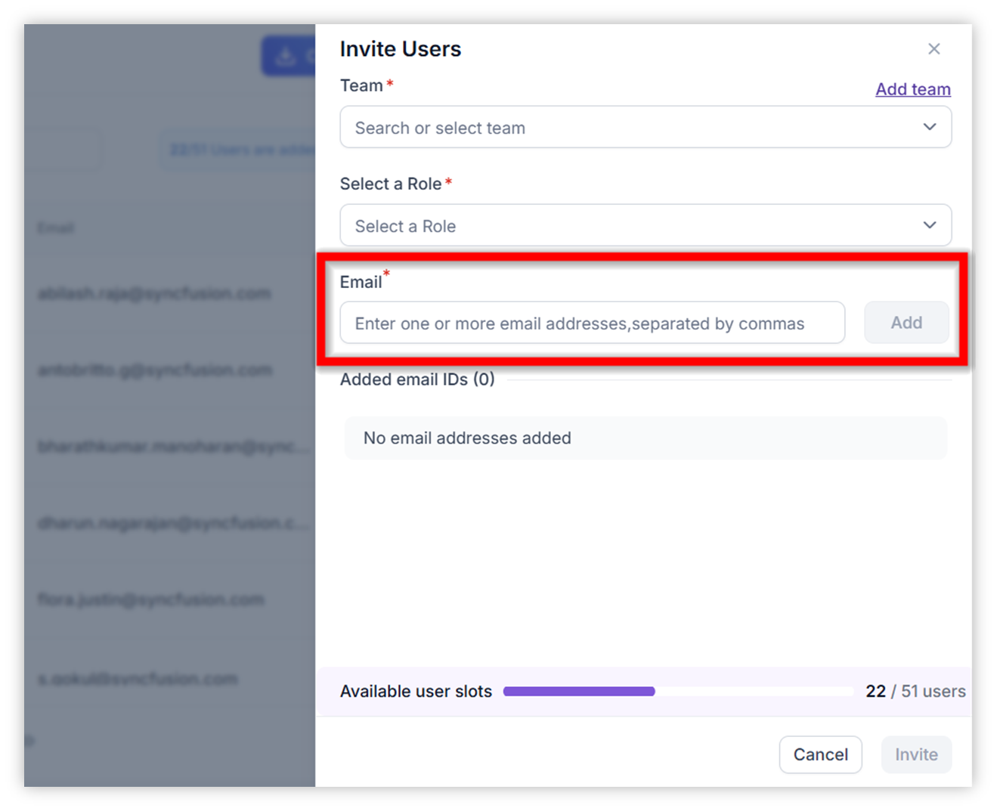
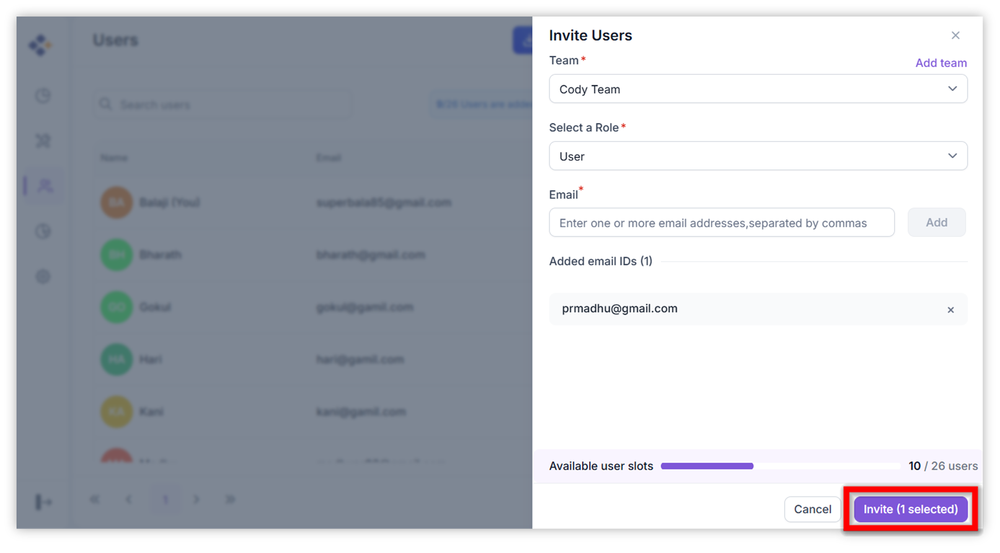

# Invite New User to Your Organization
## Overview  
This guide explains how administrators and team leads can invite new users to their organization. Invited users to gain access to the platform, allowing them to collaborate, join teams, and perform actions based on their assigned roles.

## When to Use
- Onboard new team members into your organization.

## Prerequisites 
- You are an Admin or Team Lead. 
- You have the email address of the person you want to invite
- Your Code Studio organization is active. 
- A modern web browser with internet access. 

## Steps to Invite a New User
Follow these steps to invite a new user to your organization.

### Step 1 : Open Code Studio Dashboard
- Open Code Studio Application.
- Ensure you are logged in with the correct user credentials.
- In the top-right corner of Code Studio, click your **avatar**.
    

- This opens the Account tab within the Settings page. 
- In the Account section, click **Open Dashboard**.

- You are redirected to the web dashboard where credits and usage information is displayed.

### Step 2 : Open the Users Panel
- Navigate to the **Users** section in your organization’s dashboard.

### Step 3 : Click Invite Users
- Click the **Invite Users** button at the top of the Users List.

- A dialog box will appear.

### Step 4 : Select a Team
- Choose the team to which the new user should be added.

- If no teams exist, click **Add Team**.

- Enter a team name and click **Add Team**.

### Step 5 : Select Role
- Choose the user’s role (e.g., User, Team Lead, Admin).

### Step 6 : Enter User’s Email
- Type the email address of the person you want to invite and click **Add**.

### Step 7 : Send the Invitation
- Click **Invite** to send the request.

### Step 8 : User Accepts the Invitation
The invited user receives an email with an **“Accept Invite”** link.

Once they complete onboarding:

- They appear in your organization  
- They are added to the selected team  
- Their assigned role is applied  

The new user is now fully onboarded and ready to collaborate.