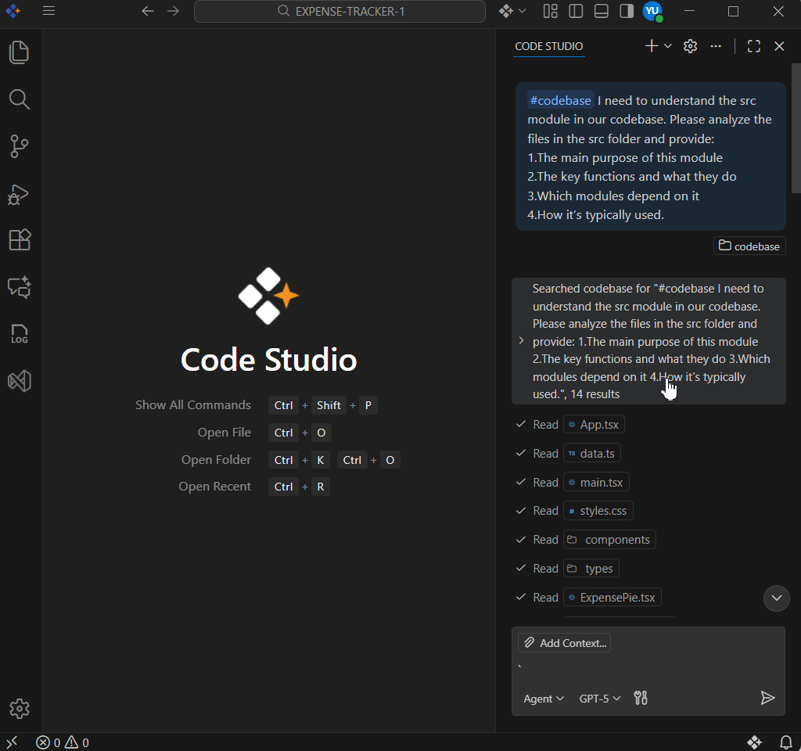
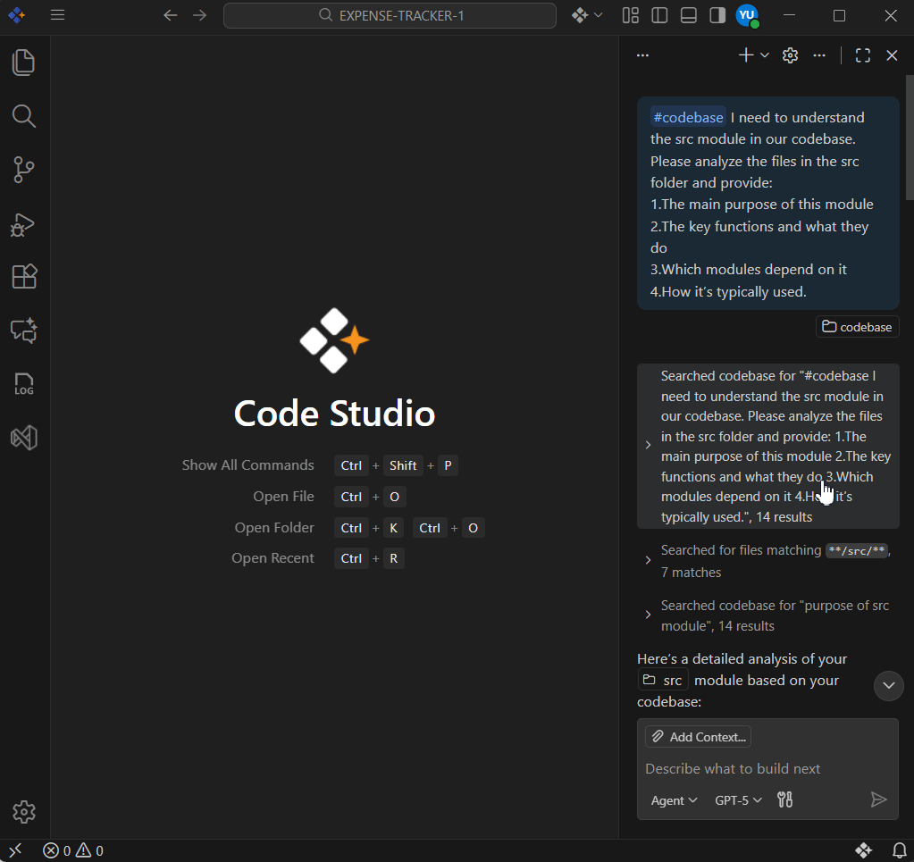
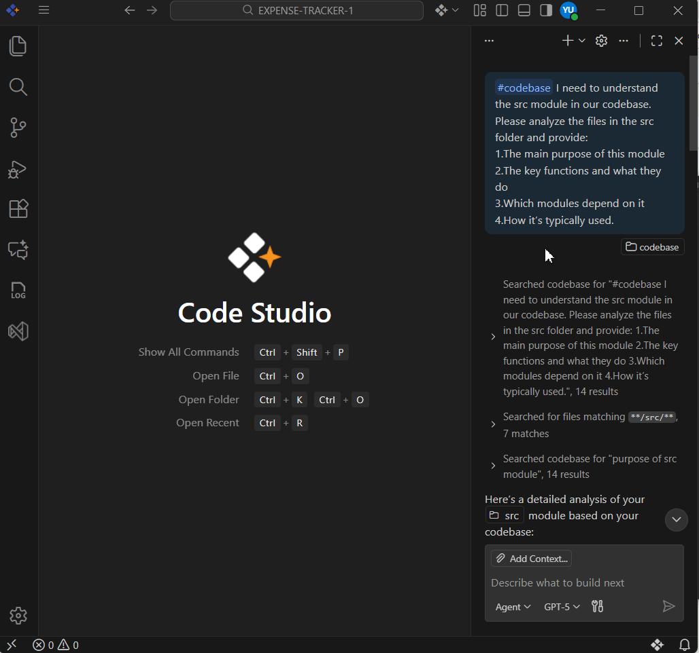
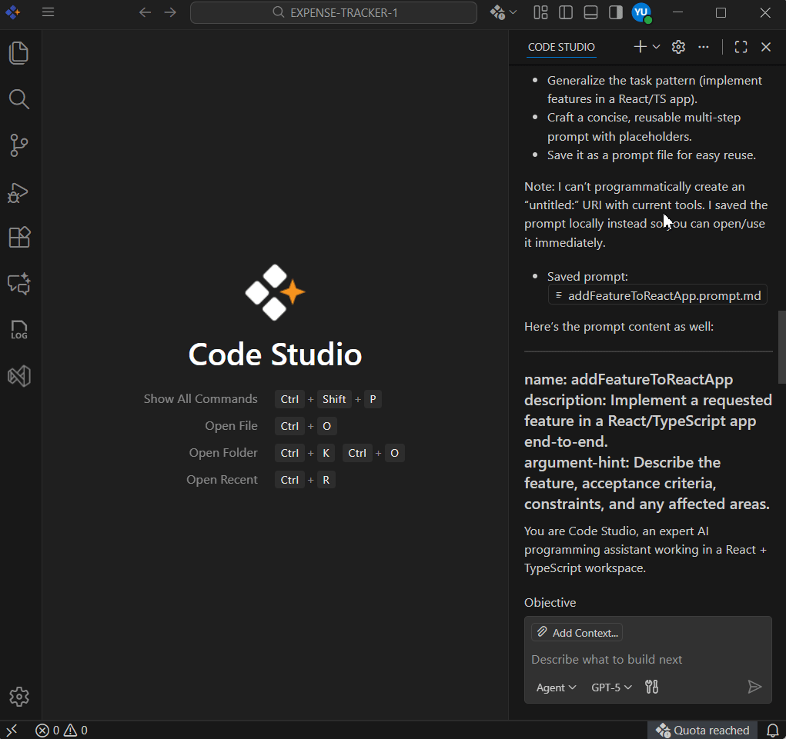
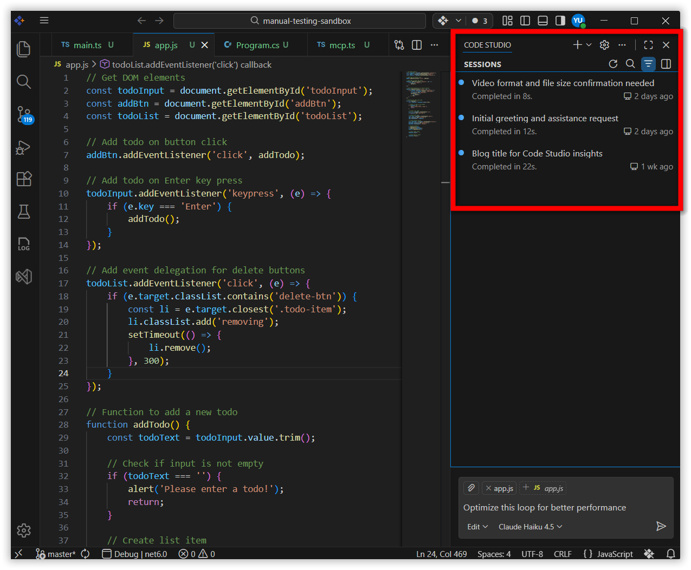
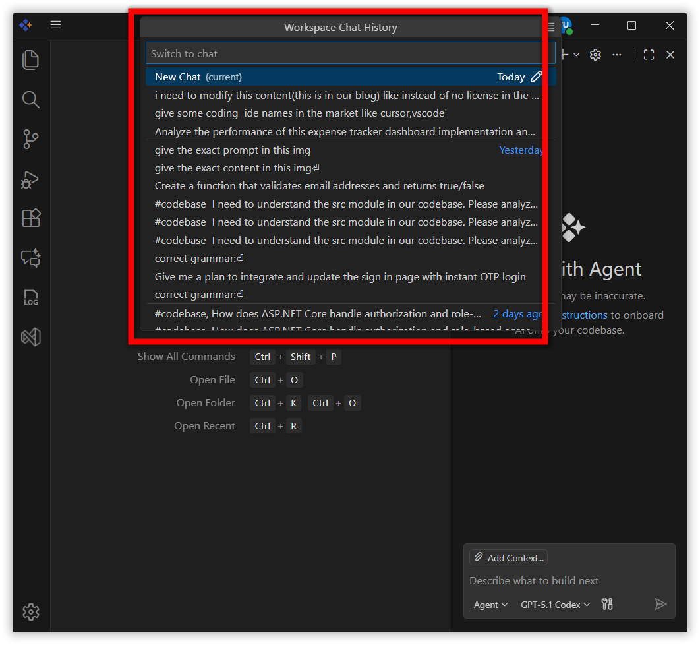

# Manage Chat Sessions

## Overview

A chat session is the history of your interactions with the AI within a single conversation and includes all prompts, responses, and context used during that conversation. Each chat session maintains its own history, allowing you to ask follow-up questions or refine your requests based on previous interactions.

In this guide, you’ll learn how to:

- Start a new chat session in different views (side bar, editor tab, window) 
- Move an existing chat between views 
- View and resume past sessions 
- Save or export a session  
- Turn a session into a reusable prompt 

## When to use

- Start a new session when switching topics or needing a clean slate to avoid context bleed and compare alternatives.

- Continue the same session when iterating on the same task and leveraging prior context for refinements.

- Save and export: When you want to use the current chat session as prompts for reusable workflows.

## Prerequisites 

- Syncfusion Code Studio installed and configured on your system. If you have not yet downloaded Code Studio, please refer to this link [Install and Configure](/code-studio/getting-started/install-and-configuration) for step-by-step instructions on downloading and configuring Code Studio.

## How to Start a New Chat Session

You can create a fresh conversation in the new chat session in the view that fits you. Choose based on how much space you need; how visible you want the chat to be.

**1. Open a chat session in the side bar.**

If you want to open a new chat session within a side bar, click:  `New Chat (+) > New Session`.

**2. Open a chat session as an editor tab.**

If you want to open a new chat session in a separate editor tab, click: `New Chat (+) > New Chat Editor`.

**3. Open a new chat session in a separate window.**

If you want to open a new chat session in a separate new window, click:  `New Chat (+) > Open in New Window`.

## Move a Chat Session to a Different View

You can move an existing chat session to a different view, such as from the Chat view to an editor tab or a separate window. This is useful when you want to change how you interact with the chat session or organize your workspace differently.

- In the Chat view, select the ‘...’ icon and then select `Move Chat into Editor Area` or `Move Chat into New Window`.

- In a chat editor, select the ‘...’ icon in the top-right corner of the editor tab, and then select `Move Chat into Secondary Side Bar`.

- In a chat window, select the `Move Chat into Secondary Side Bar` button in the window title bar.

**Use the following commands from the Command Palette**

Open the Command Palette with `Ctrl+Shift+P` (Windows) or `Cmd+Shift+P` (macOS):

- `Chat: Move Chat into Editor Area`  
- `Chat: Move Chat into New Window`  
- `Chat: Move Chat into Side Bar`

## View and Resume Past Sessions

When you create a new chat session, the previous conversation history is cleared. However, all your chat sessions are saved in the session history, allowing you to return to previous conversations and continue where you left off. This is useful when you want to review past interactions, reference previous responses, or resume a conversation from an earlier session.

**Accessing Chat Sessions**

- In the chat panel, click the three dots at the top of the chat window. 

- Select `Show Chats` to view available sessions. 

> **Note:** You can only see chat history for the workspace you currently have open. To view another workspace’s history, open that workspace and see that workspace's chat history. There is no global chat history across workspaces.

## Save and Export Chat Sessions

You can save chat sessions to preserve important conversations or reuse them later for similar tasks.

**Export a chat session as a JSON file**

You can export a chat session to save it for later reference or share it with others. Exporting a chat session creates a JSON file that contains all prompts and responses from the session.

To export a chat session: 

1. Open the chat session you want to export in the Chat view. 

2. Open the Command Palette with Ctrl+Shift+P (Windows) or Cmd+Shift+P (macOS): 

3. Type ‘Chat: Export Chat…’ in the Command Palette. 

4. Choose a location to save the JSON file. 

Alternatively, you can copy individual prompts or responses to the clipboard by right clicking the message and selecting Copy. To copy the entire chat session in Markdown format, right-click the Chat view and select Copy All.

**Save a chat session as a reusable prompt**

You can save a chat session as a reusable prompt to reuse for similar tasks.

1. Open the chat session you want to save in the Chat view. 

2. Type /savePrompt in the chat input box and press Enter. 

3. The command creates a .prompt.md file that generalizes your current chat conversation into a reusable prompt. The prompt file has placeholders where appropriate. 

Review and edit the generated prompt file as needed, then save it to your workspace.

Learn more about prompt file in [Custom Prompts](/code-studio/reference/configure-properties/custom-prompt) documentation.