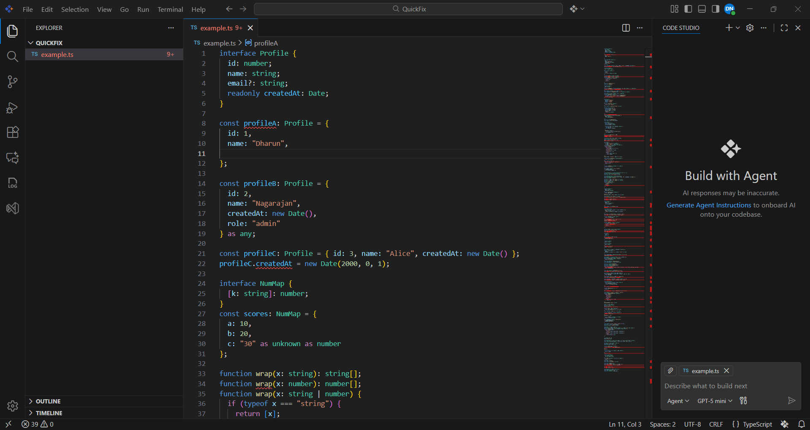
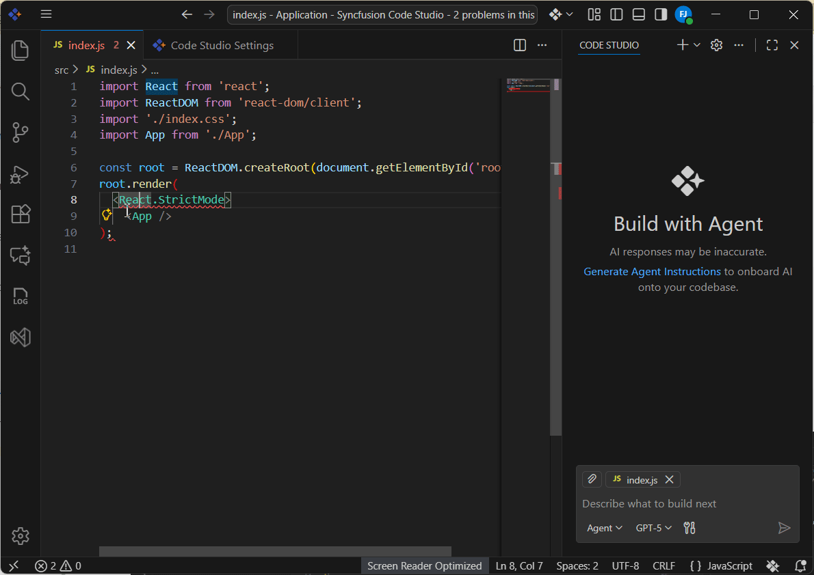

# Quick Fix Your Errors

## Overview

This guide covers two distinct workflows in Syncfusion Code Studio: Quick Fix for fast, one‑click corrections, and Explain for understanding the root cause with rationale and a proposed fix. Use them independently based on your goal—fix immediately, or learn why before you change code.

## When to Use

Use the Quick Fix feature when:

- Your code contains **syntax errors** flagged by the editor
- You encounter **compiler or linter warnings** highlighted in the code editor
- You need quick resolution to unblock your development workflow
- You want AI-powered suggestions to understand and fix code problems
- You're working with unfamiliar syntax or language features

## Prerequisites

Before using Quick Fix, ensure:

- Syncfusion Code Studio is installed and configured. See [Install and Configure](/code-studio/getting-started/install-and-configuration.md) for setup instructions.
- A code file with errors is open in the Code Studio editor.
- The editor has identified and highlighted at least one error in your code.

## Steps To Fix Error

### 1. Identify the Error

Code Studio automatically highlights errors with:
- Red squiggly underlines beneath problematic code
- Error icons in the editor gutter or problems panel
- Descriptive error messages on hover

Locate the error you wish to fix in your code file.

### 2. Open the Quick Fix Menu

1. Click directly on the highlighted error or the error icon in your code.
2. A Quick Fix icon (lightbulb) will appear adjacent to the error.
3. Click the Quick Fix icon to open the Quick Fix panel.

### 3. Select the Fix

1. Review the suggested fix displayed in the Quick Fix panel.
2. The suggestion shows the proposed correction and a brief explanation.
3. Click the fix to apply it. The AI analyzes the error context and applies the correction.

### 4. Apply the Fix

The selected fix is applied immediately to your code:
- The error highlighting disappears
- The corrected code replaces the problematic code
- The file is marked as modified

### 5. Verify the Correction

Review the corrected line to ensure:
- The syntax is now valid
- The correction aligns with your intended code logic
- No new errors were introduced

## Demonstration

## Explain Workflow (Alternative)

Use Explain when you need deeper context or multiple options instead of an immediate automatic fix.

### Steps (Explain)

1. Open the Quick Fix menu (lightbulb) for the highlighted error and select **Explain**.
2. Review the AI analysis in the chat panel. It includes:
	- A concise root‑cause explanation
	- A corrected code snippet
	- Rationale describing why the fix works and any trade‑offs

3. Apply or adapt the fix:
	- Apply directly if the proposal matches your intent
	- Or copy/paste and adjust to fit your code style or constraints

## Demonstration

## Expected Outcome (Quick Fix)

After completing these steps:

- All highlighted errors on the corrected line are resolved
- The code syntax is valid and recognized by the editor
- The file remains in the correct state for compilation or further editing
- The problems panel no longer flags the corrected line
- Development workflow resumes without blocking issues

## Expected Outcome (Explain)

- You understand the underlying cause of the error
- You have a proposed fix with rationale
- You can apply a correction confidently or adapt it to your constraints

## Common Pitfalls

**Issue:** The applied fix resolves the syntax error but changes the code logic unintentionally.
- **Solution:** Manually revert the change using **Ctrl+Z** (or **Cmd+Z** on Mac) and select a different suggestion that better preserves your intended logic.

**Issue:** New errors appear after applying a fix.
- **Solution:** The fix may have dependencies on other code sections. Review the newly highlighted errors and apply Quick Fix to each in sequence, or consult the error descriptions for context.

**Issue:** Quick Fix option does not appear when clicking the error.
- **Solution:** Ensure Code Studio has fully analyzed the file. Wait a moment, then click the error again. If the issue persists, reload the file or restart Code Studio.

**Issue:** The Explain analysis does not match the surrounding context.
- **Solution:** Provide more context by selecting a larger code region before invoking Explain, then re‑run. Optionally, ask for an alternative with specific constraints in chat.

---

**Note:** For complex errors involving multiple interdependent issues, consider using Agent mode for more comprehensive code analysis and refactoring. See [Agent Mode](/code-studio/features/agent) for details.
