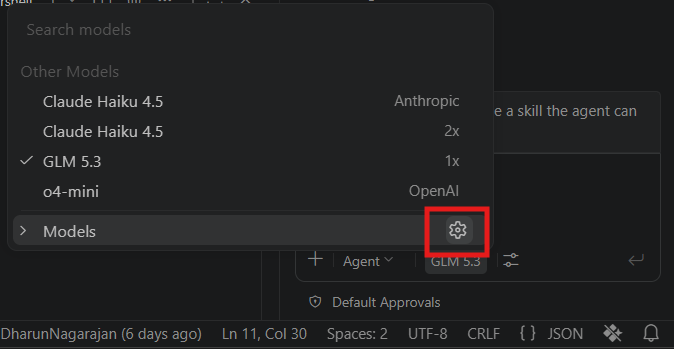
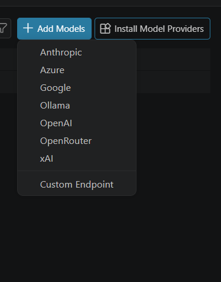
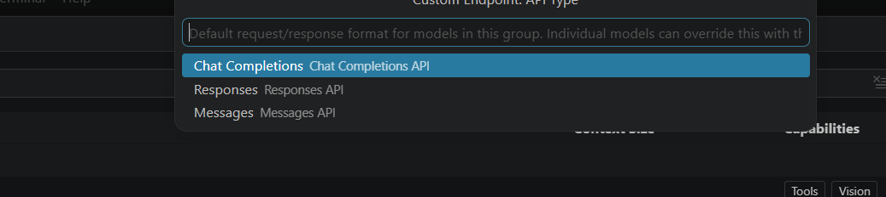
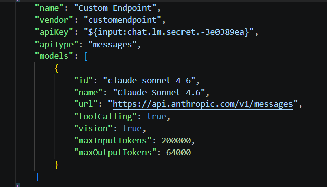
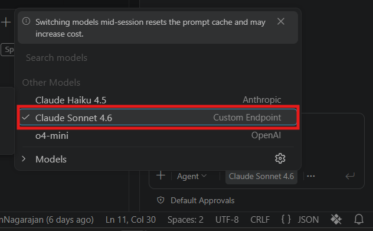

# Custom Endpoint Providers

## Overview
This guide provides step-by-step instructions to configure and use a Custom Endpoint model inside Code Studio with your own API key. The Custom Endpoint provider supports endpoints compatible with the Chat Completions, Responses, and Messages APIs, allowing you to connect models from different providers through a single configuration.

## When to Use

- When you want to connect a model from an external provider using your own API key.
- When your provider supports the Chat Completions, Responses, or Messages endpoint.
- When you need more control over the model, endpoint type, and provider configuration.

## Prerequisites

- Code Studio
- API Key

## Configure Custom Endpoint

### Step 1
Open Code Studio and click **Manage Language Model**.

### Step 2
Click **Add Models** and select **Custom Endpoints** from the dropdown menu.

### Step 3
Enter your API key and select the endpoint supported by your model provider.For example: Claude models support the **Messages** endpoint.

### Step 4
Add the required model configuration to the JSON file, including:
- Model name
- Endpoint details
- Provider-specific settings

### Step 5
Open the Chat panel, select the configured **Custom Endpoint** model from the model picker, and start using it in your chat.

