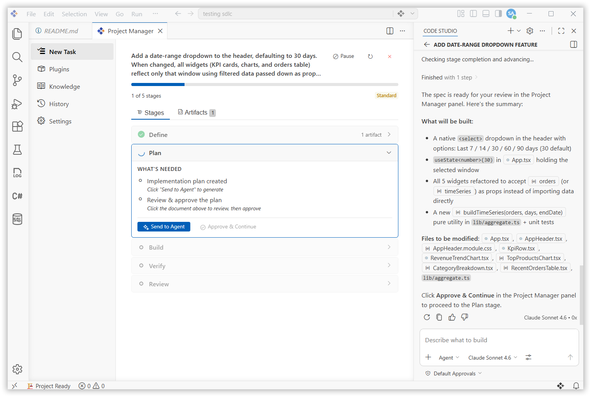
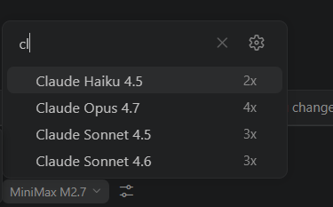

# What's New in v2.0.5
Syncfusion Code now includes **Project Manager**, a comprehensive, AI-powered extension that transforms how teams manage software development lifecycles. The project manager automates planning, code review, verification, and pre-launch preparation through intelligent workflow orchestration, bundled domain-specific skills, and configurable quality gates.

From early-stage planning through pre-launch readiness, teams can enforce consistent standards, accelerate reviews, and maintain visibility across the entire development pipeline—all through a dedicated panel UI in Syncfusion Code.
## New Features
### Project Manager
The project manager brings intelligent SDLC orchestration to Syncfusion Code through stage-gated workflows powered by AI agents. Choose from preset process levels — **Quick**, **Standard**, **Thorough**, or **Maximum** — to run your task through fixed stages: **Define**, **Plan**, **Build**, **Verify**, **Review**, and **Ship**. Each stage has configurable approval gates and domain-specific skills.

The extension bundles 12 production-ready skills covering the entire development lifecycle, from spec-driven planning and test-driven development to code review, security hardening, and pre-launch checklists. Artifacts (specs, plans, reports, reviews) are saved as Markdown files in the workspace, creating a complete audit trail of decisions.

AI agents handle complex tasks autonomously while human reviewers maintain quality control through required approvals at critical gates, ensuring consistency without sacrificing flexibility.

## Improvements
### 1. Account Page Authentication and UI Enhancements
Enhanced the Account Page UI by resolving authentication timing issues. The sign in process now correctly reflects code studio authentication status, and changes are consistently synchronized across multiple open windows.

### 2. Add clear icon in model search dropdown UI
Added a Clear icon to the Model Search Bar for quick search text removal and improved user experience.

