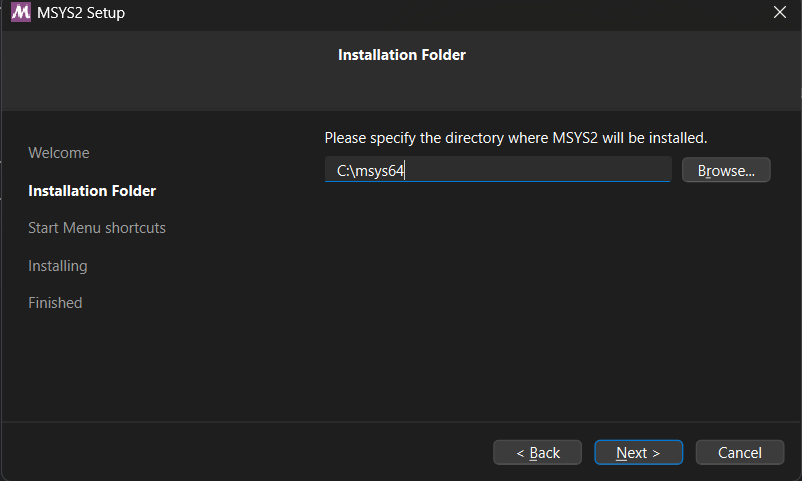
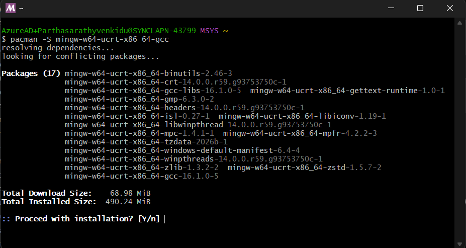
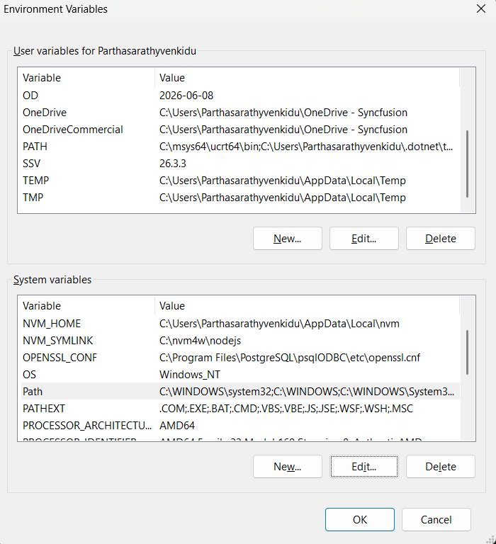
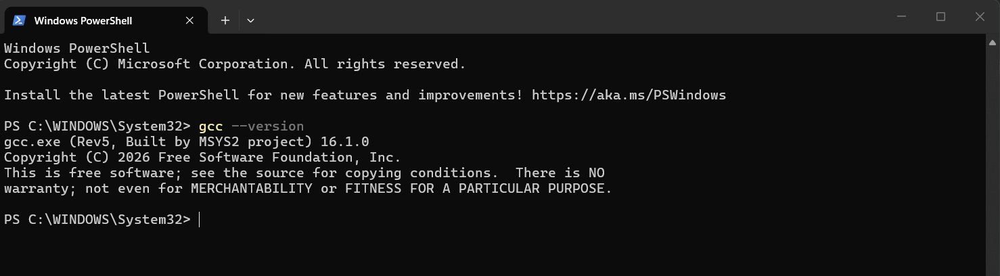
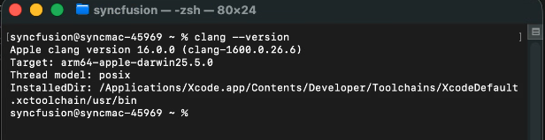
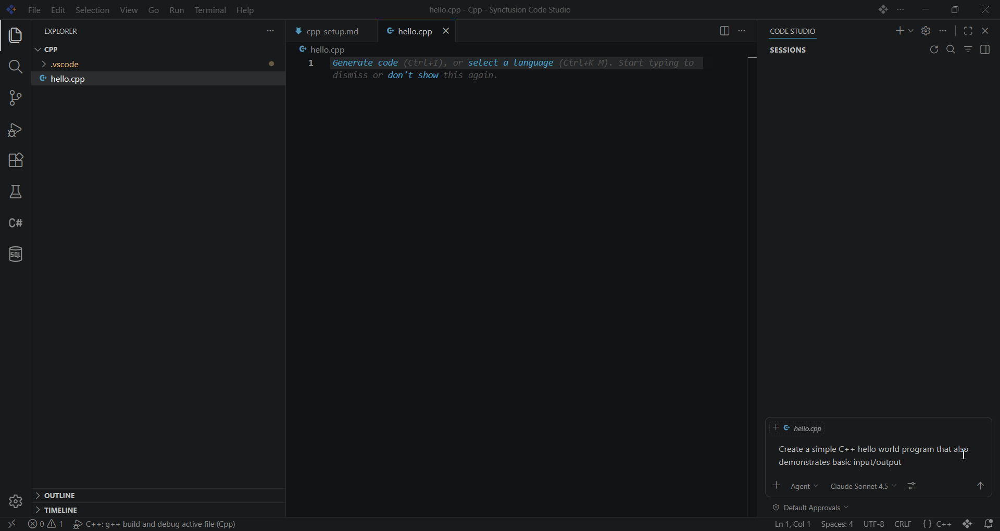
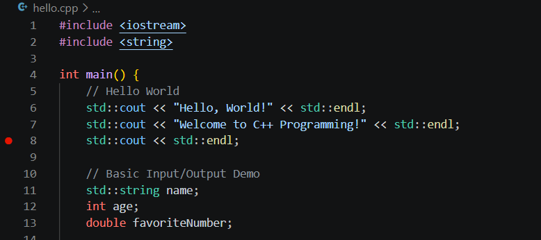
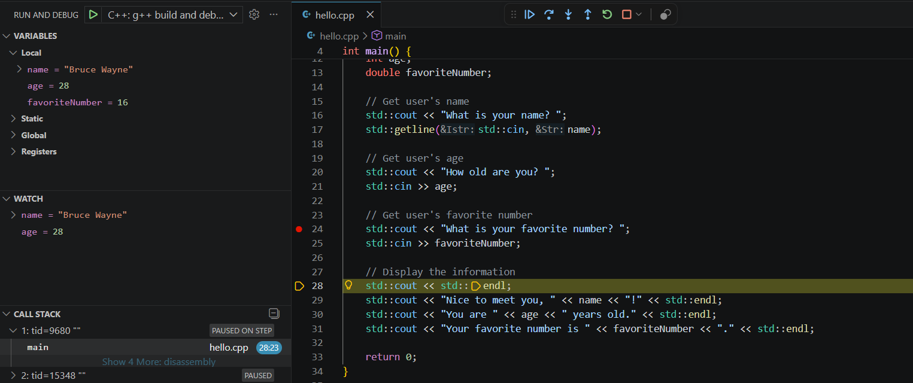

# C++ Development Setup in Syncfusion Code Studio

## Overview

Syncfusion Code Studio provides intelligent AI-powered assistance for C++ development, helping you write, debug, and optimize C++ code faster. Whether you're building system applications, game engines, or performance-critical software, Code Studio's AI features work alongside your C++ compiler to enhance your productivity.

This guide walks you through setting up a complete C++ development environment—from installing compilers to writing your first AI-assisted C++ program. Once configured, you'll be able to leverage Code Studio's autocomplete, debugging assistance, code explanations, and smart refactoring for all your C++ projects.

> **Prerequisites:** 
> - Syncfusion Code Studio must be installed. If not, see the [installation guide](/code-studio/getting-started/install-and-configuration).
> - **Disk Space:** 2-5 GB for compiler installation (Windows: MinGW-w64 ~2GB; macOS: Xcode Command Line Tools ~5GB)


## What You'll Learn

By the end of this tutorial, you'll learn how to:

- Install and configure a C++ compiler on Windows (MinGW-w64) and macOS (Clang)
- Install and configure CodeLLDB extension for debugging
- Set up build tasks for automatic compilation
- Configure debugging with breakpoints and variable inspection
- Write and run your first C++ program in Code Studio

## Download and Install C++ Compiler

### Windows

This guide uses MinGW-w64, which provides the GCC compiler for Windows. It's lightweight, open-source, and works perfectly with Code Studio.

#### Step 1: Download MinGW-w64

1. Download the **MSYS2** installer (recommended distribution):
      - visit the [MSYS2 download page](https://www.msys2.org/) for the latest version
2. Run the installer and follow the installation wizard
3. Install to the default location: `C:\msys64`



#### Step 2: Install GCC Compiler via MSYS2

1. Open **MSYS2 MSYS** from the Start menu
2. Install the compiler toolchain by running:
   ```bash
   pacman -S mingw-w64-ucrt-x86_64-gcc
   ```
   Wait for the installation to complete

   > **Note:** When prompted with `:: Proceed with installation? [Y/n]`, press **Y** and then **Enter** to continue.

    


#### Step 3: Add MinGW to System PATH

1. Open **Start Menu** → search for "Environment Variables" → click **Edit the system environment variables**
2. Click **Environment Variables** button
3. Under **System variables**, find and select **Path** → click **Edit**
4. Click **New** and add: `C:\msys64\ucrt64\bin`
5. Click **OK** on all windows to save




#### Step 4: Verify Installation

1. Open a **new** Command Prompt or PowerShell window
2. Run the following command:
   ```bash
   g++ --version
   ```
3. You should see the GCC compiler version information



---

### macOS

If you're on macOS, the setup is even simpler. macOS uses Clang (part of LLVM) as its default C++ compiler, which comes with Xcode Command Line Tools.

#### Step 1: Install Xcode Command Line Tools

1. Open **Terminal** (Applications → Utilities → Terminal)
2. Run the following command:
   ```bash
   xcode-select --install
   ```
3. This will install the Clang compiler 

#### Step 2: Verify Installation

1. In Terminal, run:
   ```bash
   clang --version
   ```
2. You should see the Clang compiler version information



---

## Configure C++ in Code Studio

With the compiler installed, the next step is to set up Code Studio to work seamlessly with your C++ environment. This involves installing an extension for debugging and configuring build and debug tasks.

> **Why Not Use Microsoft's C/C++ Extension?**
>
> Syncfusion Code Studio is a fork of Visual Studio Code with enhanced AI capabilities. Code Studio cannot use certain Microsoft proprietary extensions due to licensing restrictions. 
>
> Microsoft's C/C++ extension (`ms-vscode.cpptools`) is only licensed for use in official VS Code builds. Attempting to install it in Code Studio will result in errors or the extension simply won't function.
>
> **Solution:** We use **CodeLLDB** instead, which is:
> - Open-source and Provides full debugging capabilities (breakpoints, variable inspection, call stacks).

### Step 1: Install CodeLLDB Extension

1. Open **Syncfusion Code Studio**
2. Click the **Extensions** icon in the sidebar (or press `Ctrl+Shift+X` / `Cmd+Shift+X`)
3. Search for **"CodeLLDB"** (by vadimcn)


4. Click **Install** on the extension

> **Extension Features:**
> - Native LLDB debugger with full debugging support
> - Works seamlessly with MinGW/GCC and Clang
> - Advanced breakpoint management
> - Variable inspection and watches
> - Multi-threaded debugging support

> **Note:** CodeLLDB bundles its own LLDB debugger, so no additional debugger installation is required. It works perfectly with executables compiled by g++ or clang++.

### Step 2: Configure Build Task

With CodeLLDB installed, let's set up a build task so you can compile your C++ code directly from Code Studio without switching to the command line.

1. In your project folder, create a `.vscode` folder if it doesn't exist
2. Create a file named `tasks.json` inside `.vscode`
3. Add the following configuration:

**Example tasks.json (Windows):**
```json
{
    "version": "2.0.0",
    "tasks": [
        {
            "type": "shell",
            "label": "C++: g++ build active file",
            "command": "g++",
            "args": [
                "-fdiagnostics-color=always",
                "-g",
                "${file}",
                "-o",
                "${fileDirname}\\${fileBasenameNoExtension}.exe"
            ],
            "options": {
                "cwd": "${fileDirname}"
            },
            "problemMatcher": [
                "$gcc"
            ],
            "group": {
                "kind": "build",
                "isDefault": true
            },
            "detail": "Compiler: g++"
        }
    ]
}
```

**Example tasks.json (macOS):**
```json
{
    "version": "2.0.0",
    "tasks": [
        {
            "type": "shell",
            "label": "C++: clang++ build active file",
            "command": "clang++",
            "args": [
                "-fdiagnostics-color=always",
                "-g",
                "${file}",
                "-o",
                "${fileDirname}/${fileBasenameNoExtension}"
            ],
            "options": {
                "cwd": "${fileDirname}"
            },
            "problemMatcher": [
                "$gcc"
            ],
            "group": {
                "kind": "build",
                "isDefault": true
            },
            "detail": "Compiler: clang++"
        }
    ]
}
```

### Step 3: Configure Debugging with CodeLLDB

Set up the debugger to run and inspect your C++ programs. The debugger will automatically build your code before debugging.

1. In your project folder's `.vscode` directory, create a file named `launch.json`
2. Add the following configuration:


**Example launch.json (Windows):**
```json
{
    "version": "0.2.0",
    "configurations": [
        {
            "name": "C++: g++ build and debug active file",
            "type": "lldb",
            "request": "launch",
            "program": "${fileDirname}\\${fileBasenameNoExtension}.exe",
            "args": [],
            "cwd": "${fileDirname}",
            "preLaunchTask": "C++: g++ build active file"
        }
    ]
}
```

**Example launch.json (macOS):**
```json
{
    "version": "0.2.0",
    "configurations": [
        {
            "name": "C++: clang++ build and debug active file",
            "type": "lldb",
            "request": "launch",
            "program": "${fileDirname}/${fileBasenameNoExtension}",
            "args": [],
            "cwd": "${fileDirname}",
            "preLaunchTask": "C++: clang++ build active file"
        }
    ]
}
```

> **Important:** The `preLaunchTask` name in `launch.json` must match the `label` in your `tasks.json` file. This ensures your code is compiled before debugging starts.

> **Key Points:**
> - `"type": "lldb"` tells Code Studio to use CodeLLDB for debugging
> - `preLaunchTask` automatically builds your code before debugging
> - The configuration works with both debug and release builds

---

## Write Your First C++ Program

Now that everything is configured, let's put your setup to the test by creating and running a simple C++ program.

### Step 1: Create a New C++ File

1. In Code Studio, create a new file: `hello.cpp`
2. You can write the code yourself or ask Code Studio to help:

   **Try this prompt in Code Studio Chat:**
   ```
   Create a simple C++ hello world program that also demonstrates basic input/output
   ```
3. Code Studio will generate a basic C++ code.



---

## Debug Your C++ Code

Debugging is where Code Studio truly shines. Let's walk through setting breakpoints and inspecting your program as it runs.

### Step 1: Set a Breakpoint

1. Click in the left margin (line number area) to set a breakpoint
2. A red dot will appear



### Step 2: Start Debugging

1. Press `F5` to start debugging
2. The program will pause at your breakpoint
3. Use the debug toolbar to:
   - **Continue** (`F5`)
   - **Step Over** (`F10`)
   - **Step Into** (`F11`)
   - **Step Out** (`Shift+F11`)

4. While debugging, you can:
   - View variables in the **Variables** panel
   - Add watch expressions in the **Watch** panel  
   - Examine the call stack in the **Call Stack** panel



---

## Next Steps

Congratulations! Your C++ development environment is now fully configured in Syncfusion Code Studio. Here's what you can explore next:

- **Build Real Projects:** Start developing C++ applications with full debugging support - see [tutorials](/code-studio/tutorials/generate-your-first-code-using-agent) to get started
- **Leverage AI Features:** Use Code Studio's [autocomplete](/code-studio/features/autocomplete), [code explanation](/code-studio/features/ask), and refactoring capabilities to speed up development
- **Explore Agent Mode:** For complex multi-file projects, try [Agent mode](/code-studio/features/agent) for advanced refactoring and architectural improvements
- **Learn More:** Check out the [Quick Start Guide](/code-studio/getting-started/quick-start) and [features overview](/code-studio/features/generatecode) for additional capabilities

## Troubleshooting

**Compiler not found after installation:**
- Ensure you opened a **new** terminal window after adding to PATH
- Restart Code Studio if the terminal was already open
- Verify PATH by running `echo $env:PATH` (Windows) or `echo $PATH` (macOS)

**Build task fails:**
- Check that your `tasks.json` file has the correct compiler command (`g++` or `clang++`)
- Verify the file paths and ensure there are no typos
- Make sure your compiler is accessible from the terminal

**Debugger won't start:**
- Confirm CodeLLDB extension is installed and enabled
- Check that `preLaunchTask` in `launch.json` matches your task `label` exactly
- Ensure your program compiles successfully before debugging
