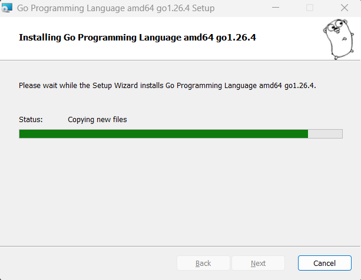
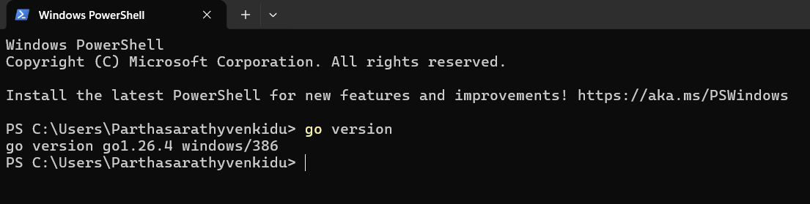
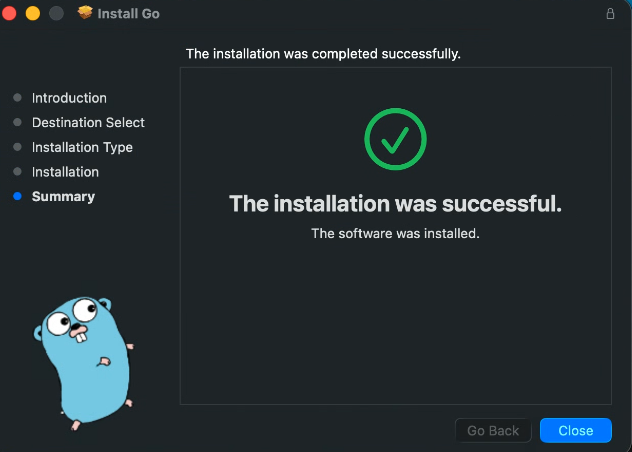
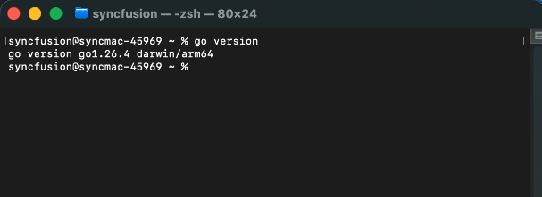
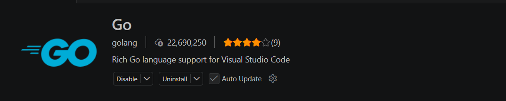
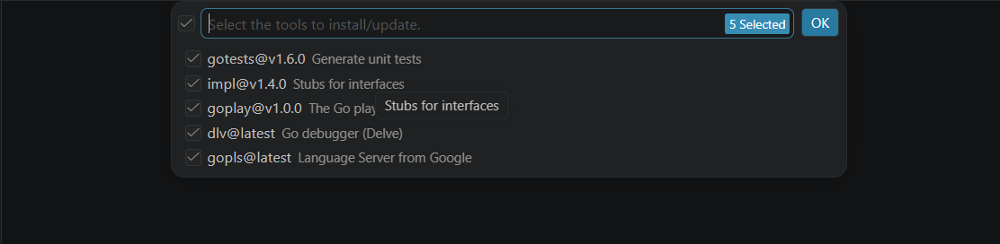
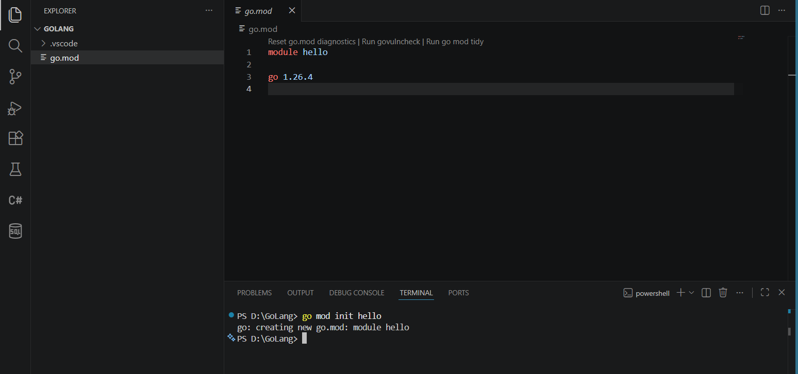
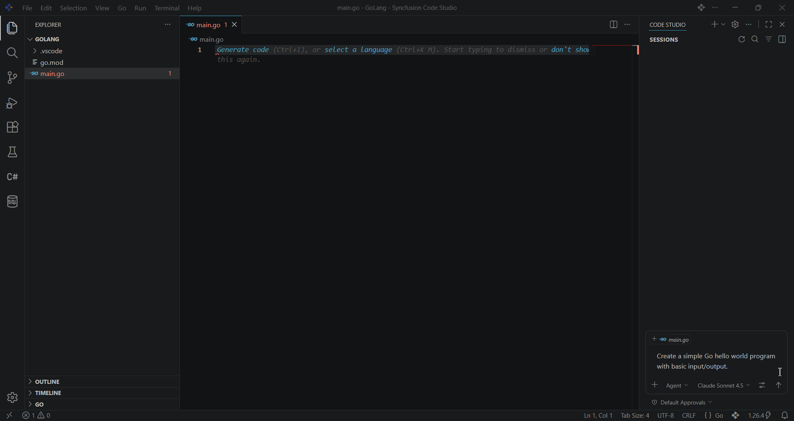
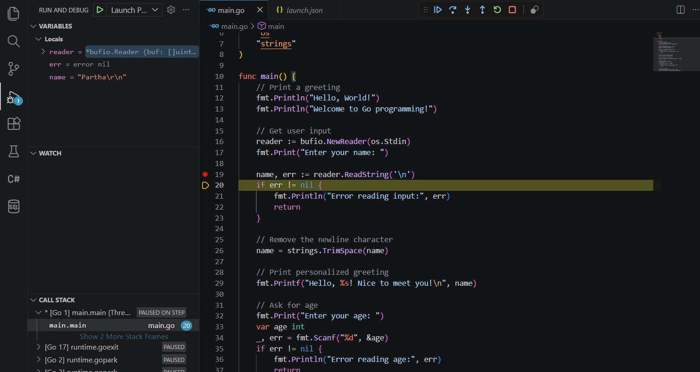

# Go Development Setup in Syncfusion Code Studio

## Overview

Syncfusion Code Studio provides intelligent AI-powered assistance for Go development, helping you write clean, idiomatic Go code with greater speed and confidence. Whether you're building microservices, CLI tools, web applications, or cloud-native solutions, Code Studio works seamlessly with Go's toolchain to enhance your productivity.

This guide walks you through setting up a complete Go development environment—from installing the Go compiler to writing your first Go program. Once configured, you'll be able to leverage Code Studio's autocomplete, debugging assistance, code explanations, and smart refactoring for all your Go projects.

> **Prerequisites:** 
> - Syncfusion Code Studio must be installed. If not, see the [installation guide](/code-studio/getting-started/install-and-configuration).
> - **Disk Space:** ~500 MB for Go installation

## What You'll Learn

By the end of this tutorial, you'll learn how to:

- Install and configure the Go compiler on Windows and macOS
- Install and configure the Go extension with essential tools
- Set up Go modules for dependency management
- Write and run your first Go program in Code Studio
- Debug Go applications with breakpoints and variable inspection

## Download and Install Go

### Windows

#### Step 1: Download Go Installer

1. Visit the [official Go downloads page](https://go.dev/dl/)
2. Download the **Windows installer** (`.msi` file) for your architecture
   - Most users: `go1.XX.X.windows-amd64.msi`
3. Save the file to your Downloads folder

#### Step 2: Run the Installer

1. Double-click the downloaded `.msi` file
2. Follow the installation wizard:
   - Click **Next** on the welcome screen
   - Accept the license agreement
   - Choose installation location (default: `C:\Program Files\Go`)
   - Click **Install**
3. Wait for installation to complete and click **Finish**.



> **Note:** The installer automatically adds Go to your system PATH.

#### Step 3: Verify Installation

1. Open a **new** Command Prompt or PowerShell window (must be new for PATH changes to take effect)
2. Run:
   ```bash
   go version
   ```
3. You should see the installed Go version




---

### macOS

If you're on macOS, you have two options for installing Go: the official installer or Homebrew.

#### Method 1: Official Installer (Recommended)

##### Step 1: Download Go Installer

1. Visit the [official Go downloads page](https://go.dev/dl/)
2. Download the **macOS installer** (`.pkg` file) for your architecture:
   - **Apple Silicon (M1/M2/M3):** `go1.XX.X.darwin-arm64.pkg`
   - **Intel Mac:** `go1.XX.X.darwin-amd64.pkg`


##### Step 2: Run the Installer

1. Double-click the downloaded `.pkg` file
2. Follow the installation wizard:
   - Click **Continue** on the introduction screen
   - Accept the license agreement
   - Click **Install** (may require your password)
3. Wait for installation to complete
4. Click **Close**




#### Method 2: Install via Homebrew

If you have [Homebrew](https://brew.sh/) installed:

1. Open Terminal
2. Run:
   ```bash
   brew install go
   ```
3. Wait for installation to complete

#### Verify Installation

1. Open **Terminal** (Applications → Utilities → Terminal)
2. Run:
   ```bash
   go version
   ```



---

## Configure Go in Code Studio

With Go installed, the next step is to set up Code Studio to work seamlessly with your Go environment. This involves installing the Go extension and essential development tools.

### Step 1: Install Go Extension

1. Open **Syncfusion Code Studio**
2. Click the **Extensions** icon in the sidebar (or press `Ctrl+Shift+X` / `Cmd+Shift+X`)
3. Search for **"Go"** (by the Go Team at Google)
4. Click **Install**




### Step 2: Install Go Tools

The Go extension requires several tools for full functionality. Code Studio will prompt you to install them automatically.

1. Open the **Command Palette** (`Ctrl+Shift+P` / `Cmd+Shift+P`)
2. Type: **"Go: Install/Update Tools"**
3. Select **all tools** from the list (or check all)
4. Click **OK**



---

## Write Your First Go Program

Now that everything is configured, let's create a simple Go program to verify your setup.

### Step 1: Create a Go Module

1. Create a new folder for your project (e.g., `hello.go`)
2. Open it in Code Studio: **File → Open Folder**
3. Open the **Terminal** (`Ctrl+`` / ``Cmd+``)
4. Initialize a Go module:
   ```bash
   go mod init example/hello
   ```



This creates a `go.mod` file that tracks dependencies.

### Step 2: Create Your First Go File

1. Create a new file: `main.go`
2. You can write the code yourself or ask Code Studio to help:

   **Try this prompt in Code Studio Chat:**
   ```
   Create a simple Go hello world program with basic input/output
   ```



3. Code Studio will generate a basic Go program.


## Debug Your Go Code

Debugging is where Code Studio truly shines. Let's walk through setting up debugging and inspecting your program as it runs.

### Step 1: Configure Debug Settings

1. Click the **Run and Debug** icon (or press `Ctrl+Shift+D` / `Cmd+Shift+D`)
2. Click **"create a launch.json file"**
3. Select **"Go"** from the environment options
4. Code Studio creates `.vscode/launch.json`

**Example launch.json:**
```json
{
    "version": "0.2.0",
    "configurations": [
        {
            "name": "Launch Package",
            "type": "go",
            "request": "launch",
            "mode": "auto",
            "program": "${workspaceFolder}",
            "console": "integratedTerminal"
        }
    ]
}
```

### Step 2: Set Breakpoints

1. Click in the left margin (line number area) to set a breakpoint
2. A red dot appears on the line

### Step 3: Start Debugging

1. Press `F5` to start debugging
2. The program will pause at your breakpoint
3. Use the debug toolbar:
   - **Continue** (`F5`)
   - **Step Over** (`F10`)
   - **Step Into** (`F11`)
   - **Step Out** (`Shift+F11`)
4. While debugging, you can:
   - Hover over variables to see their values
   - View the **Variables** panel
   - Add **Watch** expressions
   - Inspect the **Call Stack** 



---

---

## Next Steps

Congratulations! Your Go development environment is now fully configured in Syncfusion Code Studio. Here's what you can explore next:

- **Build Real Projects:** Start developing Go applications with full debugging support - see [tutorials](/code-studio/tutorials/generate-your-first-code-using-agent) to get started
- **Leverage AI Features:** Use Code Studio's [autocomplete](/code-studio/features/autocomplete), [code explanation](/code-studio/features/ask), and refactoring capabilities to speed up development
- **Explore Agent Mode:** For complex multi-package projects, try [Agent mode](/code-studio/features/agent) for advanced refactoring and architectural improvements
- **Learn More:** Check out the [Quick Start Guide](/code-studio/getting-started/quick-start) and [features overview](/code-studio/features/generatecode) for additional capabilities

### Recommended Go Resources

- [Official Go Documentation](https://go.dev/doc/)
- [Effective Go](https://go.dev/doc/effective_go)
- [Go by Example](https://gobyexample.com/)

## Troubleshooting

**Module imports showing errors:**
- Run `go mod tidy` in the terminal
- Run `go mod download` to fetch dependencies
- Reload Code Studio: Command Palette → **"Developer: Reload Window"**

**Debugger won't start:**
- Check that your `launch.json` configuration is correct
- Verify your program builds successfully with `go build`
