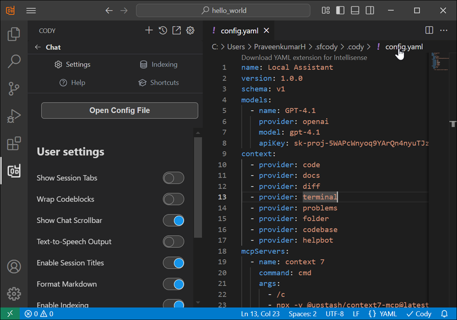

# Configure the Syncfusion code studio

The Syncfusion code studio can be configured using the `config.yaml` specification. To open this file, follow the below steps.

1. Open the settings of Syncfusion code studio chat
2. And click `Open Config File`



You add your configuration setting in the opened `config.yaml` file.

## Properties of `config.yaml`

All properties at all levels are optional unless explicitly marked as **required**.

The top-level properties in the `config.yaml` configuration file are:

<table>
  <thead>
    <tr>
      <th>Property</th>
      <th>Required</th>
      <th>Description</th>
    </tr>
  </thead>
  <tr>
    <td><code>name</code></td>
    <td>Yes</td>
    <td>Specifies the name of the configuration.</td>
  </tr>
  <tr>
    <td><code>version</code></td>
    <td>Yes</td>
    <td>Specifies the version of your configuration.</td>
  </tr>
  <tr>
    <td><code>schema</code></td>
    <td>Yes</td>
    <td>Specifies the schema version used for the <code>config.yaml</code> (e.g., <code>v1</code>).</td>
  </tr>
  <tr>
    <td><code>models</code></td>
    <td>No</td>
    <td>Defines the language models used in your configuration.</td>
  </tr>
  <tr>
    <td><code>context</code></td>
    <td>No</td>
    <td>Defines context providers.</td>
  </tr>
  <tr>
    <td><code>rules</code></td>
    <td>No</td>
    <td>List of rules that the LLM should follow.</td>
  </tr>
  <tr>
    <td><code>prompts</code></td>
    <td>No</td>
    <td>A list of custom prompts that can be invoked from the chat window.</td>
  </tr>
  <tr>
    <td><code>docs</code></td>
    <td>No</td>
    <td>List of documentation sites to index.</td>
  </tr>
  <tr>
    <td><code>mcpServers</code></td>
    <td>No</td>
    <td>Used to configure MCP server.</td>
  </tr>
</table>

## Example:
```yaml
name: Local Assistant
version: 1.0.0
schema: v1
models:
  - name: GPT-4.1
    provider: openai
    model: gpt-4.1
    apiKey: original key
prompts:
  - name: check
    description: Check for mistakes in my code
    prompt: |
      Please read the highlighted code and check for any mistakes. You should look for the following, and be extremely vigilant:
        - Syntax errors
        - Logic errors
        - Security vulnerabilities
context:
  - provider: code
  - provider: docs
  - provider: diff
  - provider: terminal
  - provider: problems
  - provider: folder
  - provider: codebase
  - provider: helpbot
mcpServers:
  - name: context 7
    command: cmd
    args:
      - /c
      - npx -y @upstash/context7-mcp@latest
```