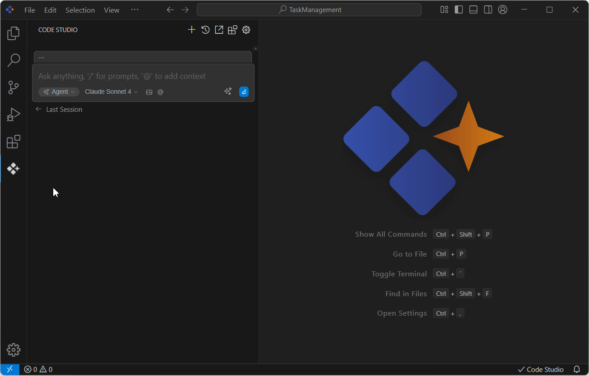

# Tools

 The Tools feature in Syncfusion Code Studio empowers developers to perform specific actions within the development environment, such as creating folders, reading files, searching within files, and interacting with browsers. This guide provides a step-by-step approach to use the built-in tools, enabling you to streamline your development workflow and automate tasks efficiently with simple prompts.

## Purpose

The built-in tools are designed to automate and simplify common development tasks, allowing you to focus on writing code. Key purposes include:
### 1. File Management
- Create new files or edit existing ones.
- Perform bulk search-and-replace operations.
- Organize project structures efficiently.
### 2. Terminal Integration
- Run CLI commands like npm install or yarn start.
- Install dependencies or launch development servers.
- Automate build and deployment processes.
### 3. Code Insights
- Identify and fix bugs with AI-driven suggestions.
- Refactor code for better performance or readability.
- Generate inline documentation automatically.
### 4. Web and Browser Tools
- Perform web searches to fetch relevant resources.
- Automate browser tasks like testing or scraping.

## Built-In Tools

Syncfusion Code Studio provides a suite of tools to streamline your workflow. Below is a comprehensive list of available tools and their description.
 
### 1. Ensure the Required Tools Policy

To balance speed and safety, each tool in Syncfusion Code Studio can be configured in one of three modes:
- **Automatic:** When the model requests a tool, Code Studio automatically executes it and sends the response back to the model.

- **Ask First:** When the model requests a tool, Code Studio prompts you to either "Cancel" or "Continue" before proceeding.

- **Excluded:** The model is unaware of the tool and cannot use it.

 To change the mode, click on the desired option. Once configured, enter your prompt to perform the task. Code Studio will then leverage the selected tools to build the application.

### 2. Toolset Overview

Available built-in tools and their descriptions:

<table border="1" cellpadding="8" cellspacing="0">
  <thead>
    <tr>
      <th>Tool Name</th>
      <th>Description</th>
    </tr>
  </thead>
  <tbody>
    <tr>
      <td>builtin_read_file</td>
      <td>Reads the contents of an existing file.</td>
    </tr>
    <tr>
      <td>builtin_create_new_file</td>
      <td>Creates a new file with specified content.</td>
    </tr>
    <tr>
      <td>builtin_run_terminal_command</td>
      <td>Executes a terminal command in the current directory.</td>
    </tr>
    <tr>
      <td>builtin_grep_search</td>
      <td>Performs a fast text search using exact strings or regex.</td>
    </tr>
    <tr>
      <td>builtin_file_glob_search</td>
      <td>Searches for files matching a glob pattern, returning their paths.</td>
    </tr>
    <tr>
      <td>builtin_search_web</td>
      <td>Conducts a web search and returns top results.</td>
    </tr>
    <tr>
      <td>builtin_view_diff</td>
      <td>Displays the diff of current working changes.</td>
    </tr>
    <tr>
      <td>builtin_read_currently_open_file</td>
      <td>Reads the contents of the currently open file in the IDE.</td>
    </tr>
    <tr>
      <td>builtin_ls</td>
      <td>Lists files and folders in a specified directory.</td>
    </tr>
    <tr>
      <td>builtin_syncfusion_ui_builder</td>
      <td>Generates Syncfusion component metadata or UI layout plans.</td>
    </tr>
    <tr>
      <td>builtin_browser_interaction</td>
      <td>Automates browser tasks using a Puppeteer-controlled environment.</td>
    </tr>
    <tr>
      <td>builtin_replace_in_file</td>
      <td>Makes targeted edits to specific parts of a file.</td>
    </tr>
    <tr>
      <td>builtin_search_files</td>
      <td>Searches for regex patterns.</td>
    </tr>
  </tbody>
</table>

## How to Use Tools

1. **Open the Chat Window** - Click the Syncfusion Code Studio icon on the left toolbar to open the chat interface.

2. **Enter Your Request** - Type your request in natural language, describing what you want to accomplish. Ensure code Studio is in Agent mode.

3. **Review Tool Execution** - The AI will automatically select and execute the appropriate tools based on your request.

4. **Approve Changes** - Review any proposed changes and approve or modify them as needed.

