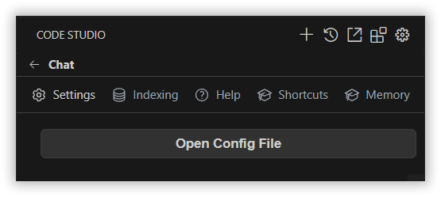
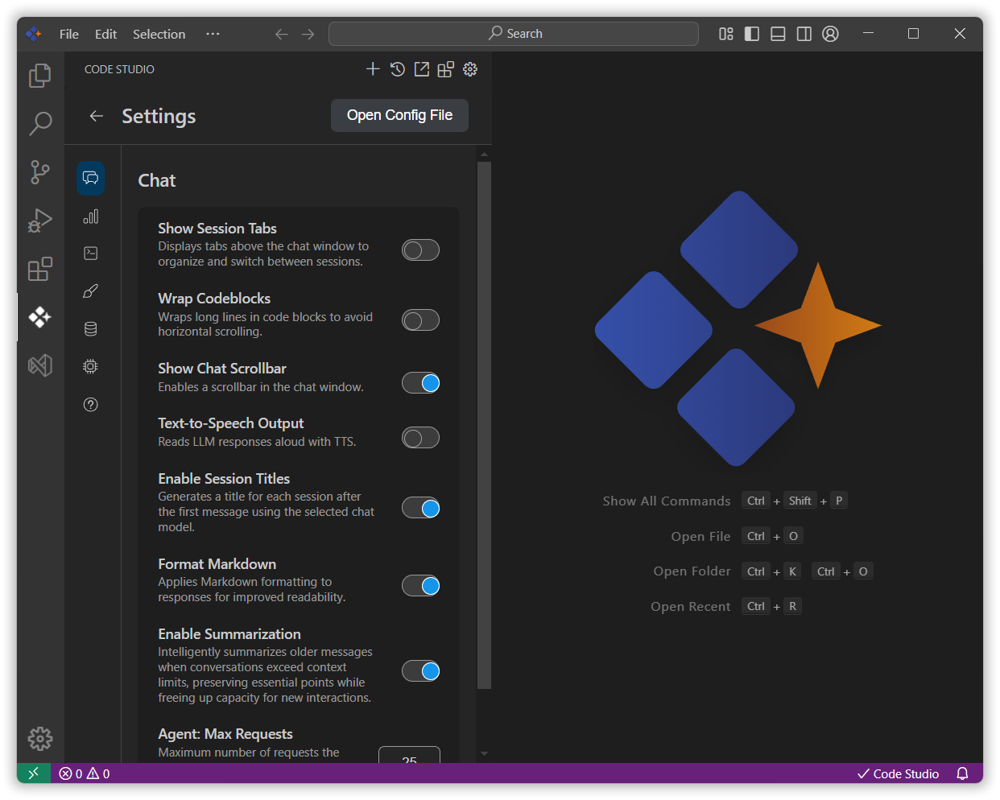

# User Settings

Customize your Code Studio experience with personalized settings that enhance productivity and workflow efficiency. Settings are stored locally and take effect immediately upon change.

## Purpose

User settings provide a way to tailor the development environment to individual preferences, which helps to:

- **Optimize Workflow**: Adjust the UI and behavior to match your personal workflow.
- **Enhance Accessibility**: Modify font sizes and enable text-to-speech for better accessibility.
- **Manage Privacy**: Control what data is shared to protect privacy.

## Accessing the User Settings Page

The User Settings page can be accessed by clicking the gear icon located in the header of the Code Studio, then selecting the Settings tab.

## Settings Categories

The following settings are available on the User Settings page.

### Interface & Display

**Show Session Tabs:** When enabled, displays tabs above the chat window to organize and access your sessions.
  - Default: Off
  - Use Case: Multi-project workflows

**Show Chat Scrollbar:** When enabled, displays a scrollbar in the chat window for easier navigation.
  - Default: Off
  - Use Case: Long conversation navigation

**Font Size:** Sets the base font size for UI elements, allowing customization of text size across the interface.
  - Default: System
  - Use Case: Accessibility preferences

**Format Markdown:** When enabled, formats responses as markdown for improved readability. When disabled, responses are shown as raw text.
  - Default: On
  - Use Case: Professional presentation

### AI & Memory Features

**Enable Memory:** Allows the assistant to recall and reuse relevant information from past interactions to enhance response context.
  - Default: On
  - Use Case: Consistent assistance

**Enable Session Titles:** When enabled, generates summary titles for each chat session after the first message, using the current chat model.
  - Default: On
  - Use Case: Better organization

**Text-to-Speech Output:** When enabled, reads the assistant's responses aloud using text-to-speech (TTS) functionality.
  - Default: Off
  - Use Case: Accessibility/multitasking

### Development Tools
**Wrap Codeblocks:** When enabled, applies text wrapping to code blocks for better readability.
  - Default: Off
  - Use Case: Long code readability

**Enable Indexing:** Enables indexing of the codebase for use with @codebase and @code context providers, improving code-related queries.
  - Default: On
  - Use Case: Enhanced code assistance

**Browser Viewport:** In webpage development, enables direct navigation to the live browser page for previewing changes.
  - Default: Off
  - Use Case: Web development

### Code Completion

**Multiline Autocompletions:** Controls multiline autocomplete behavior. Options are:
  - Always: Always provide multiline completions.
  - Never: Disable multiline completions.
  - Auto: Automatically determine when multiline completions are appropriate.
  - Default: Auto

**Disable Autocomplete in Files:** Specifies a comma-separated list of glob patterns to disable autocomplete in matching files.
  - Default: None

### Privacy & Analytics

**Allow Anonymous Telemetry:** When enabled, permits Code Studio to collect anonymous telemetry data to improve the product.
  - Default: On
  - Impact: Helps enhance features
