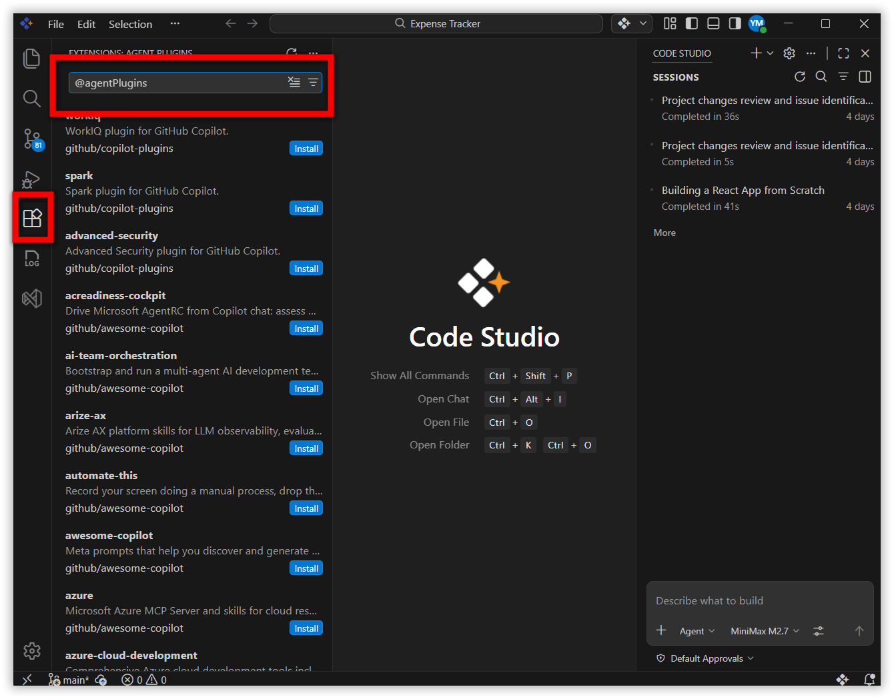
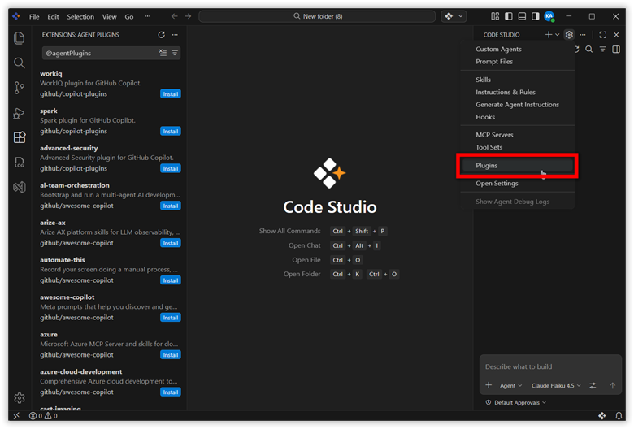
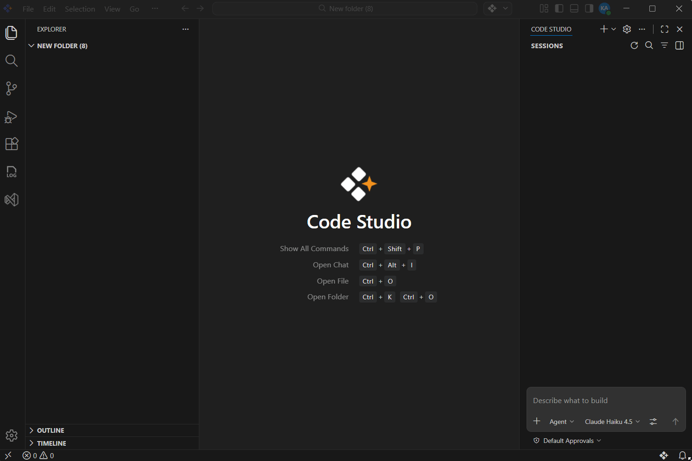
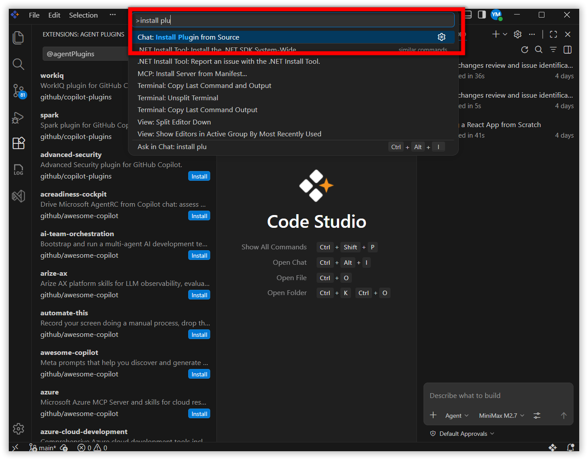
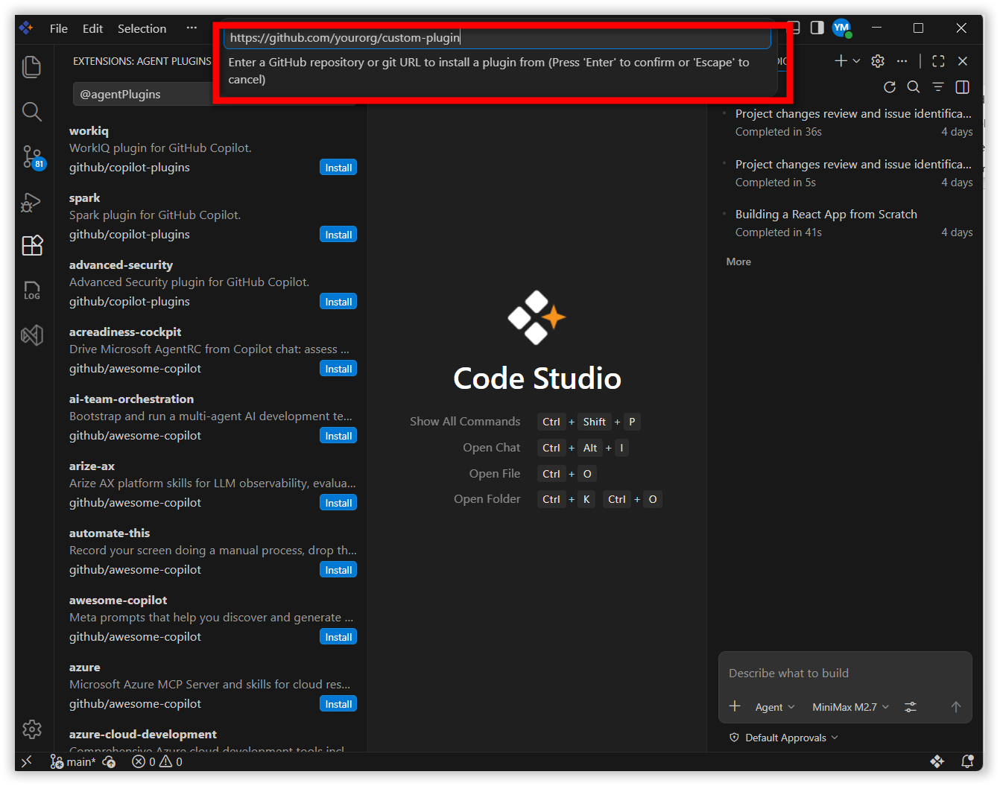
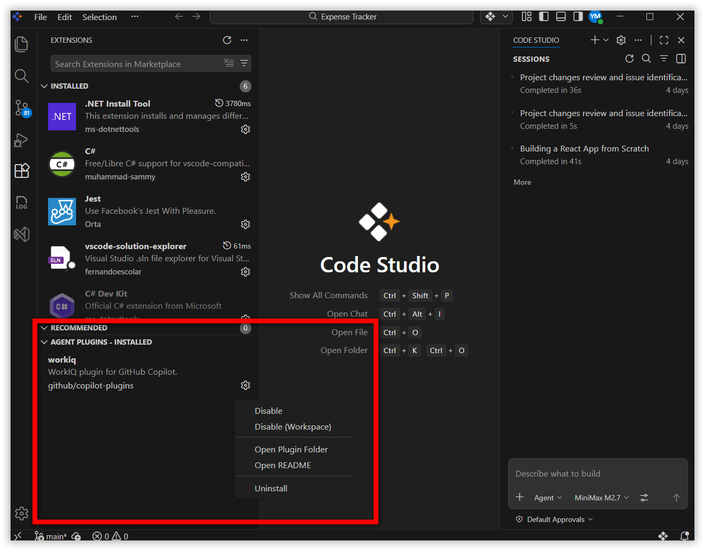
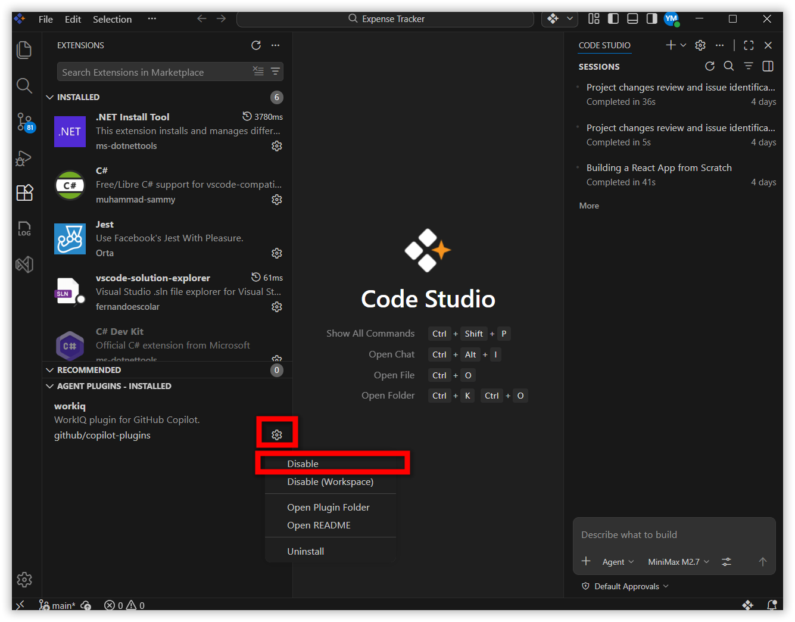
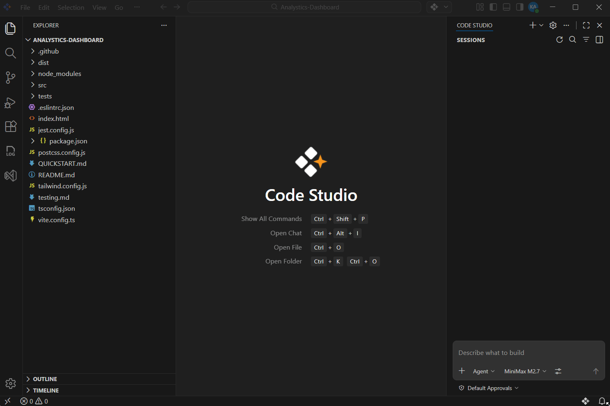

# Agent Plugins

## Purpose 
Agent plugins are bundles of customizations you can install from plugin marketplaces. They extend Code Studio with combinations of slash commands, skills, agents, hooks, and MCP servers, while working alongside your existing customizations.

**Key Benefits:**
- **Simplify Configuration** — Install complete workflows in one action
- **Standardize Practices** — Enforce consistent coding standards across your team
- **Share Knowledge** — Distribute expertise and best practices organization-wide

## What Plugins Provide 

Agent plugins can include the following components:

**Slash Commands**
Chat commands prefixed with `/` for specific tasks (like `/test-report` or `/deploy`)

**Skills**
Instructions, scripts, and resources that load on-demand for specific tasks

**Custom Agents**
Specialized AI personas with preconfigured tools for domain-specific tasks

**Hooks**
Automation scripts that execute at specific lifecycle points like `SessionStart` or `PostToolUse`

**MCP Servers**
External tool integrations providing additional capabilities to your agents

 

## When to Use Agent Plugins 

- **Team Standardization** — Ensure consistent tooling across projects.
  Uses workspace settings to recommend the same plugins for all team members.

- **Quality Enforcement** — Automate validation, formatting, and testing.
  Hooks can run these checks at key points in your workflow to maintain standards.

- **Knowledge Sharing** — Make domain expertise available to everyone.
  Packaged skills and agents democratize specialized knowledge across teams.

- **Onboarding** — Give new team members immediate access to required tools.
  New hires can install recommended plugins and be productive from day one.

## Prerequisites 

Before you begin working with agent plugins, ensure the following requirements are met: 

- **Syncfusion Code Studio**: You must have Code Studio installed and configured on your system. For installation instructions, refer to the [Install and Configure Code Studio](https://help.syncfusion.com/code-studio/install-and-configure) guide. 

- **Write Access**: You must have write permissions to either your personal profile folder or the project repository where you plan to install plugins. 

## Enabling Agent Plugins 

### Step 1: Discover Available Plugins 

Follow these steps to find available agent plugins: 

1. Open the Extensions view by pressing `Ctrl+Shift+X` (Windows/Linux) or `Cmd+Shift+X` (macOS). 

2. Enter `@agentPlugins` in the search field. 

      
 

3. **Alternative method**: Select the **settings** icon in the Extensions sidebar and choose **Plugins**. 

 

     

4. Browse the available plugins from your configured marketplaces. 

5. Review each plugin's description, author information, and version number before installation. 

### Step 2: Install a Plugin 

#### Option 1: Install from Marketplace 

To install a plugin from a marketplace: 

1. Click the **Install** button to add it to your user profile. 

2. Code Studio automatically downloads and registers the plugin. 

  

#### Option 2: Install from a Git Repository 

To install a plugin that is not available in a marketplace: 

1. Open the Command Palette by pressing `Ctrl+Shift+P` (Windows/Linux) or `Cmd+Shift+P` (macOS). 

2. Run the command **Chat: Install Plugin From Source**. 

   

3. Enter the Git repository UL (for example, `https://github.com/yourorg/custom-plugin`). 

   

4. Code Studio automatically clones the repository and installs the plugin. 

 

### Step 3: Manage Installed Plugins 

To manage your installed plugins: 

1. Navigate to **Agent Plugins - Installed** in the Extensions sidebar. 

2. From this view, you can perform the following actions: 

   - View all installed plugins and their metadata. 

   - Enable or disable plugins globally or per-workspace. 

   - Uninstall plugins that you no longer need. 

   - Check for available updates. 

   

### Step 4: Update Plugins 

Code Studio provides two methods to check for plugin updates: 

- **Automatic Updates**: Code Studio checks for updates automatically every 24 hours if the `extensions.autoUpdate` setting is enabled. 

- **On-Demand Updates**: Press `Ctrl+Shift+P` (or `Cmd+Shift+P` on macOS) and run **Extensions: Check for Extension Updates**. 

 

### Managing Plugin State 

To enable or disable a plugin: 

1. Open the Extensions view by pressing `Ctrl+Shift+X`. 

2. Navigate to **Agent Plugins - Installed**. 

3. Right-click the plugin you want to manage and select **Enable** or **Disable**. 

 
   

**Effects of Disabling a Plugin** 

When you disable a plugin, the following components become inactive: 

- Plugin skills, agents, and slash commands are hidden from view. 

- Plugin hooks do not execute. 

- Plugin MCP servers are stopped. 

 

**Note**: Disabling a plugin does not uninstall it. You can re-enable it at any time. 

## Understanding How Plugins Become Available 

Once you install a plugin, Code Studio processes the plugin's configuration and makes its components available for use. Here is what happens behind the scenes: 

### Plugin Processing 

A typical plugin contains the following components: `plugin.json` (manifest), `agents/` (custom agents), `skills/` (reusable skills), `hooks/` (lifecycle automation), and `.mcp.json` . 

When you install a plugin, Code Studio performs the following steps: 

1. **Configuration Reading**: Code Studio reads the plugin's `plugin.json` file to understand the plugin's structure and components. 

2. **Component Registration**: The plugin's AI components (agents, skills, and slash commands) are registered and made available for use in your chats. 

3. **Hook Setup**: Any automation scripts (hooks) are configured to execute at specific moments during your AI interactions. 

### Where New Plugin Features Appear 

After installation, you will notice the new plugin capabilities in the following locations: 

- **Skills**: New skills appear in the "Configure Skills" menu when you click it in the chat interface. 

- **Custom Agents**: Plugin agents become available when you switch between different AI agents. 

- **Slash Commands**: New slash commands (for example, `/analyze` or `/format`) work immediately when you type them in chat. 

   

 

### Essential Best Practices 

### 1. Review Before Installing
- Check publisher reputation and credentials
- Read documentation to understand capabilities and required access
- Test in a separate workspace before using in production
- Ask: What will it do? What access does it need? Is the source trusted?

### 2. Stay Updated
- Enable `extensions.autoUpdate` for automatic security patches
- Or manually check for updates via the Command Palette
- Test plugins briefly after updates to ensure compatibility

### 3. Monitor Security
- Understand what each hook does and when it runs
- Review scripts to verify they match documented behavior
- Disable unnecessary hooks to minimize security exposure
- Use permission levels appropriately (allow/ask/deny)

## Related Features 

For more information on features that work with agent plugins, refer to the following: 

- **[Agent Skills](https://help.syncfusion.com/code-studio/reference/configure-properties/skills)**: Learn how to create reusable, specialized tasks for agents. 

- **[Custom Agents](https://help.syncfusion.com/code-studio/reference/configure-properties/custom-agents)**: Understand how to build domain-specific AI personas. 

- **[MCP Servers](https://help.syncfusion.com/code-studio/reference/configure-properties/mcp/marketplace)**: Discover how to integrate mcp tools and data sources. 
 