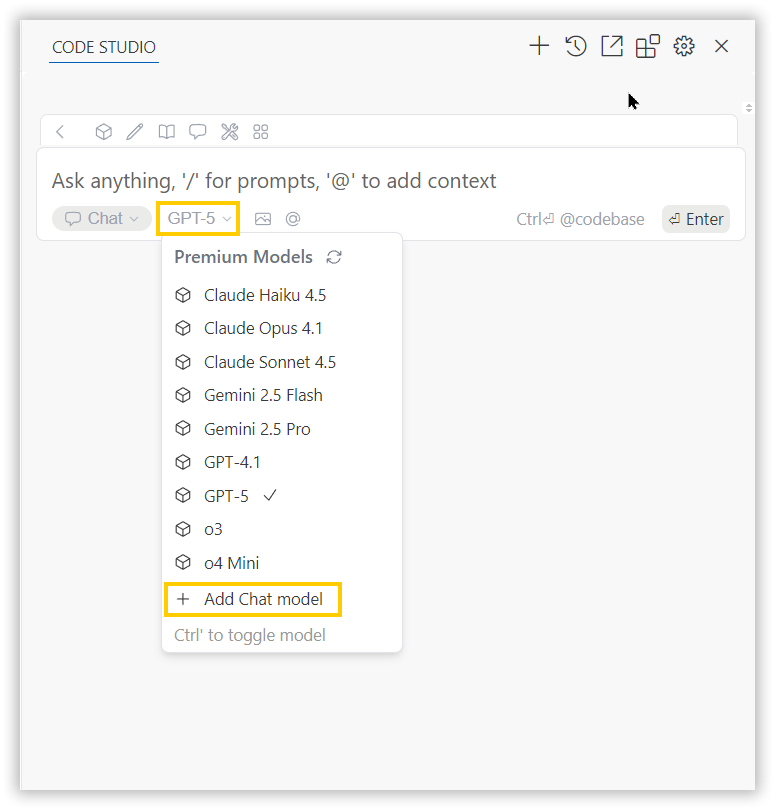
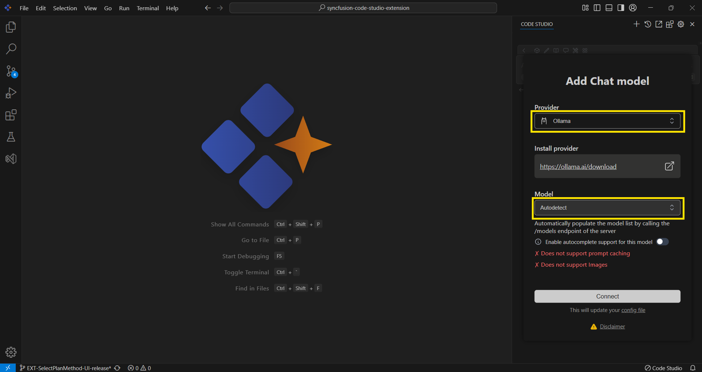
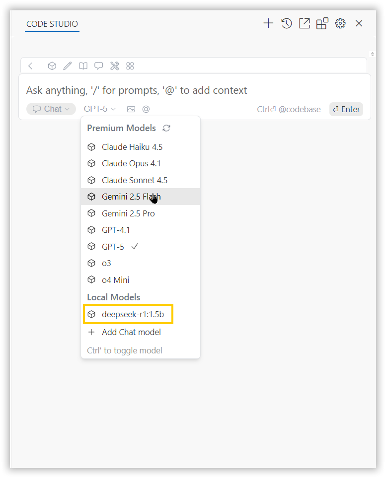
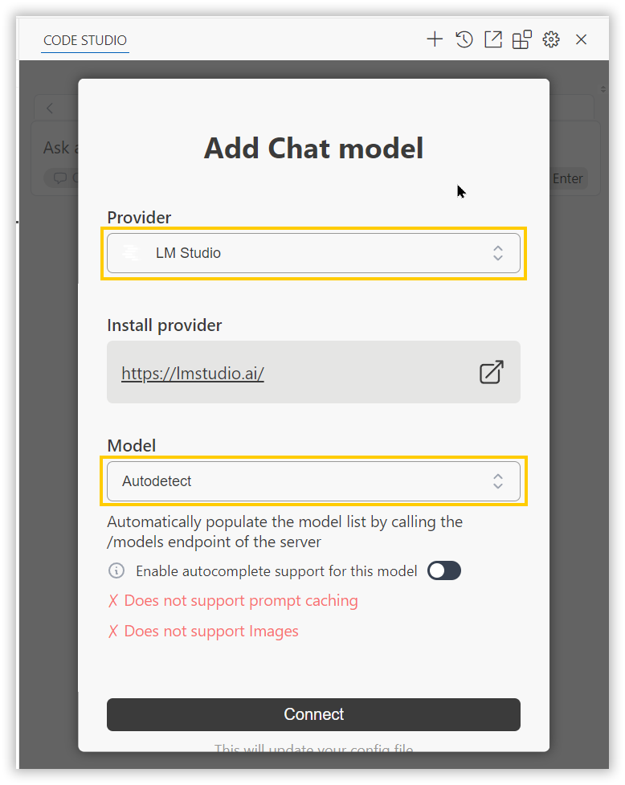
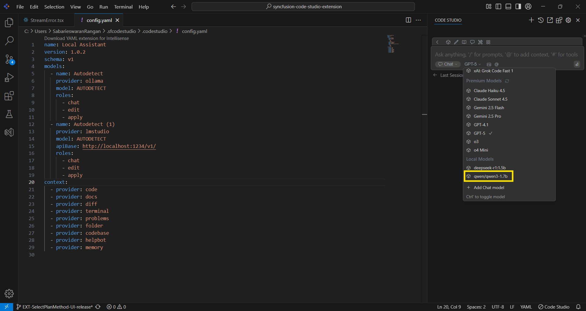

# How to Configure Open-source Models in Code Studio
 
## Purpose
This guide provides step-by-step instructions to configure open-source models within Syncfusion Code Studio. Use this feature to connect your preferred open-source model providers such as Ollama and LM Studio.
 
## When to Use
• When you want free, unlimited usage with no API costs or rate limits – perfect for long coding sessions or agent workflows.

• When you need full privacy – your code or data must never leave your computer (sensitive projects, company policy, or offline work).
 
## Prerequisites
Before starting, ensure you have system requirement to install open-source models.
 
• Refer this documentation for system requirement to install LM Studio [System-Requirements](https://lmstudio.ai/docs/app/system-requirements)

• Refer this documentation for system requirement to install Ollama
  - MacOS - [MacOS](https://docs.ollama.com/macos)
  - Windows - [Windows](https://docs.ollama.com/windows)

• Minimum hardware guidance (approximate):
  - 8–16 GB RAM for small models; 32+ GB recommended for large models.
  - GPU recommended for best performance on large models (check provider docs for GPU requirements).
 
## Download and Install steps
Refer the documentation below to download and install Ollama and LM Studio in your machine.
 
• [Ollama](https://docs.ollama.com/quickstart)

• [LMStudio](https://lmstudio.ai/docs/app/basics)
 
## Quick checklist before configuring
• Provider runtime installed (Ollama or LM Studio).

• At least one model downloaded/installed locally.

• Recommended models – deepseek-r1, qwen 2.5

• Code Studio up-to-date (latest stable release recommended).
 
## Configure Ollama Model in Code studio
• Click the model's section dropdown and click 'Add Chat Model' option.

 
• In the Add Chat Model dialog box choose the provider as ollama and model as autodetect and click connect button.

 

• You can select the installed ollama model in a model list under Local Models category.

 
## Configure LM Studio Model in Code studio
• Click the model's section dropdown and click 'Add Chat Model' option.

 

• In the Add Chat Model dialog box choose the provider as LM Studio and model as autodetect and click connect button.

 
• You can select the installed LM Studio model in a model list under Local Models category.

 
## Troubleshooting (quick steps)
• Model not listed after Connect:
  - Ensure provider runtime is running.
  - Restart Code Studio and/or the provider service.
  
• Model fails to respond or is very slow:
  - Confirm your machine has sufficient RAM/CPU/GPU for the model.
  - Try a smaller model for testing.