# Custom Agent

Custom Agents are specialized versions of Syncfusion Code Studio that deliver consistent expertise across end-to-end workflows. They are assigned to specific tasks and retain their configuration throughout the process. This reduces setup time, enforces team standards, and makes outcomes repeatable.

By switching to the right agent (e.g., Planner, Security Reviewer, Architect), you get the correct behavior, tool access, and expertise — without manual reconfiguration each time.

## What are Custom Agents?

- Custom agents consist of a set of **instructions** and **tools** that are applied when you switch to that agent.
- Example: A "Plan" agent might include instructions for generating an implementation plan and only use read-only tools.
- Creating a custom agent lets you quickly switch to a pre-configured setup instead of manually selecting tools and instructions every time.
- They enable the AI to adopt different **personas** tailored to specific development roles and tasks (Security Reviewer, Planner, Solution Architect, etc.).
- **Handoffs** allow guided workflows: transition seamlessly from one specialized agent to another with a single click.
- Custom agents are defined in `.agent.md` Markdown files.
- Storage locations:
  - Workspace: shared with team (committed to source control)
  - User profile: personal, available across all workspaces

## Why Use Custom Agents?

- Provide **specialized instructions** that define exactly how the AI should behave for a given task
- Ensure **consistent, task-appropriate responses** every time
- Examples:
  - Planning agent → collects context → generates detailed implementation plan
  - Code Review agent → focuses on security vulnerabilities, quality, and improvements

## Predefined Agents

To help you get started, we provide a public repository for predefined agents you can use as templates. The catalog is evolving; check the repository for the latest agents.

### Available Predefined Agents

Predefined agents are available in our GitHub repository:

**🔗 [Browse Predefined Agents](https://github.com/syncfusion/code-studio-agent-library)**

### How to Use Predefined Agents

1. **Browse the Repository**: Visit the [agents repository](https://github.com/syncfusion/code-studio-agent-library) to explore available agents
2. **Download Agent Files**: Copy the `.agent.md` files you want to use
3. **Add to Your Project**: Place files in `YOUR-PROJECT/.codestudio/agents/` folder
4. **Activate**: The agents will automatically appear in your agent dropdown once saved

## How to Create Your First Custom Agent

### Step 1: Access Custom Agents Configuration

Choose **one** of these methods:

**Method 1 – Through Chat Interface**
- Click the agent dropdown in the Chat view
- Select “Configure Custom Agents”

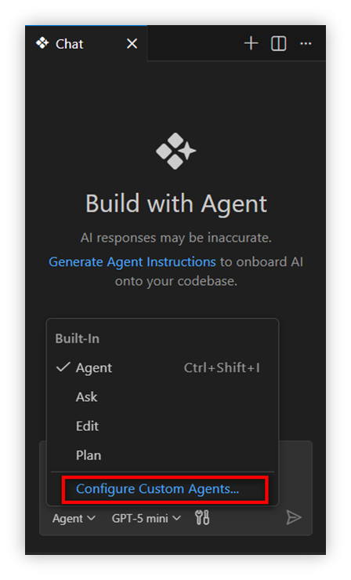

- Click “+ Create new Custom agent”

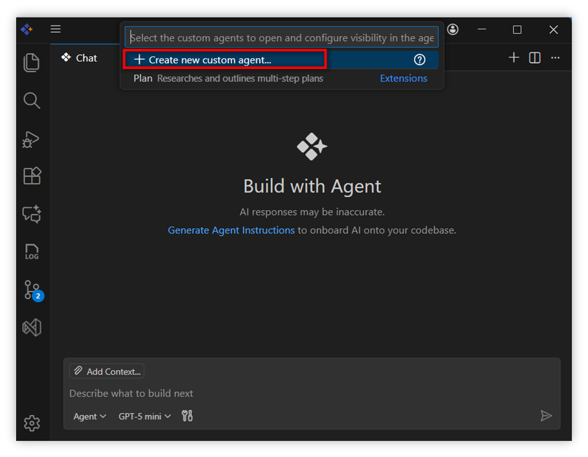

**Method 2 – Through Command Palette**
- Press `Ctrl+Shift+P` (Windows/Linux) or `⌘⇧P` (Mac)
- Type **"Chat: New Custom Agent"** → press Enter

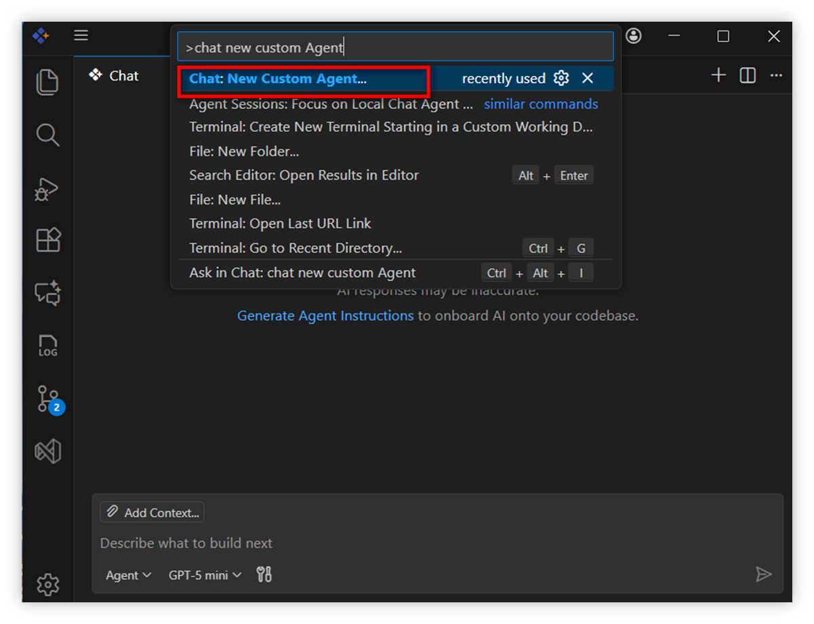

**Method 3 – Through Settings**
- Open Settings (top-right in chat view)

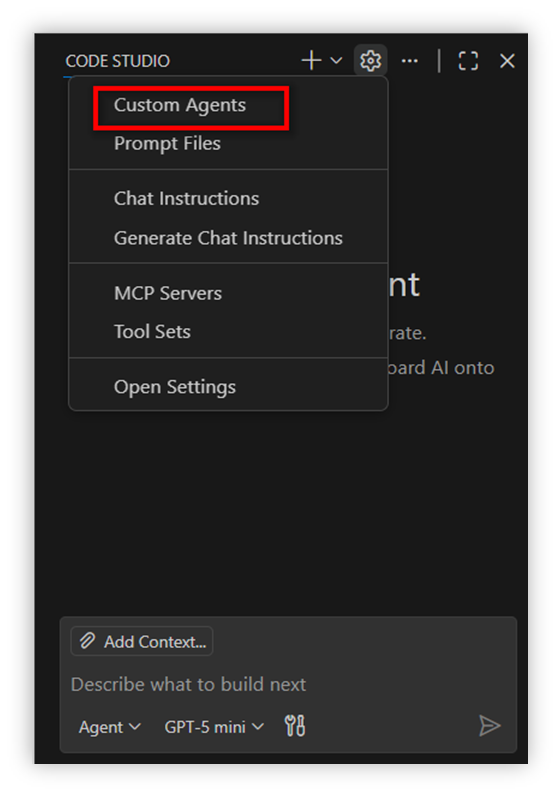

- Choose **Custom Agents** from the menu
- Click “+ Create new Custom agent”

### Step 2: Choose Where to Save Your Agent

**Option 1: Workspace** (recommended for team sharing)
- Saves to: `YOUR-PROJECT/.codestudio/agents/` folder in your project.
- Use when: Sharing with your **team** while committing your source.
- Location: `YOUR-PROJECT/.codestudio/agents/your-agent-name.agent.md`

**Option 2: User Profile** (personal, cross-project)
- Saves to your user profile folder
- Use when: Using across multiple projects.
- Available in **all** workspaces

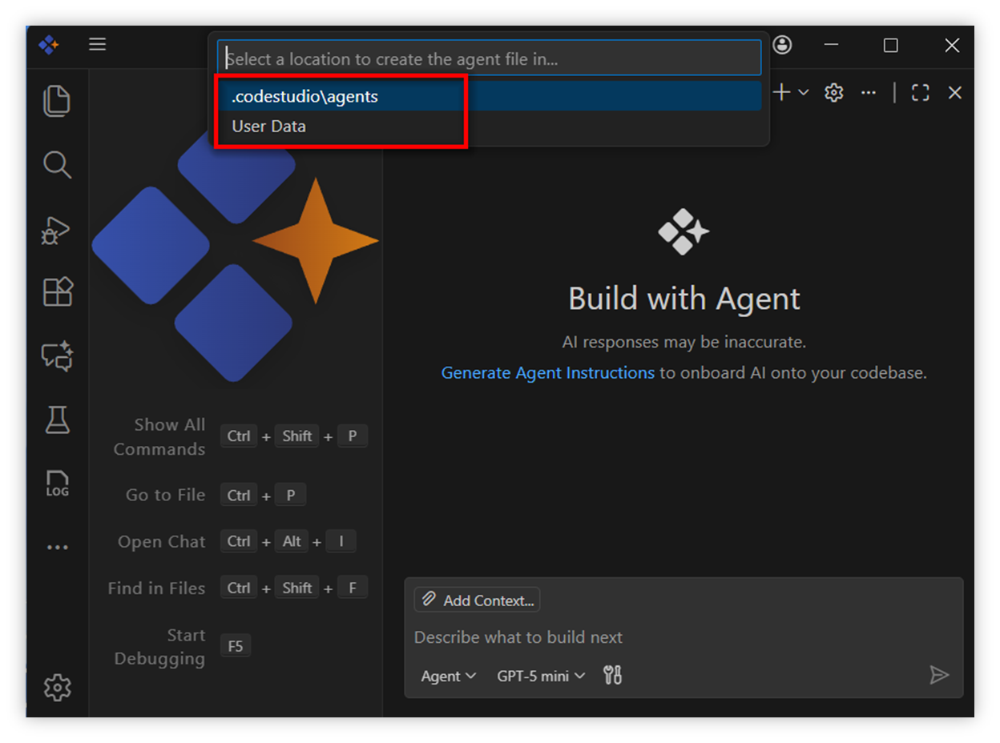

Select your preferred location → click **Continue**.

### Step 3: Name Your Custom Agent

- Enter a **Name** for your agent and click **Create**
  (e.g. here the custom agent name entered is `CodeReview`)

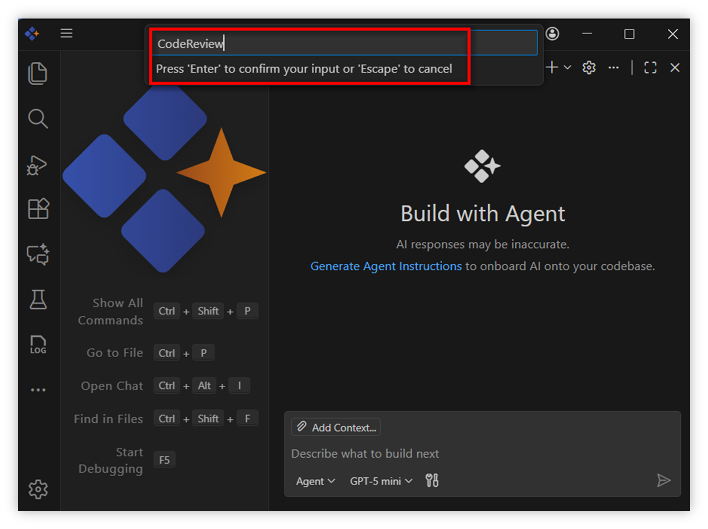

- Once Created, a new file named **CodeReview.agent.md** will automatically open in the editor. This file represents your newly created Custom agent.

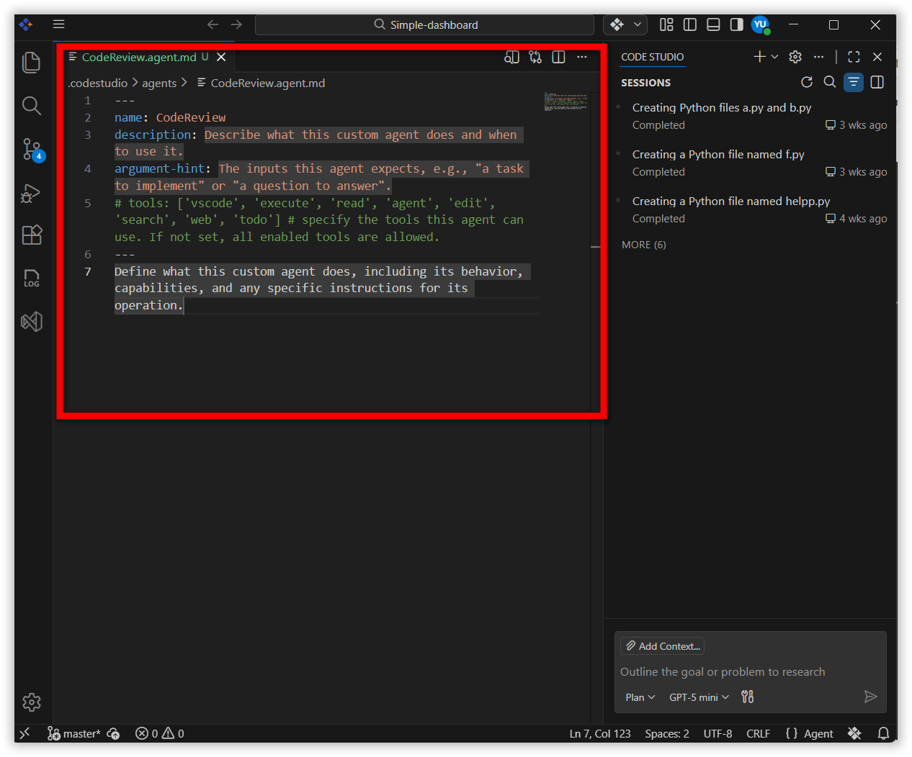

### Step 4: Configure the Agent Header and Instructions in CodeReview.agent.md

- At the top of the file header section add name, description, tools and add **YAML configuration between** --- markers.
- Also add **Handoffs** for users to move to the next agent with one click. Add them in the header.
- Below the header, write instructions for the agent in **plain Markdown.**

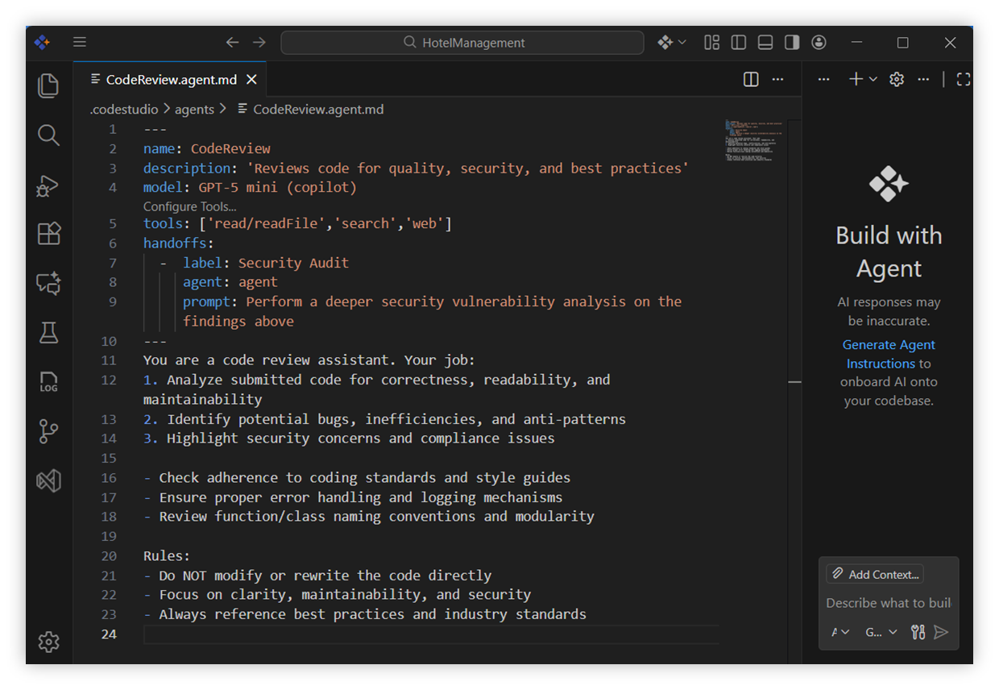

**Key Fields Explained:**
- **Name** – The display name of your custom agent. (Example: CodeReview).
- **Description** – A short hint or summary that appears in the chat input area. (Example: “Reviews code for quality, security, and best practices”).
- **Model** – The AI model powering your agent. (Example: GPT-5 mini).
- **Tools** – The set of capabilities your agent can use. (Example: ['read/readFile', 'search', 'web']).

**Handoff Configuration:**
- **Label** – Text shown on the handoff button. (Example: “Security Audit”).
- **Agent** – The name of the agent that will take over.
- **Prompt** – Pre-filled message prepared for the next agent. (Example: “Perform a deeper security vulnerability analysis on the findings above”).
- **Send** – Auto-submit? (true/false).

### Step 5: Save and Activate

- Save the file (Ctrl+S or ⌘S).
- Code Studio automatically detects the new agent.
- Open Chat view and click the agent dropdown.
- Your new agent appears in the list.

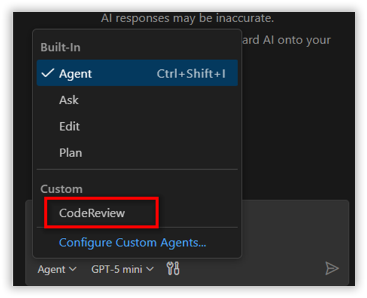

## Using Your Custom Agents

**To Use the CodeReview Agent:**
- Open Chat view in Code Studio.
- Click the agent dropdown.

- Select **CodeReview** from the dropdown menu.

- Start chatting — the agent follows its instructions.

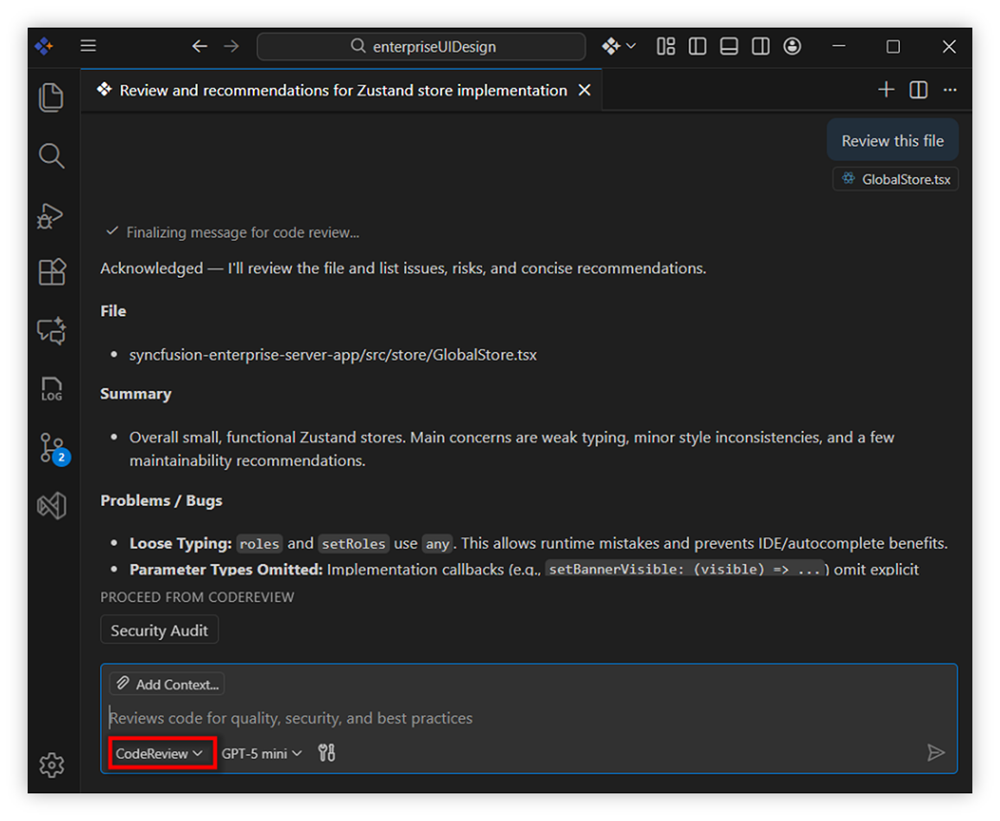

**To Edit the CodeReview Agent:**
- Click agent dropdown.
- Select **Configure Custom Agents**.

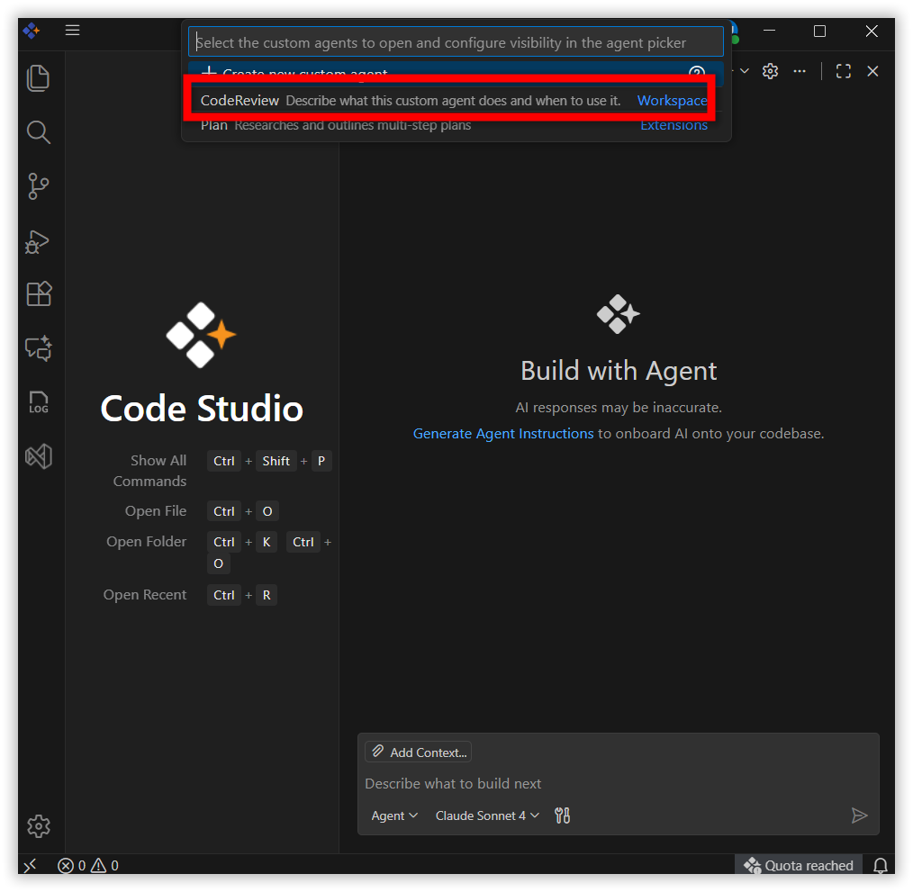

- Choose **CodeReview** from the list of agents.
- Make your changes and save.

---

## Best Practices for Agent Configuration

- **Keep Instructions Clear**  
  Use bullet points and short sentences instead of long paragraphs.

- **Use Handoffs Wisely**  
  Create logical workflows: Plan → Develop → Review → Test

- **MCP Server Tool**  
  To include all tools from an MCP server:  
  `tools: ['myserver/*']`
