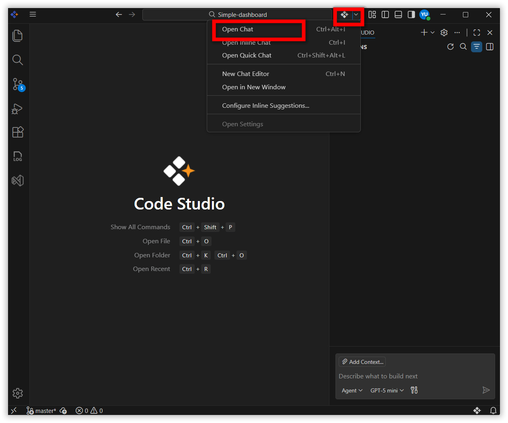
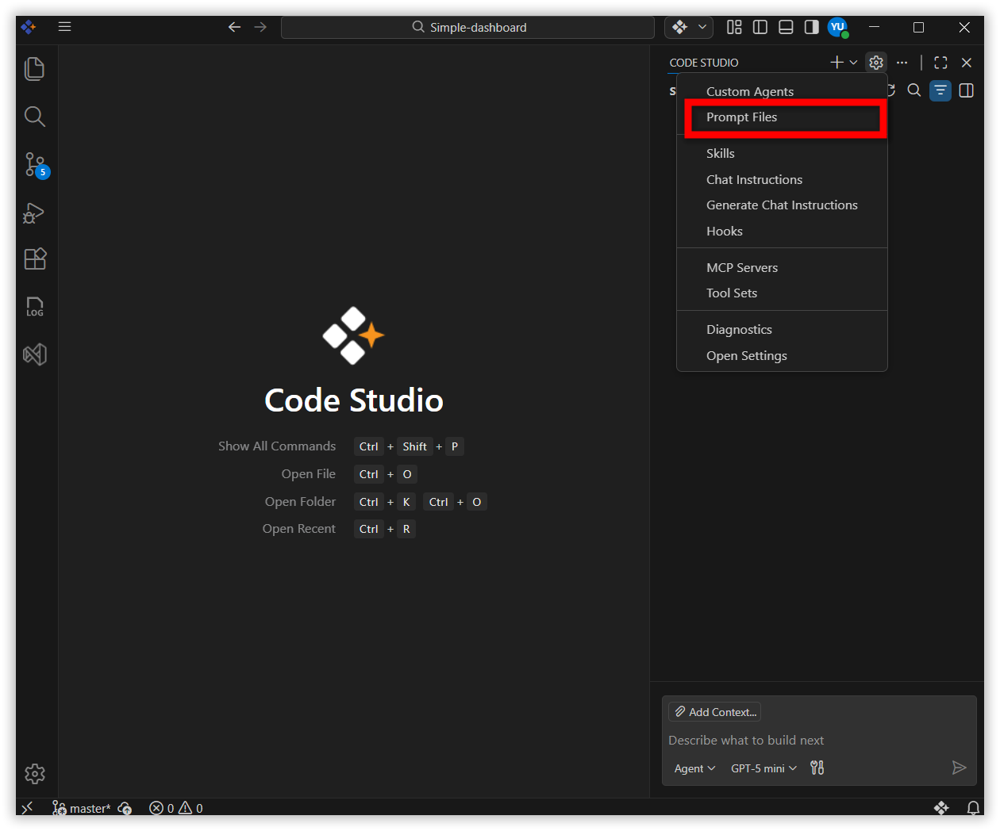
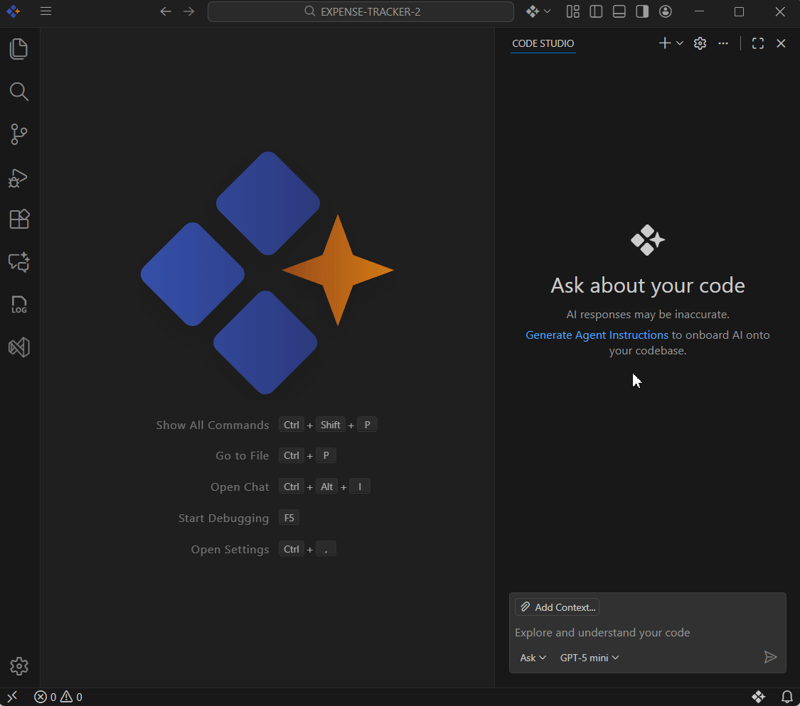

# Custom Prompt Files

## Overview
Prompt Files in Syncfusion Code Studio are reusable AI instructions you can save and run anytime. They act like templates for common tasks such as generating code, reviewing code, or documentation.

Why they matter: Instead of typing the same request again and again, you save it once as a Prompt File.

This makes your workflow faster and ensures consistency.

## Prerequisites
Before creating Prompt Files, make sure you have:

- Syncfusion Code Studio installed and configured (Follow the [Install and Configure](/code-studio/getting-started/install-and-configuration) guide if not yet installed)
- A project or folder opened in your workspace

## When to Use Prompt Files
Prompt Files are helpful when you want to:

- Save time by avoiding repetitive typing
- Standardize prompts for your team (e.g., code reviews, documentation)
- Build a library of reusable workflows

## Steps to Create and Use Prompt Files

### Step 1: Open Chat Window
Open the Code Studio Chat window.


### Step 2: Select Prompt Files
Click the Settings button at the top. In the menu, choose **Prompt Files**.


### Step 3: Create a New Prompt File
Click **New Prompt File**. You’ll see two storage options:

- **ProjectSpecific (.codestudio/prompts)** → stored in the current project folder, usable only in that project
- **Global (User Data)** → stored globally, usable across any project

Creation steps (same for both):
- Choose your storage option.
- Enter a name for your prompt file and click Enter.
- Then in the created prompt file, choose the mode (you can choose which mode to use; default is agent, but you can switch to ask, edit, plan)
- Add guidelines or instructions that AI should follow.


### Step 4: Use Your Prompt File
- Open the Chat window
- Type `/` (slash) in the chat box
- Select the desired prompt file from the list
- Press Enter to run it


## Prompt File Structure
A prompt file has two main parts: **Header (YAML frontmatter)** and **Body (prompt text)**.

### Header (optional)
- **description** — A short description of the prompt.
- **name** — The prompt name shown after typing `/` in chat; if omitted, the file name is used.
- **argument-hint** — Optional hint shown in the chat input to guide users.
- **agent** — Which agent(mode) runs the prompt: ask, edit, plan, agent.
- **model** — The language model to use; if omitted, the currently selected model is used.
- **tools** — A list of tool or tool set names available to the prompt; missing tools are ignored when running.

### Body
The prompt file body contains the prompt text that is sent to the LLM when running the prompt in chat. Provide specific instructions, guidelines, or any other relevant information that you want the AI to follow.

## Prompt File Example
```
---
agent: 'agent'
model: GPT-4o
tools: ['read','edit','web','search/codebase']
description: 'Generate a new React form component'
---
Goal: Make a simple contact form component.

Requirements:
- Fields: Name, Email, Message.
- Show labels, placeholders, and inline errors.
- All fields are required; Email must contain "@".
- Submit button and Reset button.
- On submit, call onSubmit(data) and then clear the form.
- Export the component and its TypeScript types.
- Keep the code short and easy to read. No extra libraries.
```

## Use Cases
- Organize and store prompts for easy reference
- Customize templates to match project needs
- Quickly access saved prompts without retyping

## Tips
- Think of Prompt Files like shortcuts—they save time and reduce repetitive typing
- Experiment with different agents (modes) to see which works best for your task
- Share global prompts with your team to ensure consistency
