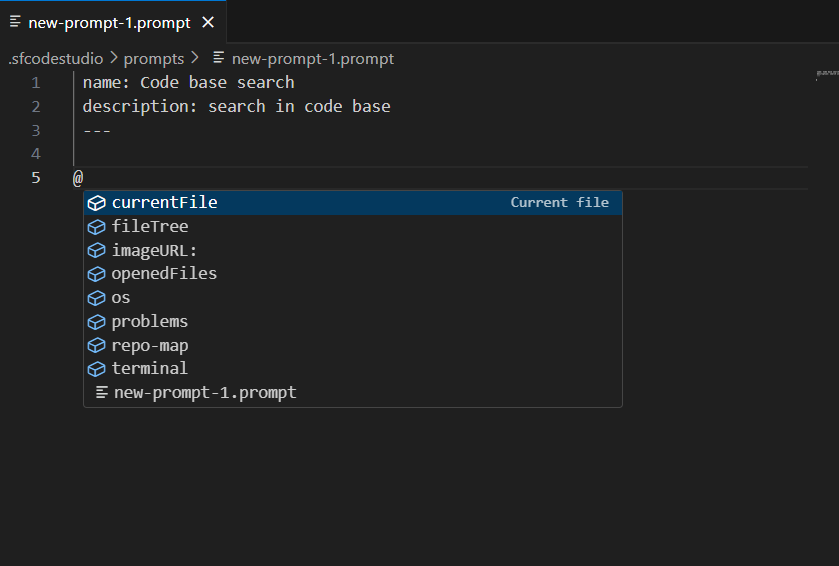

# Custom Prompts

Custom prompts let you encode your team’s coding standards into reusable templates. This delivers consistent, high-quality AI assistance and speeds up routine tasks.

## Purpose

The primary purpose of custom prompts is to streamline and standardize development workflows by:

- **Enforcing Best Practices**: Ensure generated code adheres to team conventions.
- **Improving Consistency**: Standardize how common tasks are performed.
- **Accelerating Development**: Automate repetitive coding tasks with predefined templates.
 

## Prompt File Structure 

<table border="1" cellpadding="8" cellspacing="0">
  <thead>
    <tr>
      <th>Field</th>
      <th>Description</th>
    </tr>
  </thead>
  <tbody>
    <tr>
      <td><strong>name</strong></td>
      <td>Unique identifier</td>
    </tr>
    <tr>
      <td><strong>description</strong></td>
      <td>Short summary of intent</td>
    </tr>
    <tr>
      <td><strong>prompt</strong></td>
      <td>Literal instructions (role, tasks, output format)</td>
    </tr>
  </tbody>
</table>

## How to use Prompt Files 
 
1. Click the “Add Prompt” button, Code Studio will automatically generate your new prompt file under the `sfcodestudio/prompts/` directory. 
2. In Code Studio chat, type `/` and pick your prompt.   
3. Run the prompt and review suggestions.  
4. Apply accepted changes via IDE refactoring tools.  


## Example Prompt

```yaml
name: GenerateTestCases
description: Generate test cases for the current application
prompt:
    1. Identify key functionalities to test based on user stories and requirements
    2. Use best practices and test design techniques for each test case
    3. Write testable code for each test case using popular testing frameworks
    4. Verify the return values and edge cases for each test case
    5. Document test cases and set test coverage for each functionality
  ```

## Using Context with @ Syntax

While editing a prompt file, you can enhance its context by using the @ symbol to reference specific resources. This allows the AI to incorporate relevant information from your workspace. Available options include:

**@currentFile:** References the currently open file.

**@imageURL:** Includes an uploaded image for analysis.

**@openedFiles:** Refers to open files in the editor.

**@os:** Provides operating system-specific context.

**@problems:** Accesses error or warning details from the workspace.

**@repo-map:** Includes a map of the repository structure.

**@terminal:** Incorporates terminal output or commands.

**@fileTree:** Displays the project file tree.



