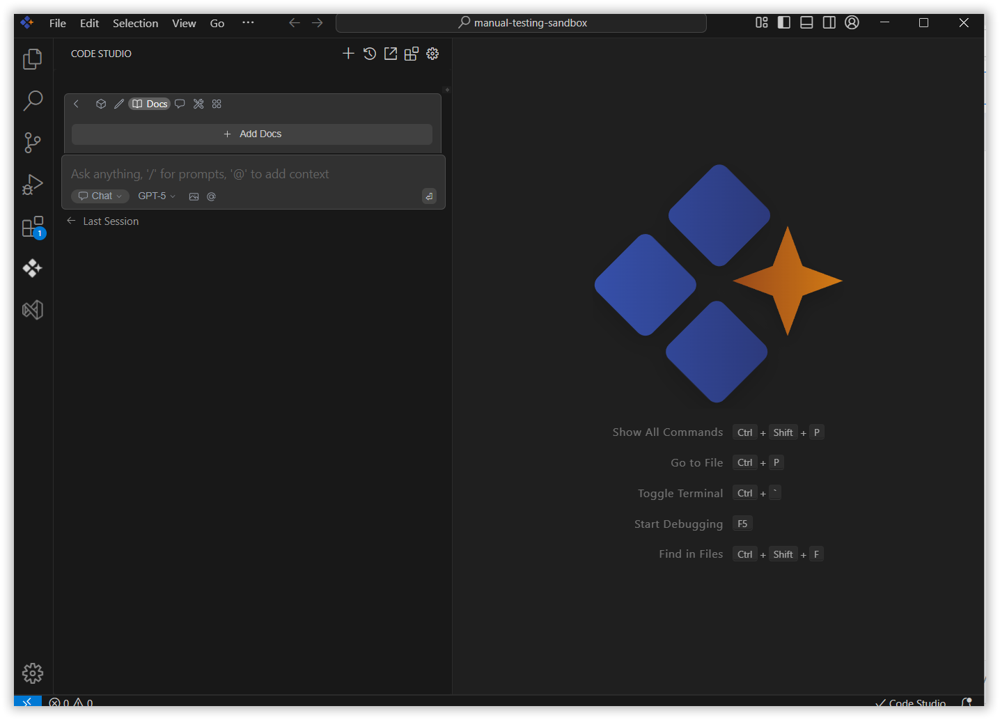
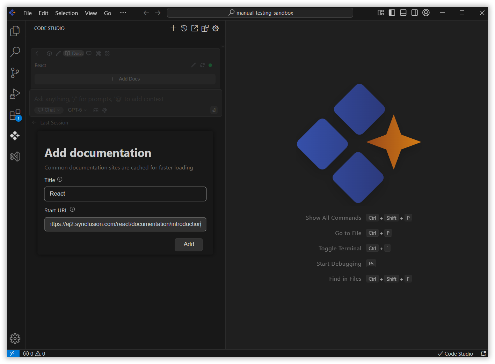
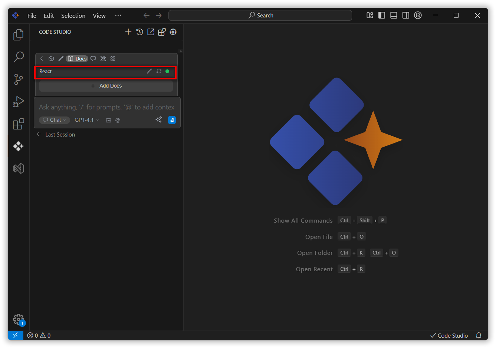

# Docs
The "Docs" section in Code Studio allows you to integrate documents directly into the environment. This means Code Studio can access and utilize these documents at any time, enhancing its ability to provide relevant assistance based on your specific information.

## Purpose
By adding your specific documentation, you can provide Code Studio with custom context relevant to your projects and workflows. All added documents are listed for easy management and direct use.
Keeping your essential resources within Code Studio, reducing the need to switch between applications.

## How to Add Documents

### 1. Navigate to the "Docs" Section
In Code Studio, locate and click on the "Docs" section.

### 2. Initiate Document Addition
Within the "Docs" section, you will find an option labeled "Add Docs". Click on this button.

### 3. Enter Document Details
A new window will appear. Give the title and url for the document.

**Title:** Enter a descriptive title for your document. This title will help you easily identify the document in the list.

**URL:** Provide the URL to your document.

### 4. Confirm Addition
Click on the "Add" button to finalize the process. Your document will now be integrated into Code Studio.

## Managing Your Added Documents
Once documents are added, they will be listed in the "Docs" section.

### Editing Document Details
To modify the title or URL of an existing document,
Click on the "Edit" option next to the desired document in the list.
This action will open the configuration file.
You can then edit the name and URL directly within the config page.

**Note:** To access the added documents refer the steps in this [page](/code-studio/features/context-providers/Docs.md).