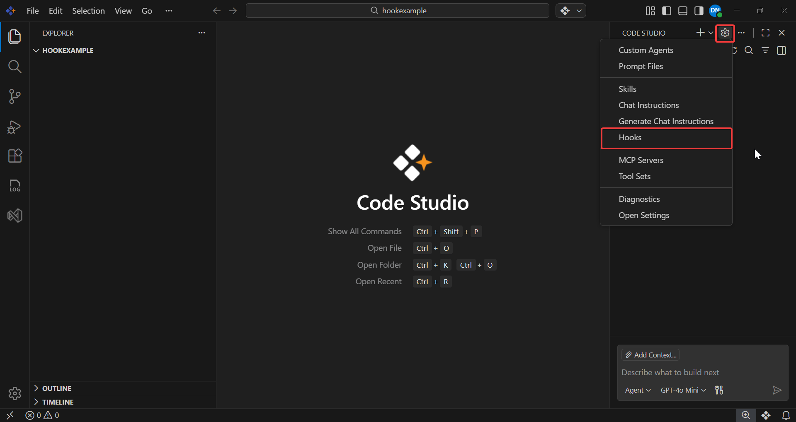
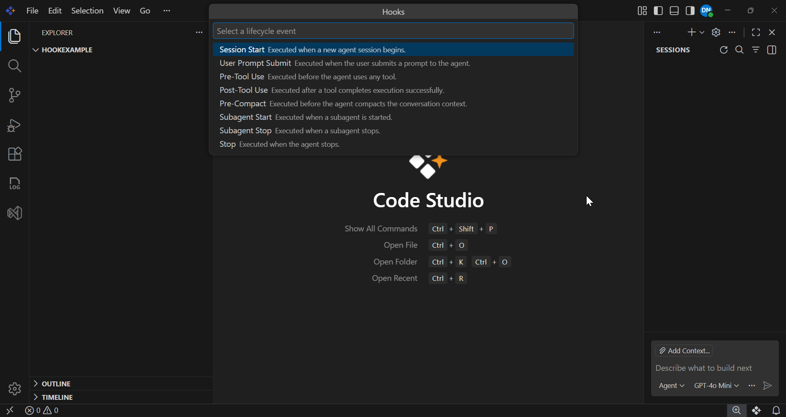
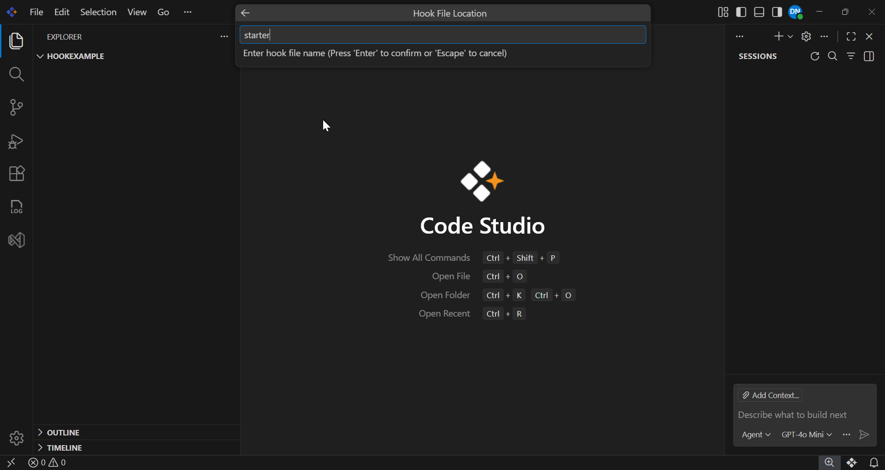
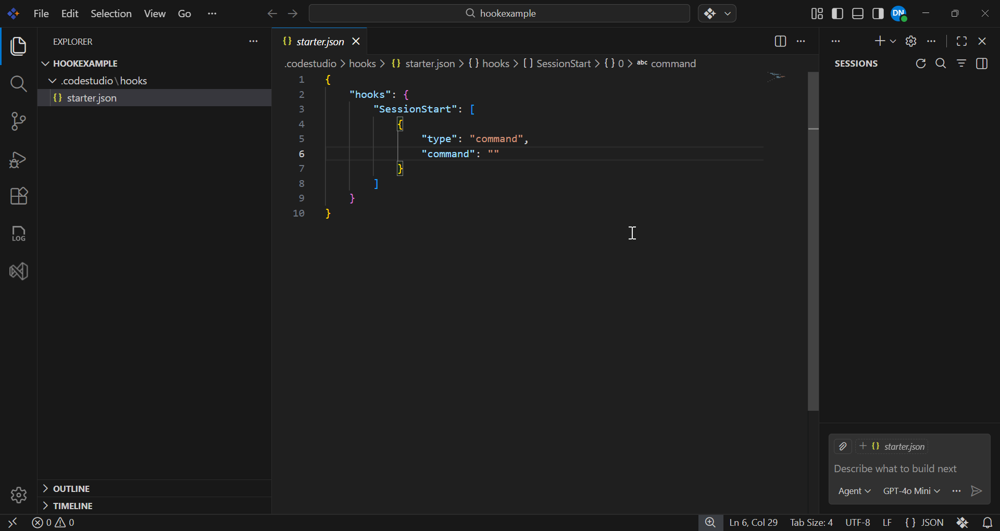
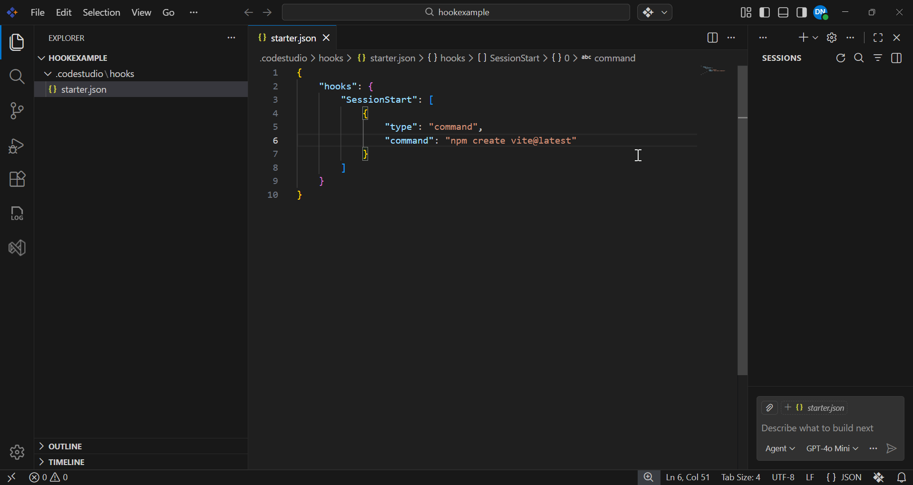
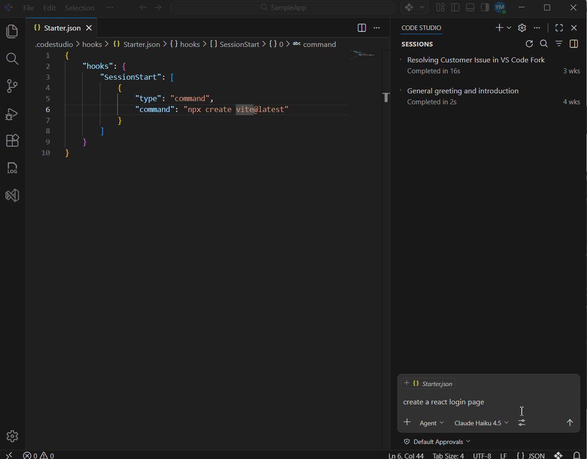

# Hooks

## Overview

Hooks let you run custom shell commands at specific lifecycle points during an agent session in Syncfusion Code Studio. Use hooks to automate repetitive tasks, enforce security policies, validate tool usage, and integrate external systems into AI-assisted workflows.

Unlike instructions or prompts, hooks execute deterministically. They run at defined events, receive structured JSON input, and can return JSON output that influences how the session continues.

Hooks are useful when you need to:

- Block unsafe tool calls before they run.
- Run formatters, linters, or validators after file edits.
- Audit prompts, tool usage, or agent sessions.
- Inject additional context into the agent or subagent.
- Enforce approval workflows for sensitive operations.

> **Important:** Hooks run locally with the same permissions as your Code Studio session. Review every hook command and script carefully before enabling it.

> **Note:** Hook behavior and UI can vary slightly by product version or organization policy.

## Prerequisites

Before you configure hooks, make sure that:

1. You have Syncfusion Code Studio installed and a workspace is open.
2. You have write access to the workspace.
3. Agent mode and tool usage are available in your environment.
5. familiar with the shell used on your operating system:
	 - Windows: PowerShell (`.ps1`)
	 - macOS/Linux: Bash or another POSIX-compatible shell (`.sh`)

## How Hooks Work

At runtime, Code Studio:

1. Detects a lifecycle event such as `PreToolUse` or `PostToolUse`.
2. Reads the matching hook configuration from your project configuration.
3. Executes the configured shell command.
4. Sends structured JSON input to the command through standard input (`stdin`).
5. Reads optional JSON output from standard output (`stdout`).
6. Continues, blocks, or modifies behavior based on the hook response.

## Hook LifeCycle Events

Code Studio supports the following hook lifecycle events. Event names are case-sensitive and must use the exact PascalCase values shown below.

### SessionStart

**Triggers:** When the first prompt of a new agent session is submitted.

**Purpose:** Initialize resources and context at the beginning of a session.

**Common use cases:**

- Set up logging or monitoring for the entire session
- Capture session metadata such as user, timestamp, or project details
- Inject project-specific context that the agent should reference throughout the conversation
- Initialize external resources or establish connections
- Load team-specific guidelines or constraints

### UserPromptSubmit

**Triggers:** Every time the user submits a prompt, before the agent processes it.

**Purpose:** Intercept and optionally modify user input before processing.

**Common use cases:**

- Audit what users are requesting
- Sanitize sensitive information from prompts
- Append additional context to user requests automatically
- Enforce organizational prompt policies or guidelines
- Track user intent for analytics

### PreToolUse

**Triggers:** Immediately before the agent invokes any tool (such as file edits, terminal commands, or searches).

**Purpose:** Act as a security gate to control tool execution before it happens.

**Common use cases:**

- Block dangerous operations such as file deletions in protected directories
- Modify tool input by adding flags or parameters
- Require manual approval for sensitive operations
- Log tool usage for compliance and auditing
- Enforce security policies on tool parameters

> **Important:** This hook can return `hookSpecificOutput.permissionDecision` with a value of `"deny"` to prevent the tool from executing.

### PostToolUse

**Triggers:** After a tool completes successfully.

**Purpose:** Automate follow-up actions and validation after tools execute.

**Common use cases:**

- Run code formatters after file edits
- Execute linters to verify code quality
- Log tool outcomes and results
- Perform follow-up validation checks
- Trigger related automation such as running tests after code changes

### PreCompact

**Triggers:** Before conversation context is compacted to reduce memory usage when the conversation grows too long.

**Purpose:** Preserve important information before it is removed from active context.

**Common use cases:**

- Export the full conversation history to a file
- Persist important decisions or key context
- Save session state for later retrieval
- Generate interim progress reports
- Archive context that may be needed later

### SubagentStart

**Triggers:** When the agent spawns a subagent to handle a complex, multi-step task.

**Purpose:** Control and configure nested agent sessions before they begin work.

**Common use cases:**

- Track when and why subagents are used
- Inject specific instructions or constraints for the subagent's task
- Log subagent task assignments for monitoring
- Apply different policies or resource limits for subagents
- Provide task-specific context

### SubagentStop

**Triggers:** When a subagent completes its work and returns control to the parent agent.

**Purpose:** Process, validate, and optionally modify subagent results before they are used.

**Common use cases:**

- Aggregate results from multiple subagents
- Validate subagent output meets quality standards
- Clean up resources the subagent allocated
- Log completion metrics and performance data
- Decide whether to accept or reject the subagent's work

### Stop

**Triggers:** When the agent session is about to end.

**Purpose:** Perform final validation and cleanup before session termination.

**Common use cases:**

- Run final validation checks across all changes
- Generate comprehensive session reports
- Prevent premature session completion if work is incomplete
- Save session summaries and outcomes
- Clean up temporary resources
- Ensure all changes are saved and committed

> **Note:** The hook can return `"block"` to prevent the session from stopping if critical work remains incomplete.

## Configure Hooks

1. **Click** the Settings icon in the Chat window and **Select** **Hooks**.

3. **Choose** the hook lifecycle event you want to configure for example we using SessionStart.

4. **Enter** a descriptive hook name and press Enter.

5. **Edit** the generated configuration.

6. **Run** a test prompt to verify the hook is active.

## Verification

After you configure hooks, verify them with a simple test flow.

1. **Save** the configuration file and any referenced scripts.
2. **Open** Chat and start a new session.
3. **Trigger** the event you configured:
	 - For `PreToolUse`, ask the agent to read or modify a file.
	 - For `PostToolUse`, ask the agent to edit a file.
	 - For `SessionStart`, begin a new chat session.
4. **Confirm** that the expected behavior occurs:
	 - The action is allowed, denied, or modified as intended.
	 - The user sees any expected message.
	 - Any follow-up automation runs successfully.

### Verification checklist

- The hook event name is spelled exactly as documented.
- The command path points to a real script file.
- The script runs successfully from the workspace.
- The hook returns valid JSON when it needs to influence behavior.
- The configured timeout is long enough for the script to finish.

## Troubleshooting

| Issue | Likely cause | Resolution |
|---|---|---|
| Hook does not run | Incorrect event name, file path, or configuration placement | Verify `.codestudio/config.json`, event names, and referenced script paths |
| Hook script fails on Windows | PowerShell execution policy or incorrect script path | Use `powershell -ExecutionPolicy Bypass -File <script>` and confirm the path exists |
| Hook times out | Script takes longer than allowed | Increase `timeout` or optimize the script |
| Hook output is ignored | Invalid JSON on `stdout` or wrong output shape | Validate JSON output and confirm event-specific fields are correct |
| Tool is not blocked as expected | `permissionDecision` not returned correctly | Return `hookSpecificOutput.permissionDecision` with `deny` for `PreToolUse` |
| Session keeps running | `Stop` or `SubagentStop` hook keeps returning `block` | Check `stop_hook_active` before blocking again |

> **Tip:** When troubleshooting, first run the referenced command manually from the workspace to confirm the script itself works before debugging hook behavior.

## Security and Best Practices

- Store hook scripts in source control when they are part of your team workflow.
- Keep hook logic focused and fast; avoid slow network calls unless necessary.
- Validate all incoming JSON fields before using them in scripts.
- Never hardcode secrets in hook scripts or configuration files.
- Use environment variables through the `env` property for non-sensitive runtime values.
- Prefer `PreToolUse` for security controls and `PostToolUse` for automation.
- Use descriptive hook names so the purpose is obvious during maintenance.

> **Warning:** If the agent can edit the hook scripts that it later executes, treat those changes as sensitive and review them before approving execution.

## Related Topics

- [Custom Instructions](/code-studio/reference/configure-properties/custom-instructions)
- [Tools Support](/code-studio/reference/configure-properties/toolssupport)
- [Enhancing Security Reviews and Code Quality with Automated Hooks in Code Studio](/code-studio/tutorials/enhance-security-with-hooks)
- [Custom Agents](/code-studio/reference/configure-properties/custom-agents)