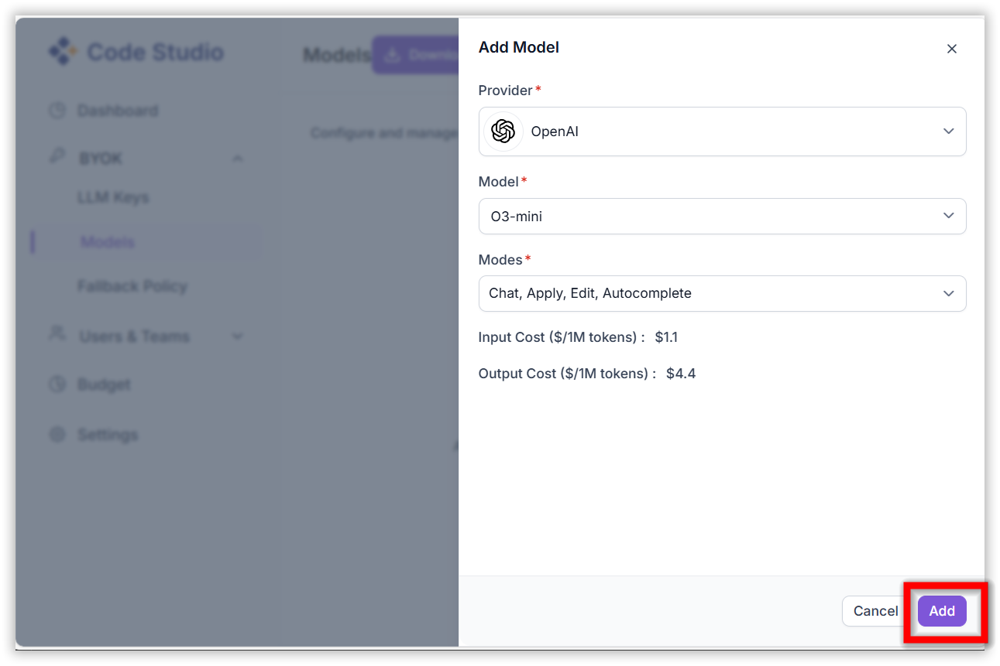

# How to add local models and BYOK models

## Local Models:
Click the model's section dropdown and click 'Add Chat Model' option.

In the Add Chat Model dialog box choose the provider and model you want to use and add the API key of that particular provider and click connect button.

you can see the added model appear in local model category in model's section

## BYOK models: 
Navigate to Code Studio dashboard website by clicking the dashboard button in the profile icon.

In the dashboard website navigate to BYOK/LLM keys section and add the LLM key by clicking 'Add LLM key' button

After adding the LLM key navigate to the BYOK/Models section and add the model by clicking 'Add Model' button

After adding the model, the added model will appear in Code Studio models section under BYOK models category.

