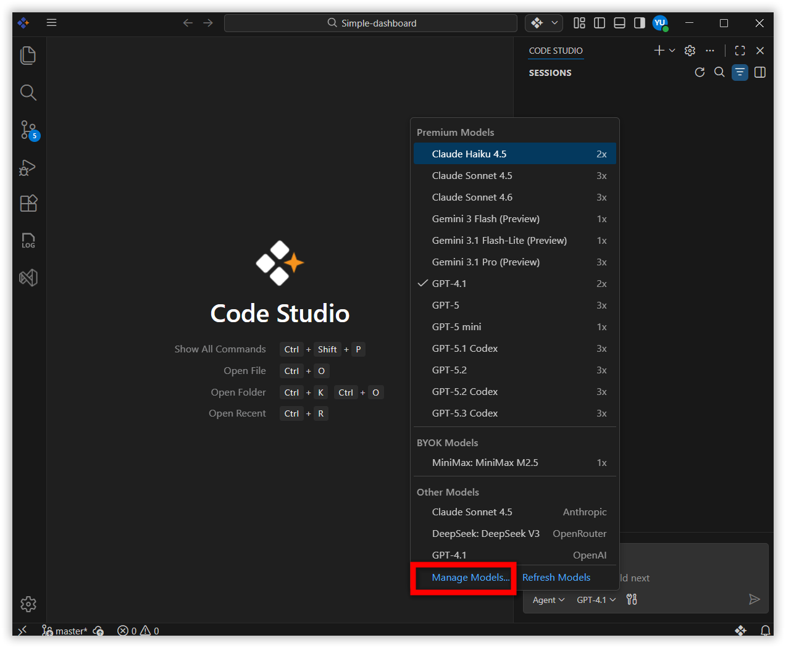
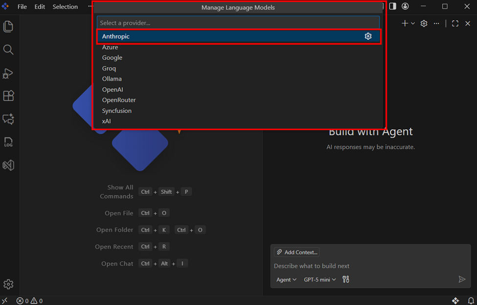
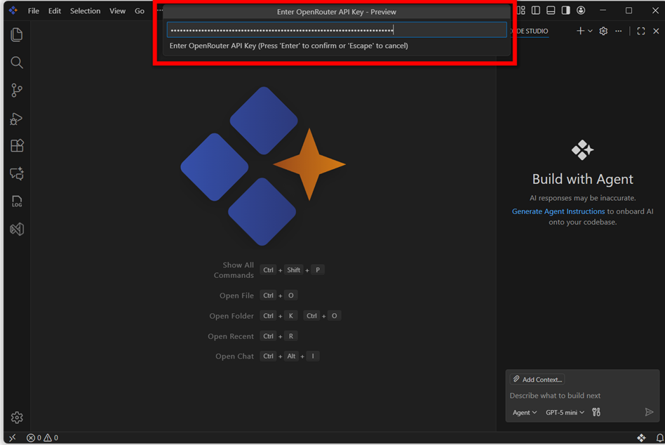
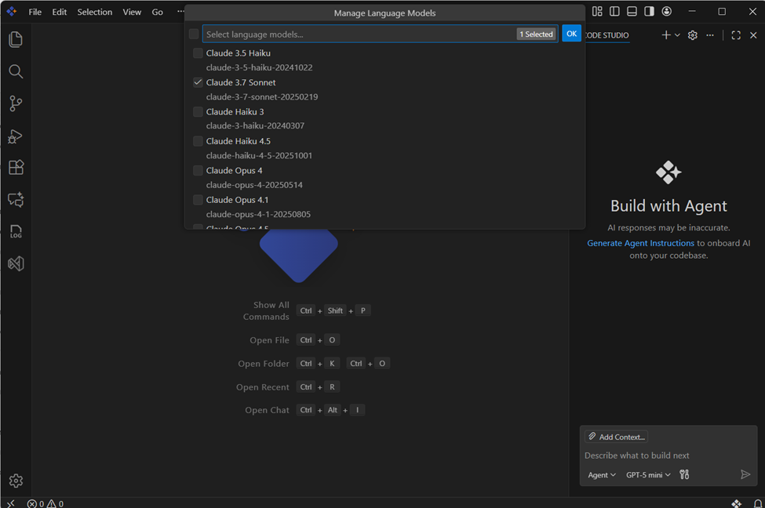
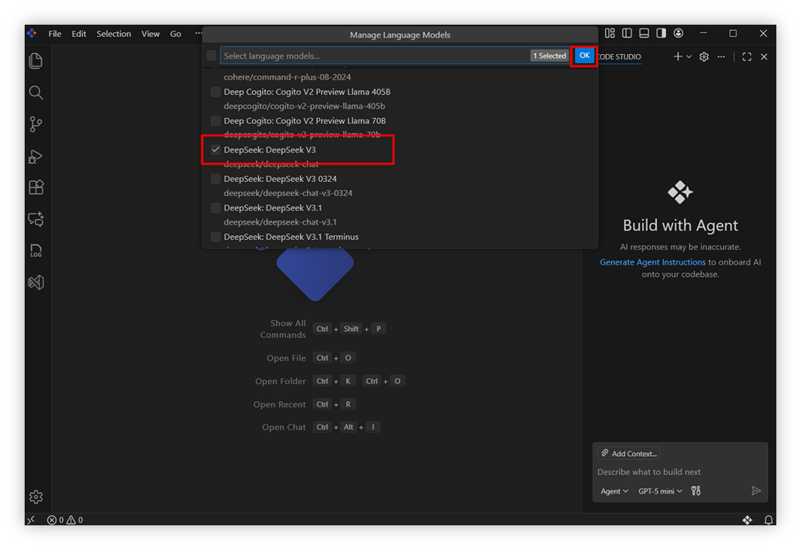
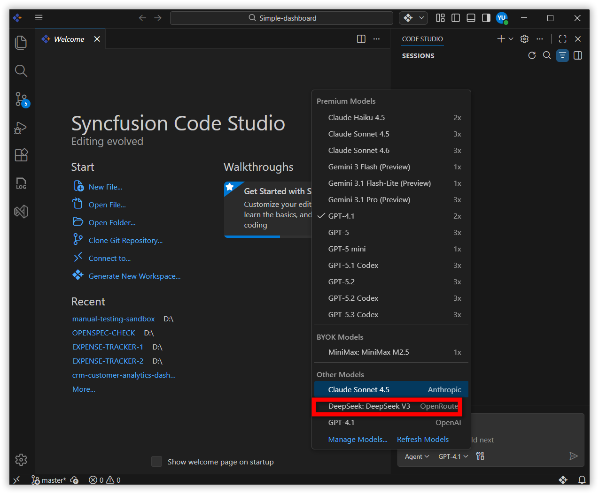

# Add Models for Personal Use

A model is the underlying AI engine responsible for producing text, code, or explanations. Since every model is built and trained differently, the results you get will depend on the model you select.

## Why Personal Models?

The **“Add Personal Model”** feature allows you to use required AI model providers and API keys inside Code Studio instead of relying only on organization‑configured models. This gives you more flexibility and control over your AI experience.

You can:

- Experiment with different model providers  
- Use higher‑capability models for personal tasks  
- Choose a model that suits your coding style  
- Avoid affecting your team’s shared configuration  

## Key Benefits

- **Full Flexibility** -  Use the models you prefer, including newer or more advanced ones not configured by your organization.  
- **Independent Workspace**  - Add, switch, or remove personal models anytime without altering organization settings.  
- **Improved Experimentation** -  Test various models for performance, accuracy, or creativity to find the best fit for your tasks.  

## How to Add a Personal Model ?

**Step 1:**   Click the model’s section dropdown and select **Manage Models**.

**Step 2:**  Choose your preferred **Provider** (e.g., OpenAI, Anthropic).

**Step 3:**  Enter your **API Key** for the selected provider.  

> **Note:** Ensure the API key is valid and correct.

**Step 4:**  After adding the key, available models will be listed. Choose the models you want from the list.

**Step 5:**  Click **OK** to add the selected model(s).

**Step 6:**  The added models appear under **Other Models**, and you can use them like any built‑in or organization‑configured model.

## How to Remove an Added Personal Model ?

Removing a model unregisters it from your available AI models and deletes its saved configuration. It will no longer appear unless you add it again.

**Step 1:**  Open **Manage Models** from the model’s dropdown section.

**Step 2:**  Select the provider (e.g., OpenAI, Anthropic).

**Step 3:**  Uncheck the model you want to remove and click **OK**.

## Best Practices

- **Use separate API keys** for personal and organizational work to avoid mixing usage.  
- **Choose lightweight models** for small or quick tasks; use heavy models only when necessary to manage costs.  
- **Keep keys secure**—never share or commit API keys in your repository.  
- **Test on small tasks first** to understand behavior, speed, and accuracy.  
- **Remove unused models** periodically to keep your workspace clean and organized.
