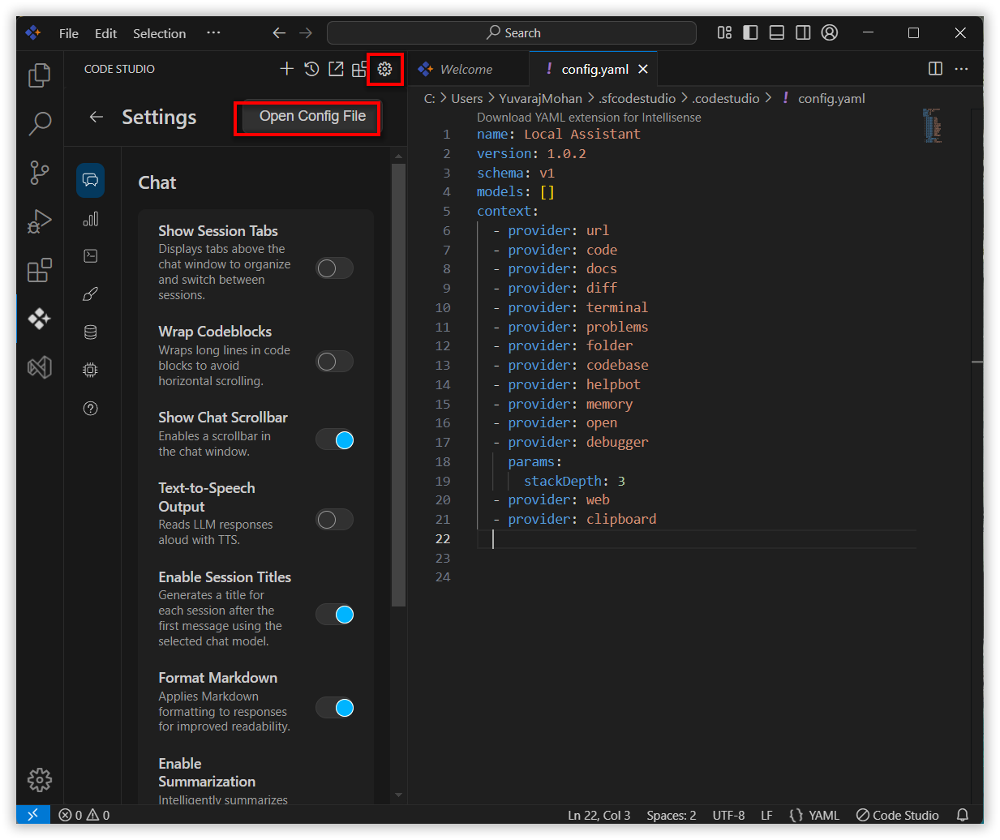
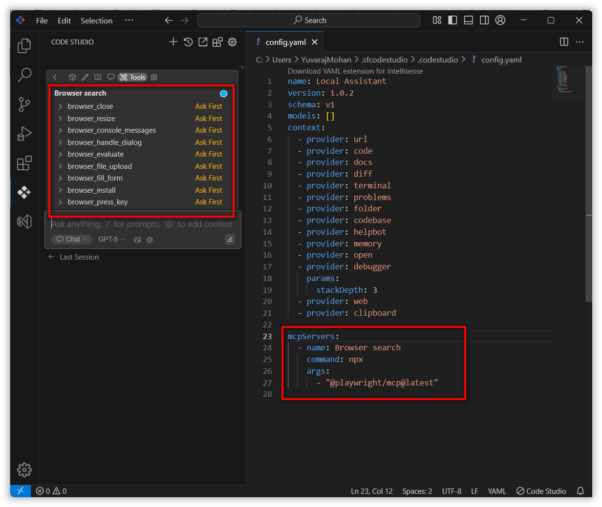

# Model Context Protocol (MCP) Configuration Guide

## Purpose
The Model Context Protocol (MCP) enables the AI in Syncfusion Code Studio to securely connect to external data sources, tools, and environments. This extends the model beyond its fixed training data, allowing real-time information access and specialized actions through a standardized, permissioned interface for more dynamic and reliable assistance.

## When to Use
- You want Code Studio to connect the assistant to external tools/data via Model Context Protocol (MCP). 
- You need to pass environment variables and secrets safely to MCP servers at launch.


## Prerequisites
- Syncfusion Code Studio installed.
- MCP configuration entry with necessary arguments and environment variables if needed


## Steps 
### 1.Accessing the Config File
- The Config file can be accessed by clicking the gear icon located in the header of the Code Studio, then selecting the Settings tab.
- Click on the Open Config File button.
- This will open the config.yaml file in the editor, where you can manually add or modify MCP server configurations.



### 2.Adding MCP Server Configuration 

- In config.yaml file add the MCP entry that you want to connect.

**MCP Server Properties**

Below are the properties you can configure for an MCP server:

- **name**: A display name for the MCP server, used for identification.
- **type**: Specifies the type of MCP server. Supported types include:
  - `sse` (Server-Sent Events)
  - `stdio` (Standard Input/Output)
  - `streamable-http` (Streamable HTTP)
- **command**: The command to execute to start the MCP server.
- **args**: A list of arguments to pass to the command.
- **env**: Secrets or environment variables to be injected into the command for secure execution.

Below is an example of a local MCP server configuration in a yaml file:

```yaml

mcpServers:
  - name: Browser search
    command: npx
    args:
      - "@playwright/mcp@latest"
```

Once configured, the added MCP's tools will be available in the tools list.



## Validation
- Save config.yaml, restart the session, then open Chat and check that the new tool(s) appear in tools section.

## Troubleshooting
- **Tools don’t appear**: check YAML indentation and keys (name, type, command) in config.yaml file, save the file, and reload the window. 
