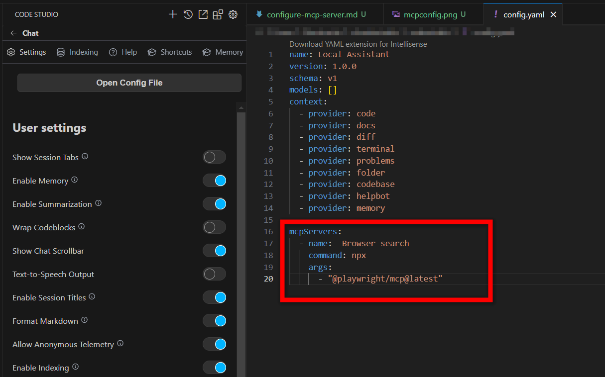
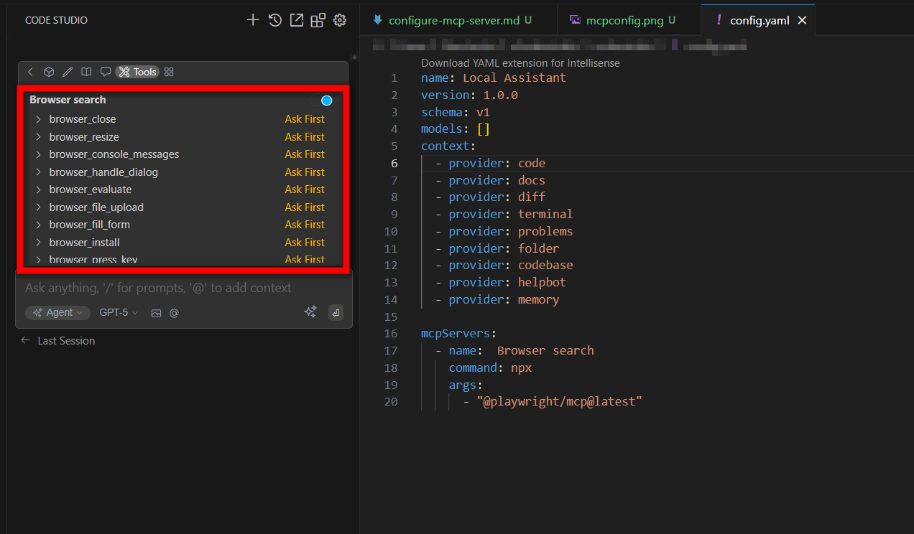

# Model Context Protocol (MCP) Configuration Guide

As AI systems evolve, they are often constrained by their dependence on fixed training datasets, which limits their ability to access real-time data or utilize specialized tools. **The Model Context Protocol (MCP)** overcomes these challenges by facilitating seamless connections between AI models and external data sources, tools, and environments, enabling dynamic and enhanced functionality.

## How to Configure MCP Servers through config.yaml

You can set up an MCP server by either downloading it from the [Marketplace](/code-studio/reference/configure-properties/mcp/marketplace) or adding a local MCP server block to your configuration file.

## Accessing the Config Page

The Config page can be accessed by clicking the gear icon located in the header of the Code Studio, then selecting the Settings tab.


## Open Config file

1. Click on the Open Config File button.

2. This will open the `config.yaml` file in the editor, where you can manually add or modify MCP server configurations.

3. Below is an example of a local MCP server configuration in a `yaml` file:

```yaml

mcpServers:
  - name: Browser search
    command: npx
    args:
      - "@playwright/mcp@latest"
```


## MCP Server Properties

Below are the properties you can configure for an MCP server:

- **name**: A display name for the MCP server, used for identification.
- **type**: Specifies the type of MCP server. Supported types include:
  - `sse` (Server-Sent Events)
  - `stdio` (Standard Input/Output)
  - `streamable-http` (Streamable HTTP)
- **command**: The command to execute to start the MCP server.
- **args**: A list of arguments to pass to the command.
- **env**: Secrets or environment variables to be injected into the command for secure execution.

Once configured, the Playwright tools will be available in the tools list.



