# Custom MCP Server

## Purpose

[Model Context Protocol (MCP)](https://modelcontextprotocol.io/docs/getting-started/intro) is an open standard that enables AI models to interact with external tools and services through a unified interface. In Code Studio, MCP servers extend your workspace by integrating with external APIs.

**Custom MCP Servers** let you add and manage MCP servers in Code Studio.

You can add a custom MCP server using one of these connection types, based on how the server is hosted and delivered:

- **Command (stdio)**: Runs a local executable/script that communicates over stdio.
- **HTTP**: Connects to a remote MCP server endpoint using a URL.
- **NPM package**: Installs and runs an MCP server published as an npm package.
- **Pip package**: Installs and runs an MCP server published as a Python package.
- **Docker image**: Runs an MCP server from a container image.

## When to use

Use a Custom MCP Server to integrate external tools or services into Code Studio. Choose this option whenever an MCP server exists for the tool or service you want to connect.

## Prerequisites

### Supported MCP Server Types and Their Prerequisites:

### **1. Command (stdio)**
Runs a local executable script that communicates over stdio.

**Use this when:**
- You have a local MCP server executable  
- You want zero network communication  
- You're developing or debugging the server locally  

**Prerequisite:**  
- The executable script must exist in the system PATH  

**Installation Steps:**  
- Ensure your script or binary is globally accessible via PATH  


### **2. HTTP**
Connects to a remote MCP server over HTTP.

**Use this when:**

- Use this option when the MCP server is hosted as a web service and you need to connect to it via a URL.
 
### **3. NPM Package**
Installs and runs an MCP server from an NPM package.

**Use this when:**

- Use this option when the MCP server is distributed through the npm registry and you prefer Node.js tooling for installation and execution.

**Prerequisite:**  
- Node.js installed  

**Installation Steps:**  
- Install Node.js from the [official site](https://nodejs.org/en/download).


### **4. Pip Package**
Installs an MCP server from a Python pip package.

**Use this when:**
- Your MCP server is written in Python  

**Prerequisites:**
- Python 3.13+ installed  
- `uv` package manager installed  

**Installation Steps:**
- Install Python 3.13+ from [official site](https://www.python.org/downloads/).
- Then, in CMD, install uv and its [documentation site](https://docs.astral.sh/uv/) for reference.

  ```bash
  pip install uv
  uv --version
  ```


### **5. Docker Image**
Runs an MCP server from a Docker image.

**Use this when:**
- You prefer containerized, portable setups  

**Prerequisites:**
- WSL must be installed  
- Rancher Desktop must be installed  

**Installation Steps:**
In CMD:
```bash
wsl --install
wsl --version
```
Then install Rancher Desktop from [official site](https://rancherdesktop.io/).


### **6. NuGet (dnx)**
Runs an MCP server via .NET packages.

**Use this when:**
- You're using .NET-based MCP servers  

**Prerequisite:**  
- .NET SDK 10 or later  

**Installation Steps:**  
- Download .NET SDK 10+ from Microsoft’s [official site](https://dotnet.microsoft.com/en-us/download/dotnet/10.0). 

> **Note:** Custom servers installed via **npm**, **pip**, or **Docker** rely on AI model–assisted execution. If your [Premium model usage budget](/code-studio/how-to-guides/buy-more-credits) is exhausted, these configurations can’t be completed until additional budget is available.

## Step-by-Step Guide: Postman MCP Server with CodeStudio

This example shows how to configure the Postman MCP Server (via an npm package) as a Custom MCP Server in Code Studio. Once connected, you can use the Code Studio chat agent to interact with Postman directly—automating API testing and validation tasks without leaving your workspace.

Follow the steps below to configure the Postman MCP Server in CodeStudio,

**Step 1:** In Code Studio Extension, click the Settings icon and select MCP Servers 

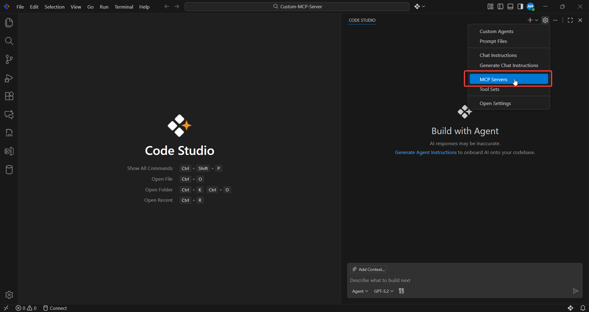

**Step 2:** In the MCP Servers page, open the Custom Server tab.

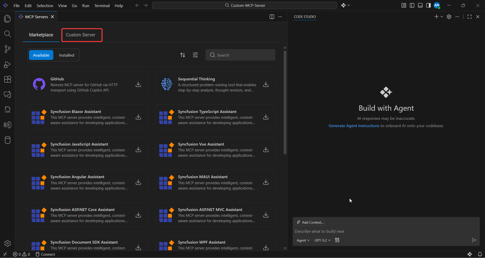

**Step 3:** Click Add MCP Server. 


Step 4: Review the Terms and Conditions, then click Accept and proceed. 

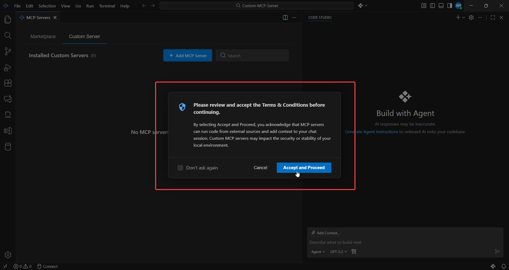

**Step 5:** Select the connection type that matches your setup. For this demonstration, choosing NPM package to install the Postman MCP Server. 

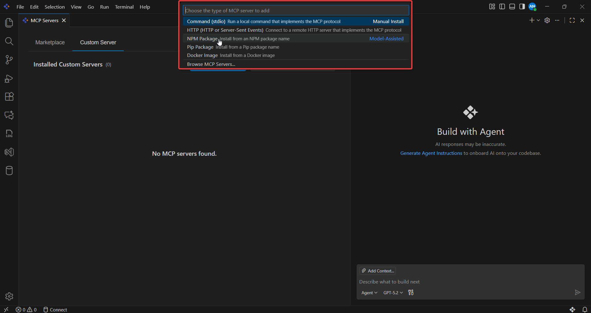

**Step 6:** The npm package name field will appear. Enter the required package name. For this demonstration, entering the Postman MCP Server package name ([@postman/postman-mcp-server](https://www.npmjs.com/package/@postman/postman-mcp-server?activeTab=readme)) and press Enter. 

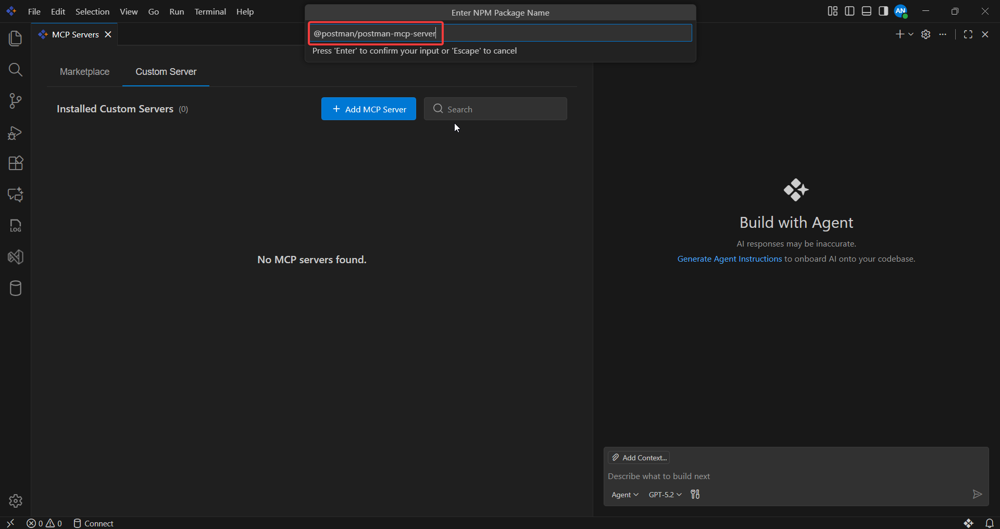

**Step 7:** The Postman API key field will appear. Paste the Postman API key you generated and press Enter. 

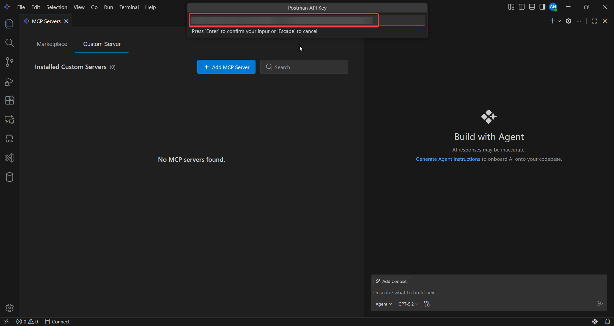

**Note:**
- If you don’t already have a Postman account, use Postman’s documentation guide to sign up: [Sign up for Postman](https://learning.postman.com/docs/getting-started/first-steps/sign-up-for-postman/)
- To generate a Postman API key, follow Postman’s official documentation: [Postman API Key Generation](https://learning.postman.com/docs/developer/postman-api/authentication)

**Step 8:** Select the tool configuration that fits your needs. For this demonstration, choosing the Minimal option. 

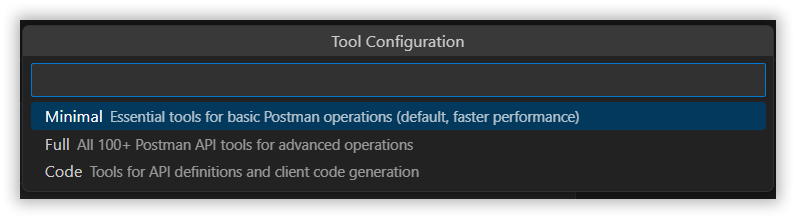

**Step 9:** Select the region. Keep the default selection (US). 

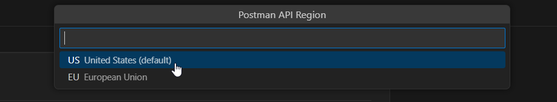

**Step 10:** Enter a Server ID. This is a label you choose in Code Studio to identify the custom server (not a Postman ID). 

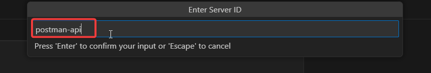

**Step 11:** Select the configuration target based on your needs. For this demonstration, choose Global to make the server available across all workspaces. 

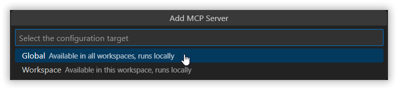

**Step 12:** The Postman MCP Server is now configured and ready to use. 

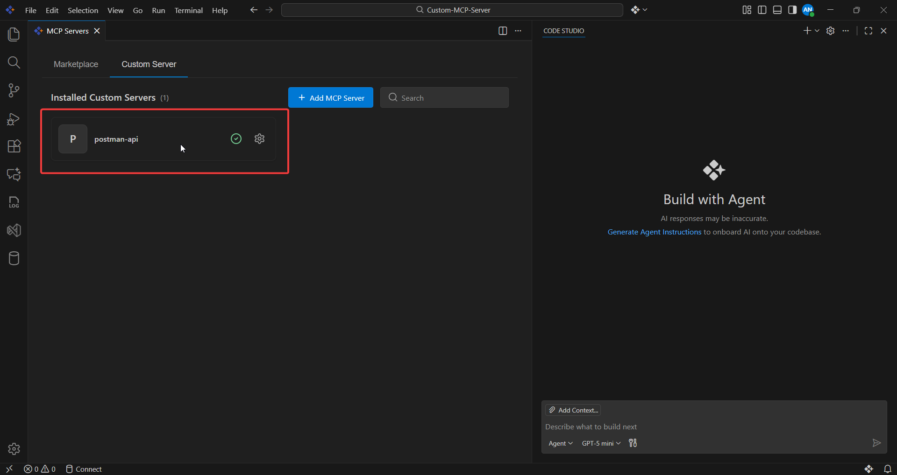

For demonstration purposes, we created a **User Management API** collection in Postman with sample data and added five sample requests to the collection.

You can create your own collection and add API requests by following Postman’s [documentation](https://learning.postman.com/docs/collections/use-collections/use-collections-overview).


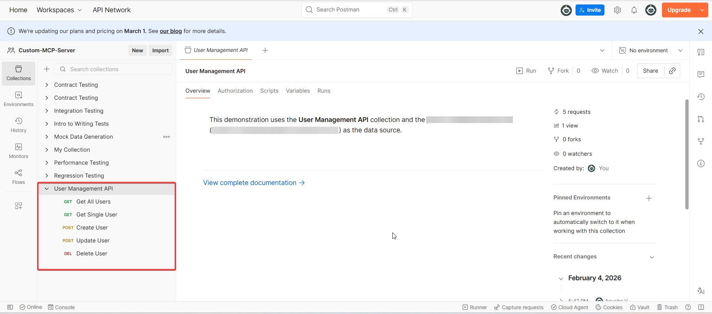

### Generate test scripts

- In this section, you will use Code Studio and the Postman MCP Server to generate standardized test scripts for the **User Management API** collection.

- When you give the prompt, Code Studio generates the test scripts and updates them directly in Postman for each request.

- Code Studio generates the test scripts and automatically updates it in Postman by applying them under each request’s **Test Scripts** tab.

**Sample prompt**

```text
Generate Postman test scripts for the “User Management API” collection (5 requests: GET all users, GET user by id, POST create user, PUT update user, DELETE user). Apply the scripts directly to each request’s Tests tab.

For each request, include tests that validate:

1. Expected status code (based on the method/API behavior)
2. Response time is within an acceptable range
3. Content-Type header (when present)
4. Response body structure and key fields (required properties and data types)

Use consistent, readable test names and keep scripts minimal and maintainable. Keep assertions non-brittle (no fixed record counts or hardcoded values). If the API does not persist changes, validate response structure and echoed fields instead of permanent updates.
```


### Run the monitor and create a deployment readiness report

- In this section, you will run a Postman Monitor from Code Studio as a pre-deployment validation check. In production workflows, this confirms that critical endpoints respond correctly and that basic performance expectations are met.

- After the monitor run completes, Code Studio can summarize the results into a **deployment readiness report**.

**Sample prompts**

```text
List my Postman Monitors and their IDs.
```

```text
Run the Postman Monitor with ID - <Monitor-Id> and generate a deployment readiness report from the latest run results. Include:

1. Overall status (pass/fail) and total tests passed/failed
2. Failed requests (request name/endpoint) with the failing assertions and error messages
3. Response-time summary (slowest request, average/peak time if available) and whether performance is acceptable
4. Key risks and recommended actions (what to fix or re-run)
5. Final recommendation: Go / No-Go for deployment, with a one-line justification
```


Postman provides many tools for creating and managing collections, environments, monitors, and more.
You can explore and use these tools in your workflow.

## MCP Settings and Management
You can manage your installed MCP servers through the Manage Settings option.
Available actions include:

- Start server
- Stop server
- Show output logs
  - The Output option opens the Output tab in the Terminal panel, where you can view real time MCP server logs
- Edit configuration (JSON)
  - Opens the mcp.jsonn file where you can edit the entry manually.
- Configure model access
  - Choose which LLMs can access the server
- Browse tools
  - View all tools exposed by your MCP server

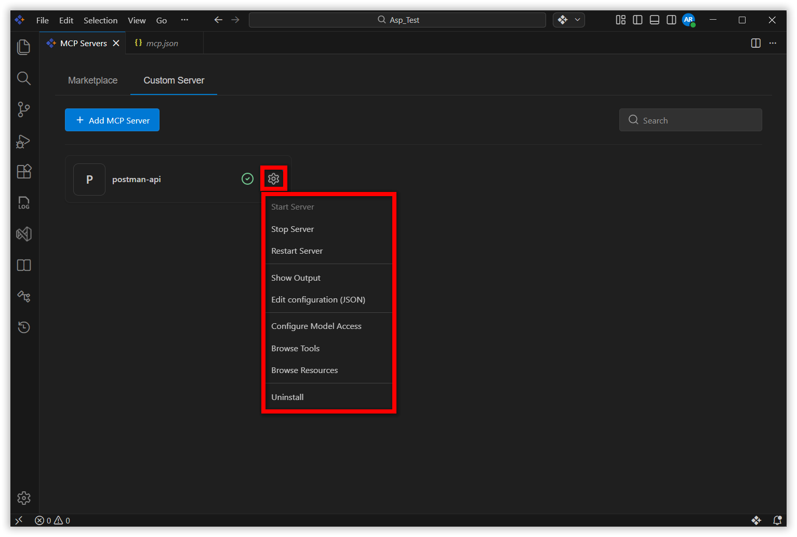

## Uninstalling an MCP Server
To remove a custom MCP server:

1. Click Manage next to the MCP server.
2. Select Uninstall.
3. The server is removed from your device and Code Studio.

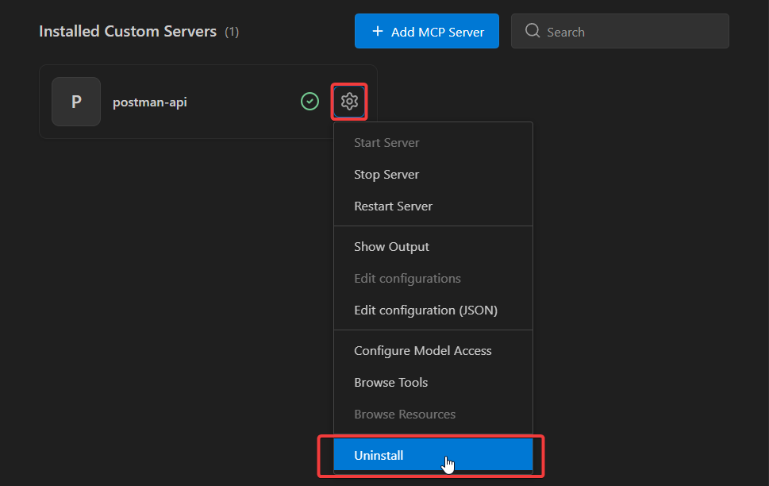
