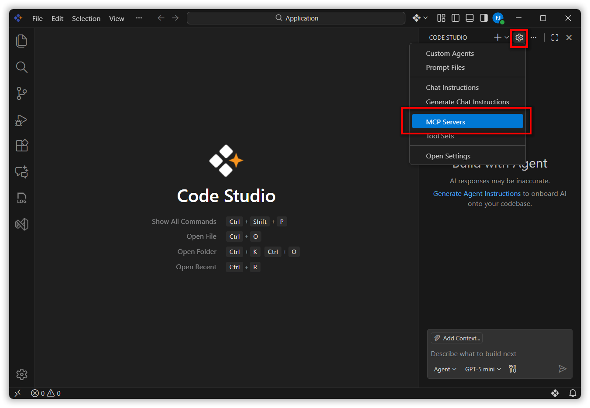
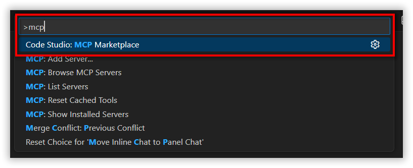
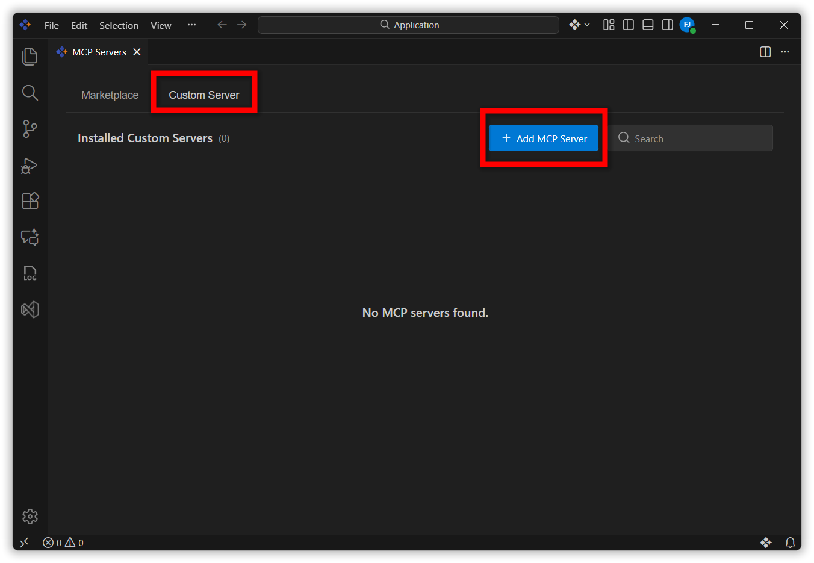
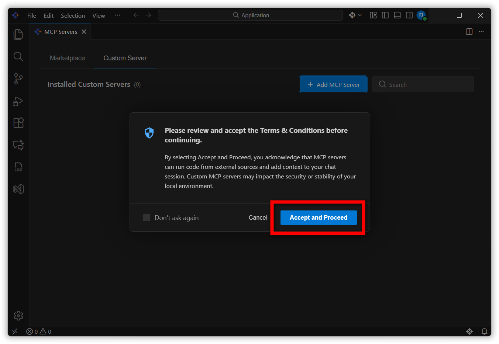
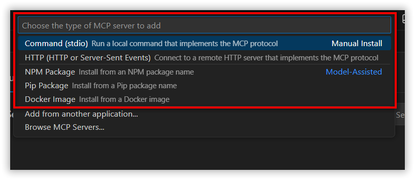
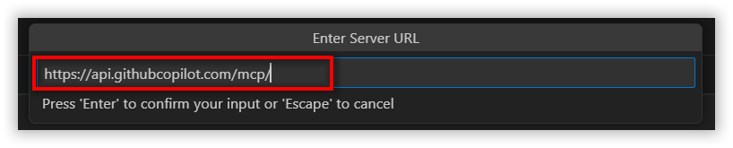
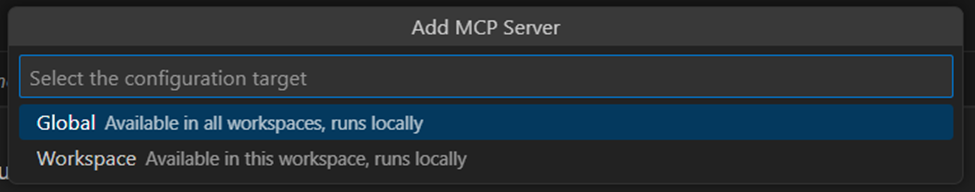
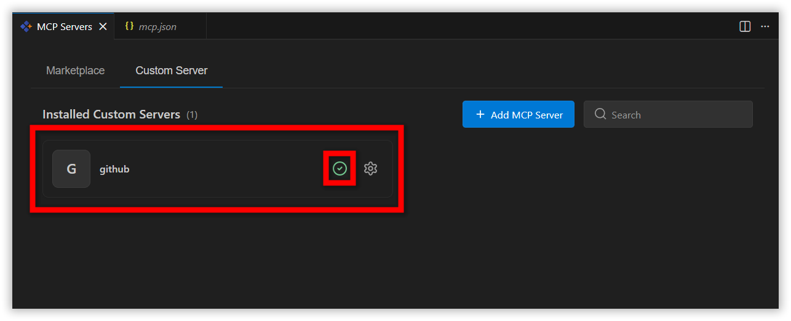
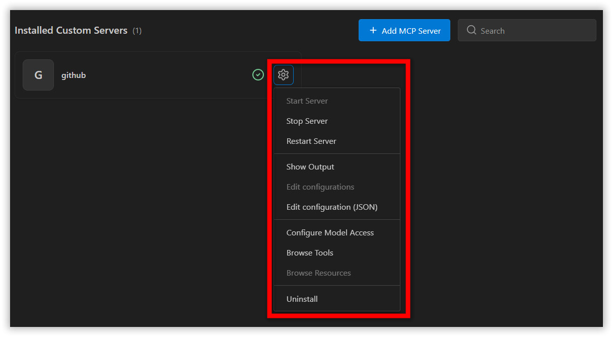
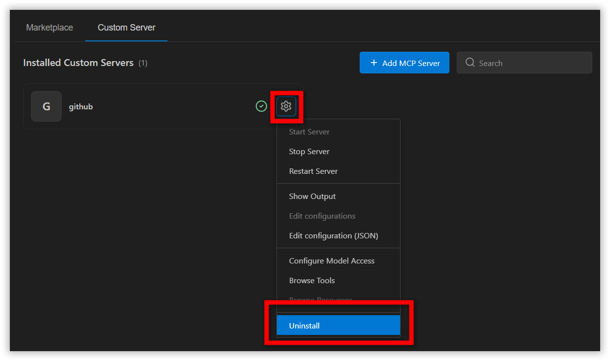

# Custom MCP Servers

## Overview
Model Context Protocol (MCP) is an open standard that allows AI models to interact with external tools and services through a unified interface.
In Code Studio, MCP servers extend your workspace by Integrating with external APIs.
The Custom MCP Servers feature lets you connect any MCP server to the Code Studio application—providing flexibility, simplified workflows, and full control over your development environment.

## Supported MCP Server Types and Their Prerequisites

### **1. Command (stdio)**
Runs a local executable script that communicates over stdio.

**Use this when:**
- You have a local MCP server executable  
- You want zero network communication  
- You're developing or debugging the server locally  

**Prerequisite:**  
- Executable script must exist in the system PATH  

**Installation Steps:**  
- Ensure your script or binary is globally accessible via PATH  


### **2. HTTP**
Connects to a remote MCP server using HTTP.

**Use this when:**
- The MCP server runs on another machine  
- You need to connect to a cloud-hosted MCP endpoint  
 


### **3. NPM Package**
Installs and runs an MCP server from an NPM package.

**Use this when:**
- Your MCP server is published as an NPM module  
- You prefer Node.js tooling  
- You want automatic installation and execution  

**Prerequisite:**  
- Node.js installed  

**Installation Steps:**  
- Install Node.js from the [official site](https://nodejs.org/en/download).


### **4. Pip Package**
Installs an MCP server from a Python pip package.

**Use this when:**
- Your MCP server is written in Python  

**Prerequisites:**
- Python 3.13+ installed  
- `uv` package manager installed  

**Installation Steps:**
- Install Python 3.13+ from [official site](https://www.python.org/downloads/).
- Then install uv in CMD:  
  ```bash
  pip install uv
  uv --version
  ```


### **5. Docker Image**
Runs an MCP server from a Docker image.

**Use this when:**
- You prefer containerized, portable setups  

**Prerequisites:**
- WSL must be installed  
- Rancher Desktop must be installed  

**Installation Steps:**
In CMD:
```bash
wsl --install
wsl --version
```
Then install Rancher Desktop from [official site](https://rancherdesktop.io/).


### **6. NuGet (dnx)**
Runs an MCP server via .NET packages.

**Use this when:**
- You're using .NET-based MCP servers  

**Prerequisite:**  
- .NET SDK 10 or later  

**Installation Steps:**  
- Download .NET SDK 10+ from Microsoft’s [official site](https://dotnet.microsoft.com/en-us/download/dotnet/10.0). 


## How to Add a Custom MCP Server

**Step 1:** First navigate to Custom MCP server in code studio. You can navigate to a custom MCP server in Code Studio using either of the two entry points below.

### Option 1
Click the gear icon in the chat window and select MCP Server.

  

### Option 2
Open the Command Palette → type >MCP and select Code Studio: MCP Marketplace.


**Step 2:** Then the MCP Marketplace opens, navigate to the Custom Server section and click Add MCP Server.


**Step 3:** Review the Terms & Conditions → click Accept and Proceed.


**Step 4:** A list of MCP server types (Command, HTTP, npm, pip, Docker) appears.


**Step 5:** Select your preferred type and enter the required information:
   - Command (path)
   - URL
   - NPM package name
   - Pip package name
   - Docker image


**Step 6:** Enter your custom MCP server name and press Enter.


**Step 7:** Select your Configuration target.


**Step 8:** Your server appears in the UI.

**Step 9:** A green tick indicates successful installation.


> **Note**: Custom MCP servers installed via pip, Docker, NuGet, or npm rely on AI model–assisted execution. If your Premium model usage budget is exhausted, these AI-assisted custom MCP server configurations cannot be completed until additional budget is available.

## MCP Settings and Management
You can manage your installed MCP servers through the Manage Settings option.
Available actions include:

- Start server
- Stop server
- Show output logs
  - The Output option opens the Output tab in the Terminal panel, where you can view real time MCP server logs
- Edit configuration (JSON)
  - Opens the mcp.jsonn file where you can edit the entry manually.
- Configure model access
  - Choose which LLMs can access the server
- Browse tools
  - View all tools exposed by your MCP server

 

## Uninstalling an MCP Server
To remove a custom MCP server:

1. Click Manage next to the MCP server.
2. Select Uninstall.
3. The server is removed from your device and Code Studio.

  
