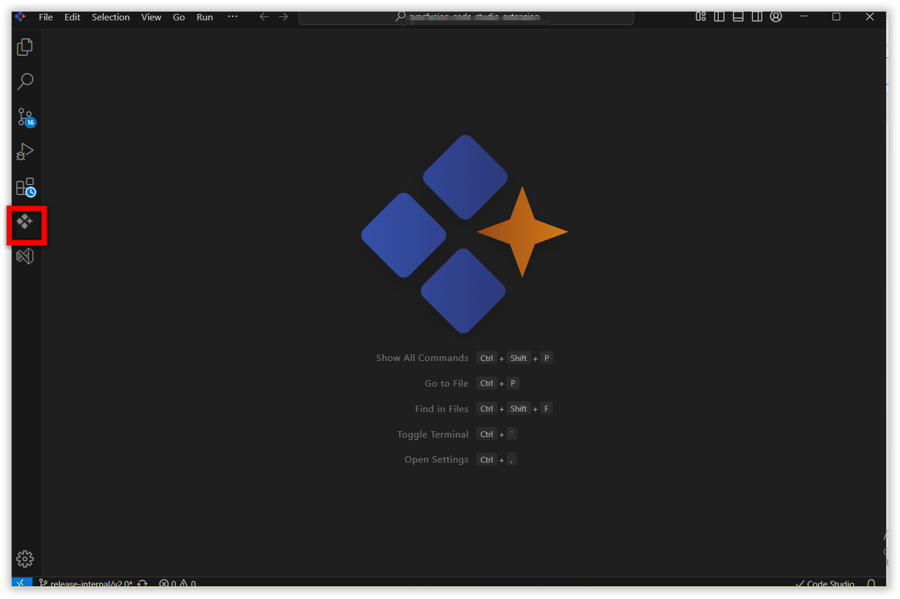
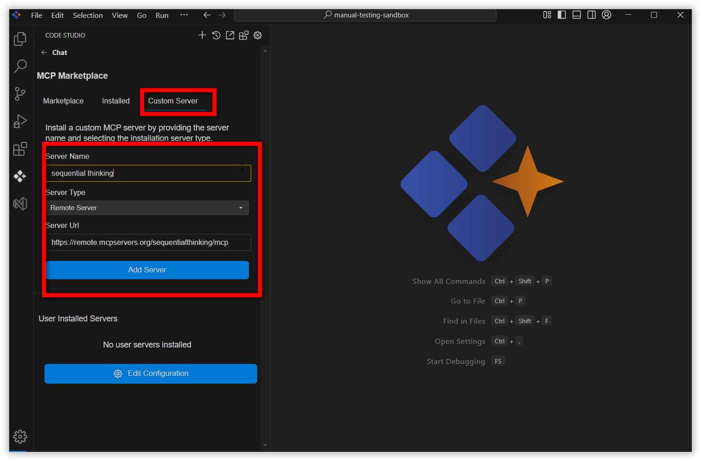
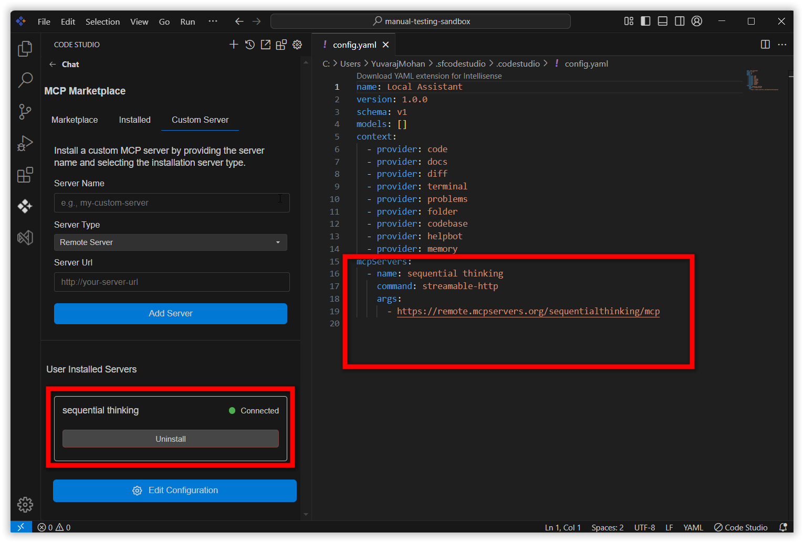
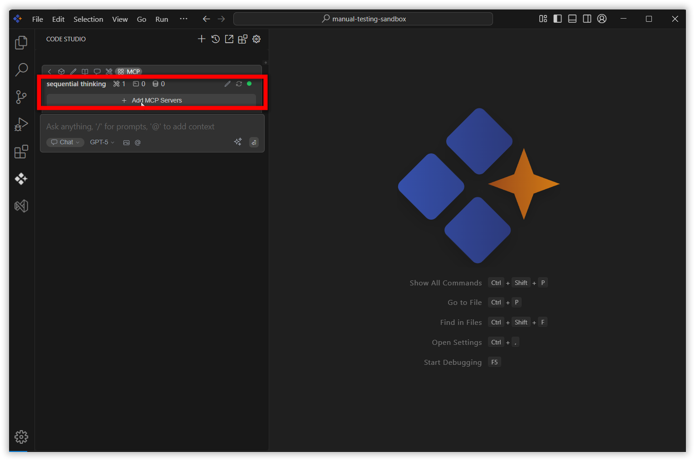
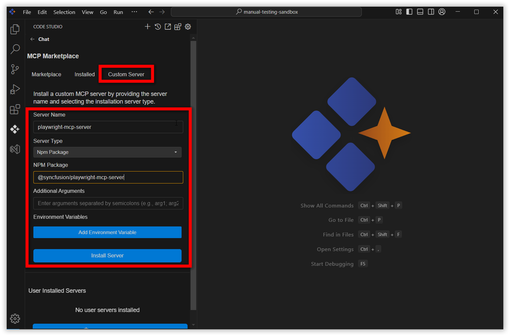
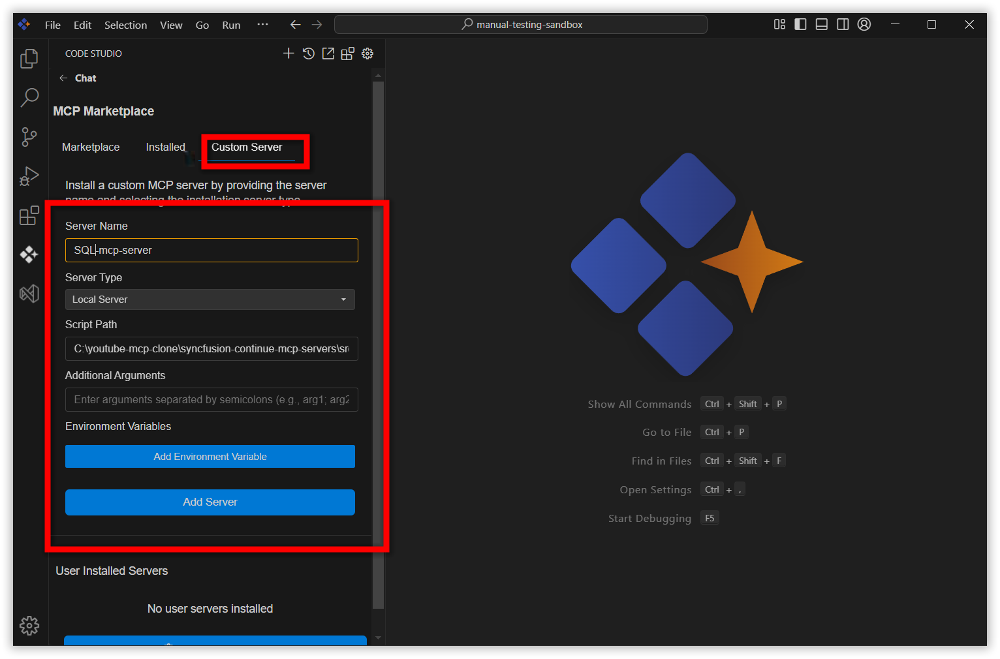
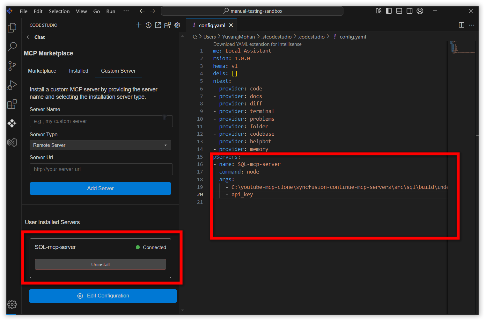
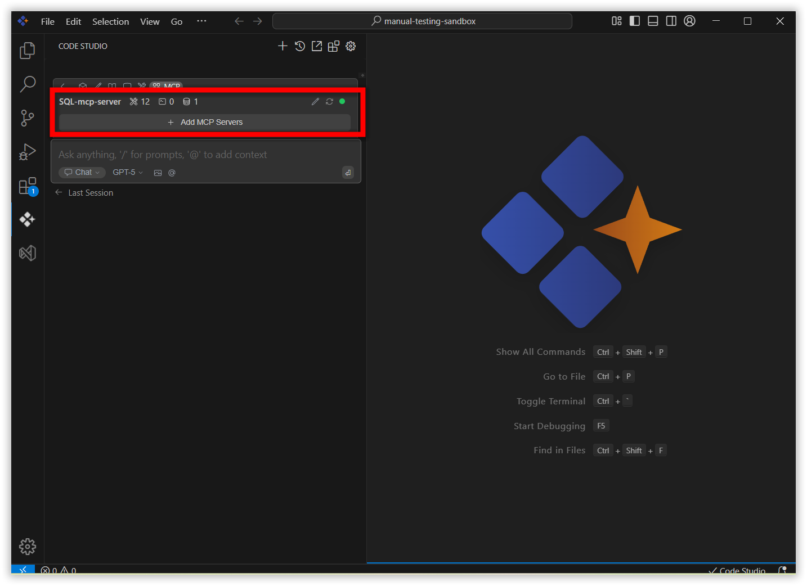

# Custom Servers

## Purpose
Custom Servers allows users to connect to any custom MCP servers, providing a seamless way to link these servers to the Code Studio extension for enhanced accessibility and control. 
1.	Remote server 
2.	NPM server 
3.	Local server 

## When to Use
- When you want to expand Code Studio’s capabilities by adding new or custom MCP servers.
- To integrate remote servers, NPM-based servers, or local servers for custom workflows or processing

## Prerequisites
- Syncfusion Code Studio open 
- Required server details, depending on the server type:
   - Remote Server: Server name and URL endpoint.
   - NPM Server: Server name and NPM package name.
   - Local Server: Server name and the path to the server script.

## Steps
Click the **Syncfusion Code Studio** icon on the left toolbar to open the Syncfusion Code Studio chat window.

Navigate to MCP section by clicking MCP icon and move to custom servers tab.

 
 

### Remote Server: 
This option allows user to connect existing remote servers to the Code Studio extension using the remote server url end point. 
Fill server name, server url, choose server type as remote server  then click ‘add server’ button 

After installation, the custom remote server entry occurs in config.yaml file and user installed servers section.  
 
Also, the added custom remote server occurs in MCP section and custom remote server’s tool occurs in tools section. 
 
 
 
### NPM Server: 
This option allows user to install and configure mcp server as npm package to the Code Studio extension using npm package name. 
Fill server name, NPM package, choose server type as npm package then click ‘add server’.  
 
After installation, the custom npm server entry occurs in config.yaml file and user installed servers section.  
 
Also, the added custom npm server occurs in MCP section and custom npm server ‘stools occurs in tool section. 
 
 
 
### Local server: 
This option allows user to build and configure the mcp server from the server source to the Code Studio extension. 
Fill server name, script path, choose server type as local server then click ‘add server’.  
 
After installation, the custom local server entry occurs in config.yaml file and user installed servers section.  
 
Also, the added custom local server occurs in MCP section and custom local server’s tools occur

## Validation
- Verify the new server appears in the user installed servers section.
- Ensure a corresponding entry for the server is present in your config.yaml file.
- Confirm the new server’s tools are listed in the Tools section.

## Troubleshooting
- **Server Not Added**: Double-check the information (server type, name, URL/NPM package/script path) entered.Ensure the server endpoint or package is valid.Refresh Code Studio if necessary.