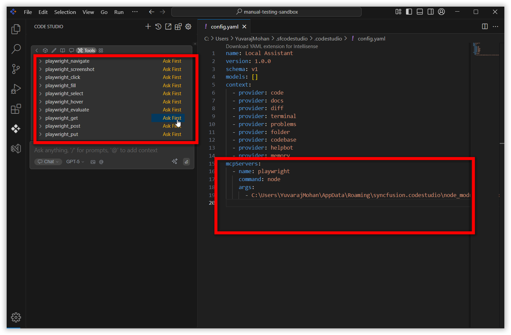
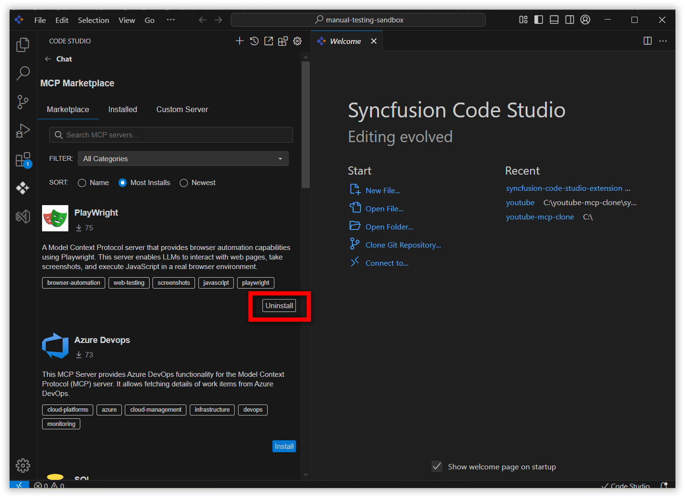

## MCP Marketplace
The MCP Marketplace is a centralized platform for server management, helping users discover, install, and connect the right servers for their needs through an easy-to-use interface. 
This showcases a variety of available MCP servers. Users can explore server options and configure them for use by simply clicking the "Install" button, which initiates an automated setup process to integrate the server with the code studio extension. 

## Steps to install an MCP server from marketplace
Click the **Syncfusion Code Studio** icon on the left toolbar to open the Syncfusion Code Studio chat window.

Navigate to MCP section by clicking MCP icon and navigate to marketplace tab.

 

Click the install button to install the MCP server
 
 
After installation click restart code studio button 
 

After restart, the installed MCP’s tools occurs in tools section and MCP entry occurs in config.yaml file. 

 
You can uninstall the MCP server by clicking uninstall button. 

 
## Installed Servers
Navigate to installed tab. The installed MCP servers is showing here. 
