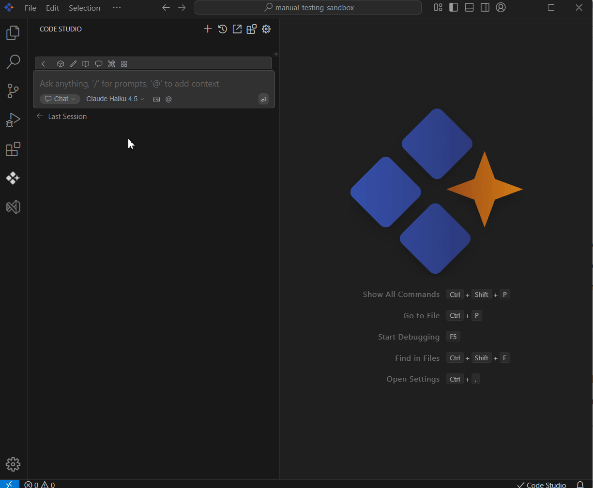

# Models

## Purpose

The Model section lets you select the right language model from the dropdown menus in each section to optimize your workflow for tasks like chat, editing, or code completion.

## When to Use

- When you want to decide specfic models excels at specific tasks—some are conversational, while others are optimized for code completion or context understanding.
- When you want to tailor your experience, choose the model that best matches your use case.

## Prerequisites
- Syncfusion Code Studio open with chat.
- Access to premium/BYOK models, if logged out local models are needed

## Steps

### 1. Locate the Model Dropdown
- Navigate to models section in the chat.In each mode section (e.g., Chat, Edit, Autocomplete), you’ll find a model selection dropdown.

**Available Model Use Cases**

You can apply different models to the following features, except for embed and rerank, as they use the built-in Transformer.js.

- **Chat**: Interact naturally to get explanations, answers, or code reviews.
- **Edit**: Generate, refactor, or transform code snippets.
- **Apply**: Execute targeted code modifications with high accuracy.
- **Autocomplete**: Receive smart code completions while typing.

### 2. Choose Based on Your Task

- Click the dropdown and select the model from the list of models.
- Click on the most suitable model for your current task.
- Code Studio will now use this model for actions in this section.

## Validation
- Chat: ask for a step‑by‑step explanation, then switch to a different model and compare clarity/latency.
- Edit/Apply: request a refactor; verify the Apply model makes minimal, precise diffs.
- Autocomplete: type a function scaffold and confirm inline suggestions appear quickly after switching models.

## Troubleshooting
- **Slow or timeouts**: choose a smaller/faster model, reduce attached contexts, or use a local model.
- For autocomplete use cost efficient models for lower token generation.
