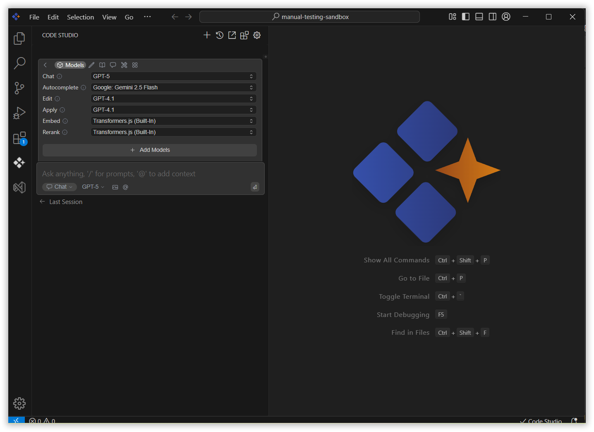

# Models

Select the right language model from the dropdown menus in each section to optimize your workflow for tasks like chat, editing, or code completion.

## Why Choose a Model?

- **Specialization**: Each model excels at certain tasks—some are conversational, others are optimized for code completion or understanding context.
- **Customization**: Tailor your experience by picking the model that best matches your use case.

## Available Model Use Cases

You can apply different models to the following features:

- **Chat**: Interact naturally to get explanations, answers, or code reviews.
- **Edit**: Generate, refactor, or transform code snippets.
- **Apply**: Execute targeted code modifications with high accuracy.
- **Autocomplete**: Receive smart code completions while typing.
- **Embed**: Produce vector representations for tasks like search or similarity.
- **Rerank**: Improve the ordering of search or recommendation results.

## How to Select a Model

### 1. Locate the Model Dropdown

In each mode section (e.g., `Chat`, `Edit`, `Autocomplete`), you’ll find a model selection dropdown.

### 2. Choose Based on Your Task

1.  Click the dropdown and select the model from the list of models.
2.  Click on the most suitable model for your current task.

Code Studio will now use this model for actions in this section.
