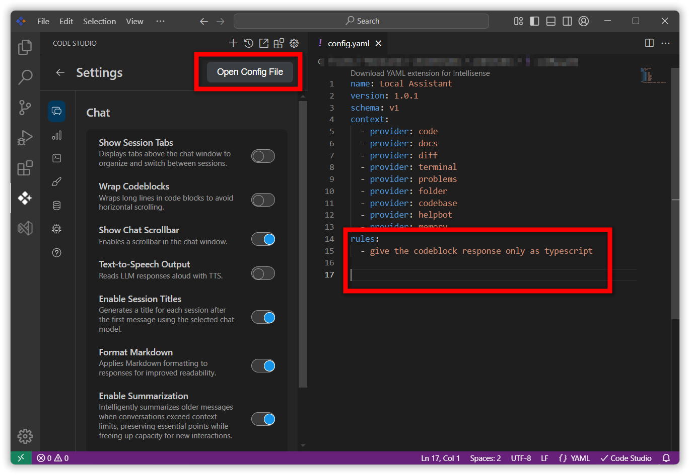
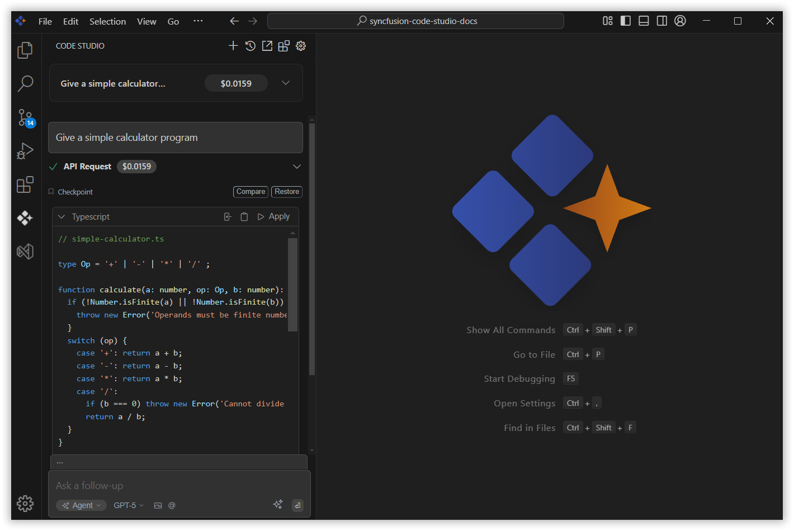
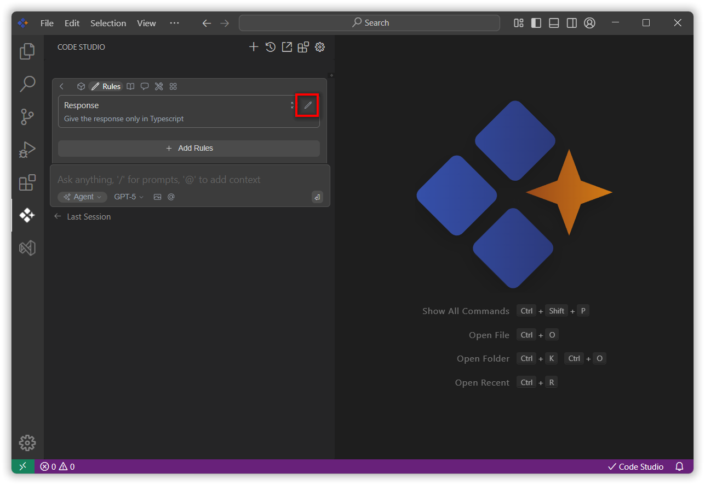
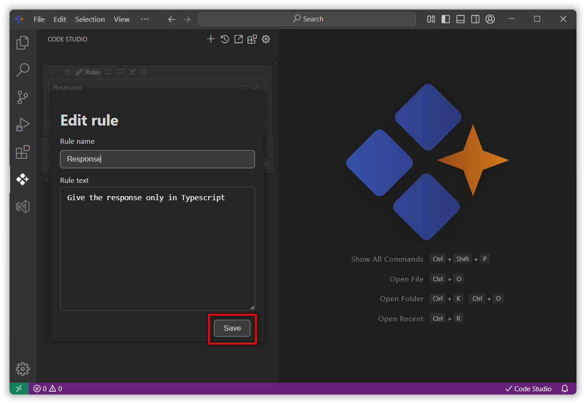

# Rules
 
## Purpose
**Rules** in Code Studio allow you to provide specific instructions that guide how the AI assistant behaves when working with your code. Instead of the AI making assumptions about your coding standards, architecture patterns, or project-specific requirements, you can explicitly define guidelines that ensure consistent, contextually appropriate responses.

## When to Use
- You want the assistant to follow specific rules or instructions that guide how the AI assistant behaves when working with your code.
- You want to define guidelines that ensure consistent, contextually appropriate responses.

## Prerequisites
- Syncfusion Code Studio open with a workspace

## Steps

### 1. Add Rules
You can add rules in three different ways. Regardless of the method you choose, Code Studio will automatically apply the changes once the file is saved.

**1. Using add Rules block**
- Go to the **Rules** section and click **Add Rules**.
- Enter the **rule name** and **description**, then click the **Add** button.
- Once added, the rule will appear as a block in the interface and will be automatically included in the configuration file.

**2. Using a `.sfcoderules` file**
- At the root of your workspace, create a file named `.sfcoderules`.
- Add your rules to this file, one per line.
- Save the file. Code Studio will automatically apply these rules.

**3. Using the `config.yaml` file**
- Open `config.yaml` page by clicking the settings icon and click on `open config file` the config page will be opened.
- In the file, create a `rules` section and list the instructions you want the Code Studio to follow.
- Save the file. The Code Studio will respond according to these rules.

 
### 2. Verify the Response
 
After adding the rules, give a query to the model. The response will be based on the rules you provided.

 
### 3. Edit the Rules

- Navigate to the **Rules** section and click the **pencil icon** next to the rule you want to edit.

-  The **Edit Rules** interface will open, allowing you to update the rule name or description.
-  After making your changes, click **Save** to apply the updates.

## Validation
- Add a rule and ask a query; confirm the reply follows the rule.
- Try to edit the rules and save and ensure the edited rule appear in config.yaml file

## Troubleshooting
- **Rules not followed by model**: Ensure the rules are visible in the Rules section also in config.yaml file under 'rules' array and reload if needed.
