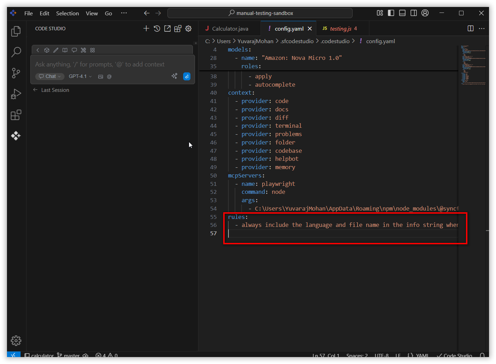
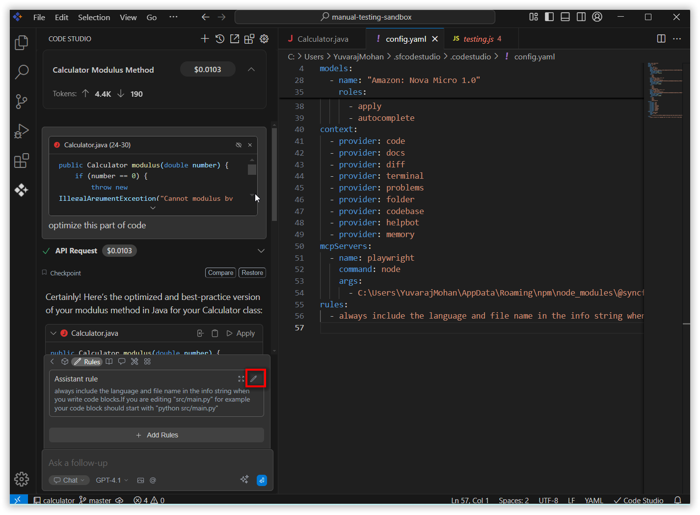

# Overview
 
**Rules** in Code Studio allow you to provide specific instructions that guide how the AI assistant behaves when working with your code. Instead of the AI making assumptions about your coding standards, architecture patterns, or project-specific requirements, you can explicitly define guidelines that ensure consistent, contextually appropriate responses.
 

# purpose
- **Set Standards:** Make sure the AI follows your coding styles, guidelines, and project needs.
- **Keep Responses Consistent:** Ensure all answers fit your team’s requirements every time.
- **Easily Update Guidance:** Change rules as your project evolves to always get relevant suggestions.
- **Support Team Alignment:** Help everyone on the project receive guidance that matches shared practices.
## How to Use Rules
 
### 1. Open Code Studio Extension
 
Click the **Syncfusion Code Studio** icon on the left toolbar to open the Syncfusion Code Studio chat window.

### 2. Add the Rules
 
Navigate to the **rules** section and click the **Add Rules** button. This will navigate to the `config.yaml` file.

In the `config.yaml` file, add a `rules` section. Under that section, specify the rules or instructions you want the AI to follow. The AI will provide responses based on these defined rules.

 
### 3. Verify the Response
 
After adding the rules, give a query to the model. The response will be based on the rules you provided.

 
### 4. Edit the Rules
 
You can also edit the rules. Navigate to the **rules** section and click the pencil icon to edit the rules.
This will open the `config.yaml` file where you can edit the rules.

