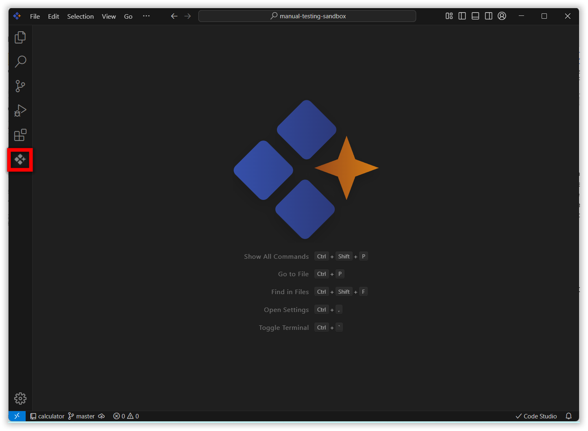

# Rules
 
**Rules** in Code Studio allow you to provide specific instructions that guide how the AI assistant behaves when working with your code. Instead of the AI making assumptions about your coding standards, architecture patterns, or project-specific requirements, you can explicitly define guidelines that ensure consistent, contextually appropriate responses.
 

## Purpose

- **Set Standards:** Ensure the AI follows your coding styles, guidelines, and project needs.
- **Keep Responses Consistent:** Ensure all answers align with your team’s requirements every time.
- **Easily Update Guidance:** Modify rules as your project evolves to maintain relevant suggestions.
- **Support Team Alignment:** Help everyone on the project receive guidance that matches shared practices.

## How Rules Work in Syncfusion Code Studio

 To form the system message, rules are joined with new lines, in the order they appear in the toolbar.

## How to Use Rules
 
### 1. Open Code Studio Extension
 
Click the **Syncfusion Code Studio** icon on the left toolbar to open the Syncfusion Code Studio chat window.

### 2. Add Rules

You can add rules in two ways. You can use either method, once you save the file, Code Studio will automatically apply the changes.

1. Using the `config.yaml` file
- Go to Rules in the product UI and click **Add Rules**. This opens the `config.yaml` file.
- In the file, create a `rules` section and list the instructions you want the Code Studio to follow.
- Save the file. The Code Studio will respond according to these rules.

2. Using a `.sfcoderules` file
- At the root of your workspace, create a file named `.sfcoderules`.
- Add your rules to this file, one per line.
- Save the file. Code Studio will automatically apply these rules.

 
### 3. Verify the Response
 
After adding the rules, give a query to the model. The response will be based on the rules you provided.

 
### 4. Edit the Rules

To edit rules, navigate to the rules section and click the pencil icon. This will open the `config.yaml` file, where you can modify the rules.

