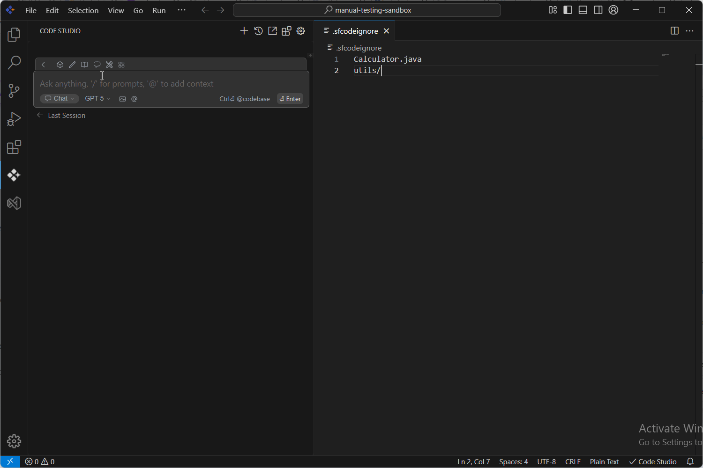

# .sfcodeignore

The “.sfcodeignore” file allows you to specify files or directories from your workspace that should be ignored during indexing when using the Syncfusion Code Studio. This is useful for excluding irrelevant, sensitive, or unnecessary files from being processed.

## Steps to Add Folders and Files in the “.sfcodeignore” File:
### step1: create ".sfcodeignore" file 
create ".sfcodeignore" file in your workspace and open it

### step 2: Add a file/folder 
Add the required files and folders in ".sfcodeignore" file to ignore while indexing.

### step 3: Added files will be ignored
After adding the required file/folders reload the code studio and the added files and folders will be ignored during indexing. You can check this by using the file and folder context providers. Type '@' and open file and folder context providers. The added files and folders will not appear.

