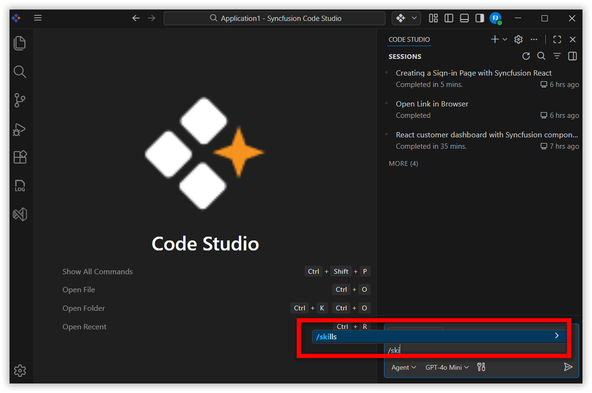
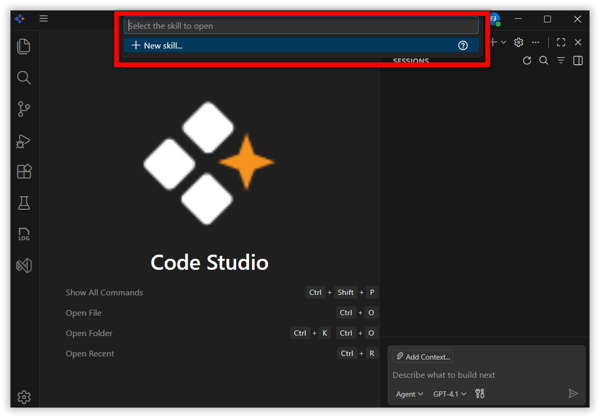
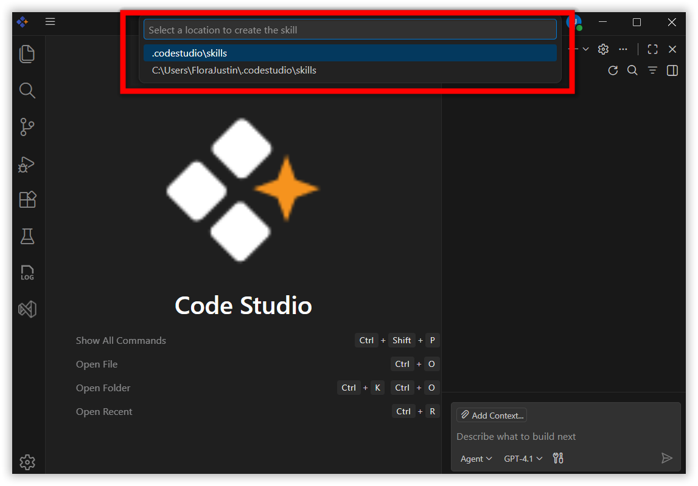
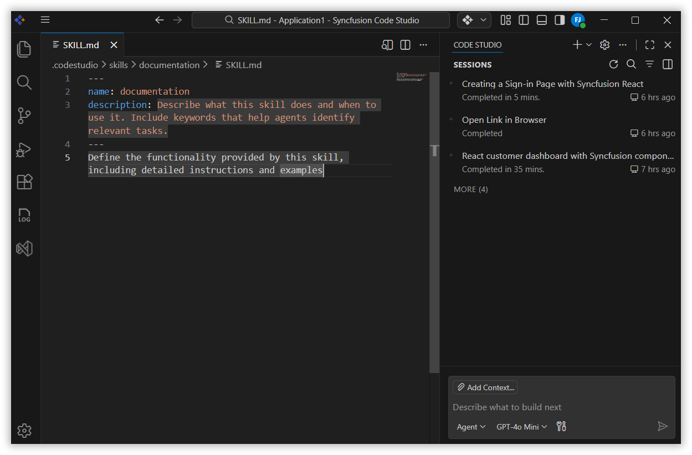
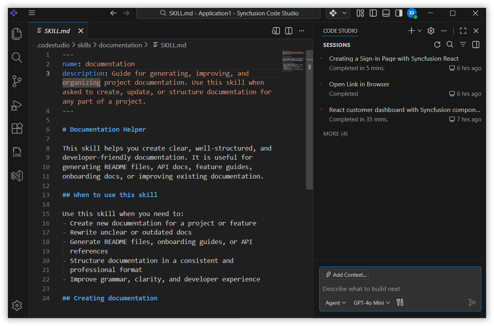
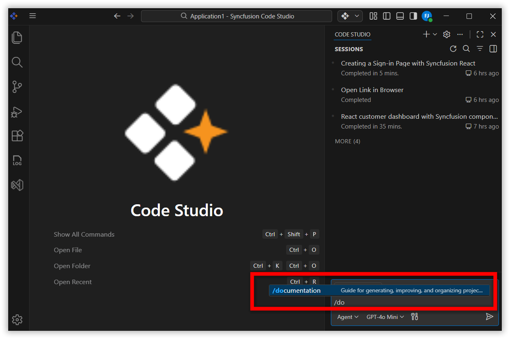

# Skills in Code Studio

## Overview
Skills in Code Studio let you extend the platform with reusable, task‑focused capabilities. A Skill is a structured folder that can contain instructions, scripts, examples, and other supporting assets that Code Studio can load when needed.

## Purpose
The purpose of Skills in Code Studio is to enable specialized workflows without repeating context or manual setup. Unlike simple configuration or coding rules, Skills allow you to package complete capabilities—such as testing flows, deployment routines, debugging steps, UI generation patterns, or domain‑specific automation. Code Studio loads a Skill only when it becomes relevant, allowing you to create once and reuse everywhere, while keeping the workspace clean and efficient.

## How Skills Work
Each skill is a folder that includes a special file called `SKILL.md`.

### This file contains:

### Header (Required):
- **name**
- **description**

### Optional fields:
- `argument-hint`
- `user-invokable`
- `disable-model-invocation`

## Body
The skill body contains the instructions, guidelines, and examples that Code Studio should follow when using this skill.

Write clear, specific instructions that describe:
- What the skill helps accomplish
- When to use the skill
- Step-by-step procedures to follow
- Examples of the expected input and output
- References to any included scripts or resources

When the user asks the Code Studio to perform a task:
- If the request matches the skill’s description, Code Studio will autoload the skill.
- The user can also manually trigger the skill using a slash command.
- Code Studio then follows the steps and examples defined inside `SKILL.md`, and uses any included scripts or resources to accomplish the task.

## Steps to Create a Skill

### Step 1: Open the Skills Menu
Open the chat box and type `/skills` in the chat input.
    

### Step 2: Create a New Skill
Click "+ New Skill" from the command palette.
    

### Step 3: Choose the Save Location
You can store your skill in:
- **Project Skills** → saved in the repository
- **Personal Skills** → saved in your personal profile
    

### Step 4: Create the SKILL.md File
Enter a name for your folder. This creates a `SKILL.md` file within the same folder name.
    

### Step 5: Add Optional Resources
You can include any files the AI should use, such as:
- Scripts
- Templates
- Examples
- Notes

    

### Step 6: Use the Skills
Skills are available as slash commands in chat. Type `/` in the chat input field to see a list of available skills. Additionally, Skills can be invoked automatically—if your prompt clearly matches what a Skill is designed to handle, Code Studio detects the relevance and loads that Skill without needing a manual command.
    