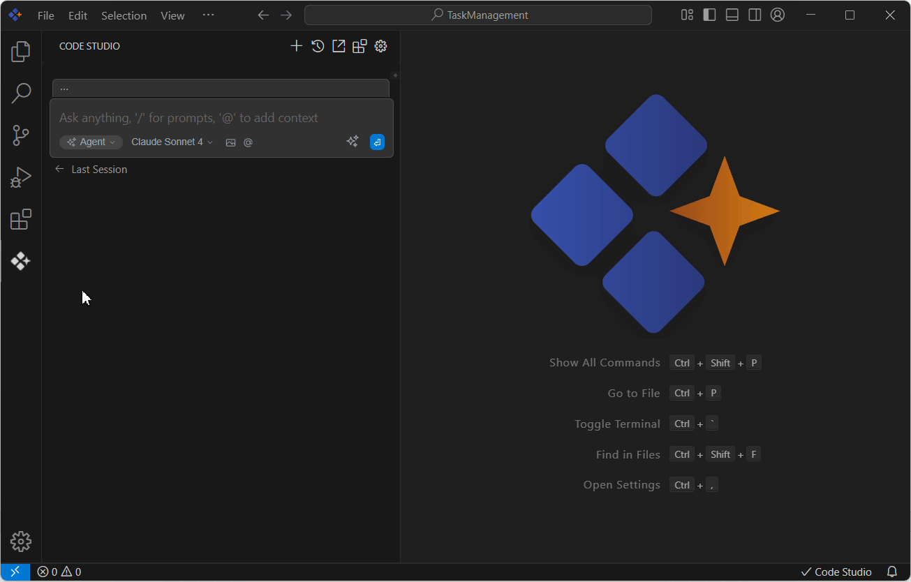

# Tools
## Purpose
 The Tools feature in Syncfusion Code Studio empowers developers to perform specific actions within the development environment, such as creating folders, reading files, searching within files, and interacting with browsers. This guide provides a step-by-step approach to use the built-in tools, enabling you to streamline your development workflow and automate tasks efficiently with simple prompts.

## When to Use
- You want to automate routine development actions (create/edit files, search/replace, browse the web) from chat. 
- You need the assistant to execute concrete steps with safety controls (Automatic, Ask First, Excluded). 
- You’re in Agent mode and prefer approving changes before they touch your workspace.

## Prerequisites
- Syncfusion Code Studio open with a workspace

## Steps

**1.Open the Chat Window**: Click the Syncfusion Code Studio icon on the left toolbar to open the chat interface.

**2.Choose tool permissions for each tool set mode**: Automatic, Ask First, or Excluded. Use Ask First for impactful actions (writes, terminal).
- **Automatic**: When the model requests a tool, Code Studio automatically executes it and sends the response back to the model.
- **Ask First**: When the model requests a tool, Code Studio prompts you to either “Cancel” or “Continue” before proceeding.
- **Excluded**: The model is unaware of the tool and cannot use it.

**3.Enter Your Request**: Type your request in natural language, describing what you want to accomplish. Ensure Code Studio is in Agent mode.

**4.Review Tool Execution**: The AI will automatically select and execute the appropriate tools based on your request.

**5.Approve Changes**: Review any proposed changes and approve or modify them as needed.

**Toolset Overview**

Available built-in tools and their descriptions:

<table border="1" cellpadding="8" cellspacing="0">
  <thead>
    <tr>
      <th>Tool Name</th>
      <th>Description</th>
    </tr>
  </thead>
  <tbody>
    <tr>
      <td>builtin_read_file</td>
      <td>Reads the contents of an existing file.</td>
    </tr>
    <tr>
      <td>builtin_create_new_file</td>
      <td>Creates a new file with specified content.</td>
    </tr>
    <tr>
      <td>builtin_run_terminal_command</td>
      <td>Executes a terminal command in the current directory.</td>
    </tr>
    <tr>
      <td>builtin_grep_search</td>
      <td>Performs a fast text search using exact strings or regex.</td>
    </tr>
    <tr>
      <td>builtin_file_glob_search</td>
      <td>Searches for files matching a glob pattern, returning their paths.</td>
    </tr>
    <tr>
      <td>builtin_search_web</td>
      <td>Conducts a web search and returns top results.</td>
    </tr>
    <tr>
      <td>builtin_view_diff</td>
      <td>Displays the diff of current working changes.</td>
    </tr>
    <tr>
      <td>builtin_read_currently_open_file</td>
      <td>Reads the contents of the currently open file in the IDE.</td>
    </tr>
    <tr>
      <td>builtin_ls</td>
      <td>Lists files and folders in a specified directory.</td>
    </tr>
    <tr>
      <td>builtin_syncfusion_ui_builder</td>
      <td>Generates Syncfusion component metadata or UI layout plans.</td>
    </tr>
    <tr>
      <td>builtin_browser_interaction</td>
      <td>Automates browser tasks using a Puppeteer-controlled environment.</td>
    </tr>
    <tr>
      <td>builtin_replace_in_file</td>
      <td>Makes targeted edits to specific parts of a file.</td>
    </tr>
    <tr>
      <td>builtin_search_files</td>
      <td>Searches for regex patterns.</td>
    </tr>
  </tbody>
</table>

## Validation
- File operations: Create any file and ensure the file is created by create file tool; 
- Web: “Search web for ‘vite coverage exclude config’ and summarize top solutions.” Verify cited results.
- Terminal: “Run npm test and summarize failures.” Confirm command output and diagnosis.

## Troubleshooting
- **Tools not running**: ensure mode is in Agent mode and the tool isn’t set to Excluded in tools section.
