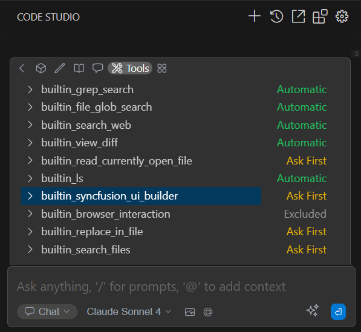
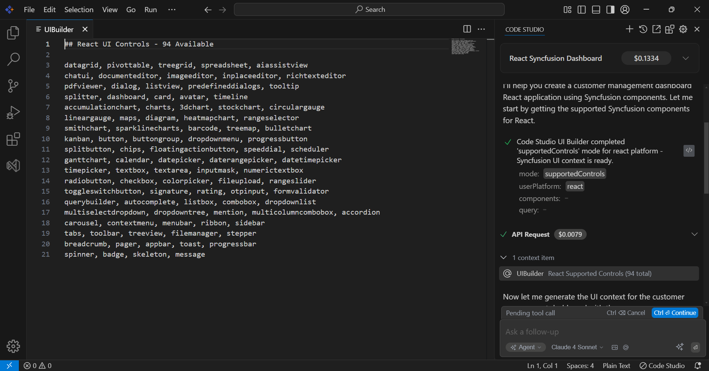
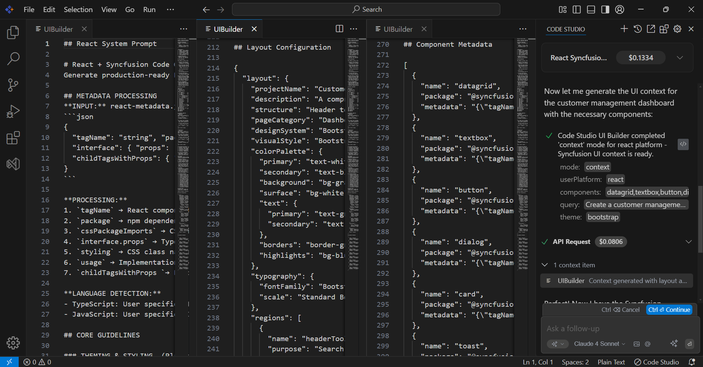

# Syncfusion UI Builder Guide

## Overview

UI Builder is a specialized tool that provides essential information for building user interfaces with Syncfusion components. When you describe what you want to create, it automatically analyzes your request and returns the technical guidance to the code studio for implementation.

### What UI Builder Provides

- **Component Information**: Lists of available Syncfusion components for your platform
- **Implementation Context**: Platform-specific guidelines and best practices  
- **Layout Guidance**: Suggestions for structuring your interface effectively
- **Component Metadata**: Technical details and documentation for each component
- **Multi-Platform Support**: Works across 14 different development frameworks

### Key Benefits

- **Eliminates Documentation Search**: Get relevant component information instantly
- **Ensures Accuracy**: Validates component availability for your specific platform
- **Accelerates Development**: Reduces trial-and-error coding with proven patterns
- **Platform Optimization**: Delivers framework-specific implementation guidance

## Quick Start

### UI Builder Setup

1. **Access Chat Interface**: Open the chat panel in Code Studio.
2. **Enable UI Builder Tool**: Select "UI Builder" from the tools panel.
3. **Choose Mode**: Select between Automatic or Ask First mode.



### Basic Usage

Simply describe what you want to build using this format:

```
Create a [feature description] for [platform] using Syncfusion components with [requirements]
```

**Example:**
```
Create a customer dashboard for React using Syncfusion components with data grid, charts, and export functionality.
```

### Required Elements

For UI Builder to activate and provide accurate results:

1. **Include "Syncfusion"**: This keyword activates the UI Builder tool
2. **Specify Platform**: Name your framework (React, Angular, Vue, Blazor, etc.)
3. **Describe Functionality**: Explain what you want to build and key features needed

### What You Get Back

UI Builder automatically provides:
- **System Prompts**: Platform-specific implementation guidelines
- **Layout Configuration**: AI-generated structure suggestions based on your requirements
- **Component Metadata**: Detailed information about available components

### How UI Builder Works

#### Supported Controls Response
UI Builder provides a comprehensive list of available Syncfusion components for your specific platform:



#### Context Mode Response
UI Builder delivers detailed implementation guidance including system prompts, layout configuration, and component metadata:



### Syncfusion License Setup

After implementing features with Syncfusion components, proper licensing is required:

**Trial Users:**
- Register license key from [Syncfusion Account Portal](https://www.syncfusion.com/account/downloads)
- Required for trial installations and NuGet packages from nuget.org

**Licensed Users:**
- Licensed installer includes automatic license registration
- No additional license key registration required

**License Key Registration:**
Add the license key to your application startup code to avoid licensing popups during development and production.

## Supported Platforms

UI Builder supports 14 platforms with varying component libraries:

| Platform | Components Available | 
|----------|---------------------|
| WinForms | 121 components |
| Blazor | 102 components |
| ASP.NET Core | 99 components |
| Angular | 98 components |
| TypeScript | 98 components |
| Vue.js | 98 components |
| WPF | 97 components |
| JavaScript | 97 components |
| React | 94 components |
| MAUI | 74 components |
| WinUI | 41 components |
| Flutter | 25 components |
| PureReact | 17 components |
| Java | 1 component |

## Best Practices

- **Be Specific**: "Create a customer form with validation" vs "Create a form"
- **Include Features**: Mention export, search, responsive design, validation
- **Name Platform Clearly**: Use Syncfusion supported platform like "React" and "JavaScript"

## Key Limitations

- **15 component maximum** per request
- **Exact component names** required (case-sensitive)
- **Platform-specific** component availability varies

## Troubleshooting

**UI Builder Not Activating**: Include "Syncfusion" keyword and specify platform explicitly (React, Angular, etc.)

**Wrong Platform Detection**: Use exact platform names early in request like "React" or "JavaScript"

**Generic Response**: Be more specific about functionality, include business context and specific features needed

**Component Not Available**: Check Supported Platforms table or request component list for your platform

## FAQ

**Does UI Builder create complete applications?**

No, UI Builder provides implementation guidance and component information. Code Studio uses this information to build complete applications with appropriate Syncfusion components.

**Can I modify the code that Code Studio creates?**

Yes, all code created by Code Studio using UI Builder guidance can be customized and extended to match your specific requirements.

**Which AI models work best with UI Builder?**

GPT and Claude provide optimal results when Code Studio implements features using UI Builder guidance. Configure your preferred model in Code Studio settings.

**Are there limits on UI Builder requests?**

UI Builder processes up to 15 components maximum per request.

**Can UI Builder work with existing projects?**

Yes, UI Builder provides component information that Code Studio can use to add Syncfusion features to existing applications.