# User Settings

## Overview

The Settings is designed to make it easy for users to manage how the application works for them. It consolidates all essential controls in one place, enabling you to personalize features, monitor credits and usage, and optimize your workflow. The Settings page gives users full control, flexibility, and clarity so they can tailor Code Studio to their needs while staying efficient, cost aware, and compliant. Settings are stored locally and take effect immediately upon change.

## Purpose

Settings allow users to tailor the development environment to their individual preferences. They help by providing

- **Centralized Control** – All key configuration options are available in one place.
- **Personalization** – Customize features such as agents, autocomplete, and instructions to fit your workflow.
- **Usage Monitoring** – Track daily costs and token usage to stay within budget.
- **Compliance & Transparency** – Access legal policies, agreements, and telemetry settings for clarity.
- **Help & Support** – Quickly reach documentation, tutorials, and support tickets when needed.

## How to Access User Settings

The User Settings page can be accessed in three ways:

### 1: From the Account

- Click the Code Studio Account icon.

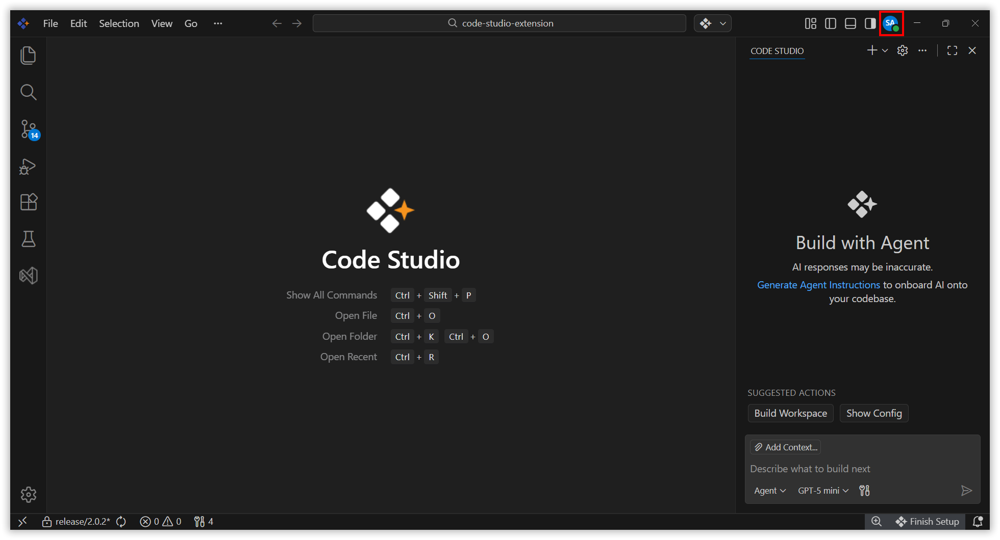

- The Settings page will open.

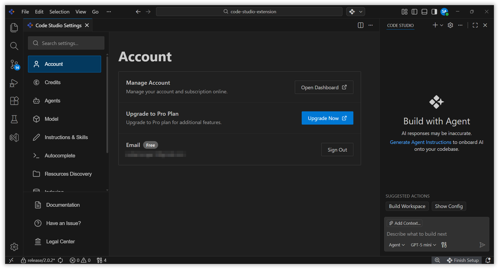

### 2: From the Toggle Sidebar

- Click the **gear icon** on the left sidebar of the Code Studio window.
- Select Code Studio Settings from the menu.

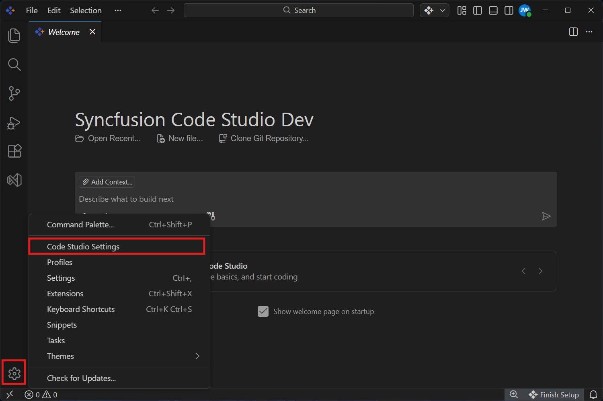

- The Settings page will open.

### 3: From the Chat Window

- Navigate to the **Code Studio Chat Window**.
- Click the **gear icon** located at the top right corner.
- Select Open Settings. 

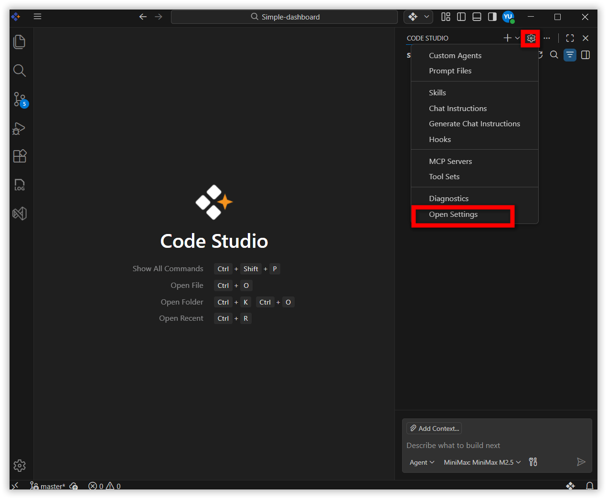

- The settings page will open.

## Settings Categories

The following settings are available on the User Settings page.

### Account

#### Manage Account
  - Monitor your LLM usage and manage billing and subscriptions.

> **Note:** You can track daily costs and token usage by applying filters in your Dashboard. This helps you stay on budget and manage usage effectively.

#### Upgrade to Pro Plan
  - Upgrade to Pro plan for additional features.

> **Note:** Upgrade the plan can be accessible only for Admins.

#### Email 
  - Sign in or sign out of your account.

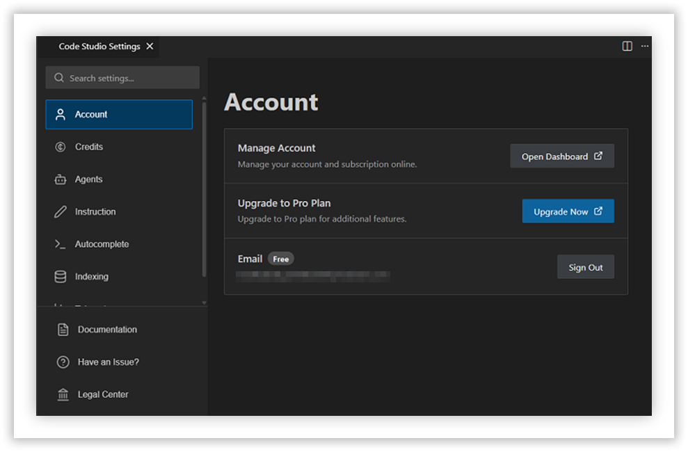

### Credits

- View your current balance. 
- Purchase credit based on your budget and requirements. 
- Access pricing details. 

> **Note:** Credits sections can be accessible only for Admins. 

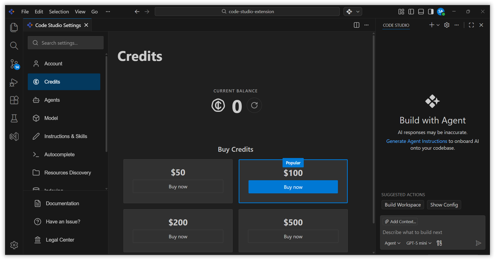

### Agents

#### Agent Enabled 
- Enables agent mode, which can be activated via the dropdown in the chat box. 
- Default: Enabled 

#### Agent Max Requests 
- Sets the maximum number of requests per turn when using an agent. If the limit is reached, you’ll be asked to confirm to continue. 
- Default: 25 

#### Use Agents Md File 
- Decide whether the instructions from the AGENTS.MD file in your workspace are added to every chat request.
- Default: Enabled

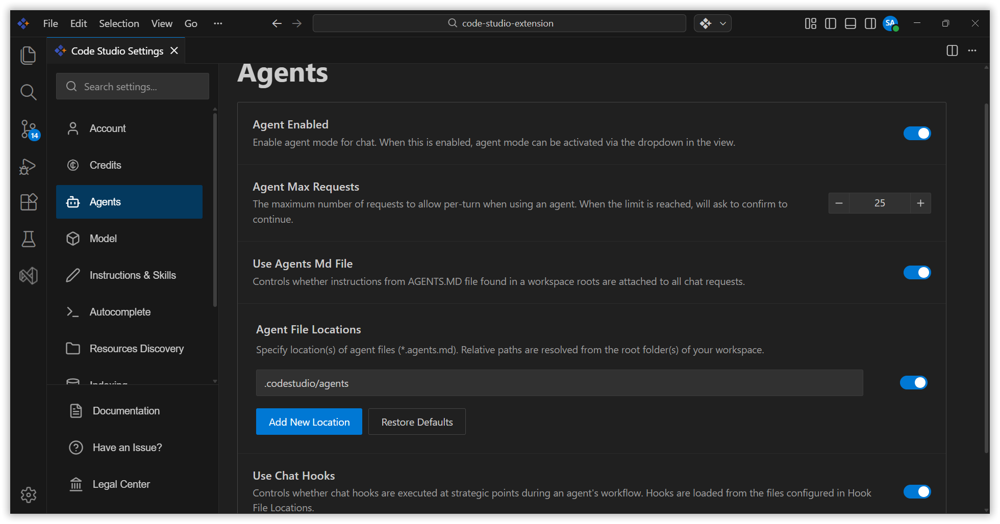

### Instructions

#### Use Codestudio-instructions Md File 
- Controls Whether code instructions from .codestudio/codestudio-instructions.md are added to Code Studio requests. 

> **Note:** Keep your instructions short and precise. Poor instructions can degrade Code Studio quality and performance. 

#### Instruction File Locations 
- Specify location(s) of instruction files (*. instructions.md) that can be attached in Chat sessions

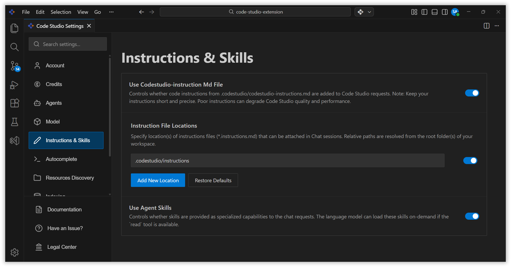

### Autocomplete

- When enabled, Code studio will give inline code suggestions globally across all supported languages

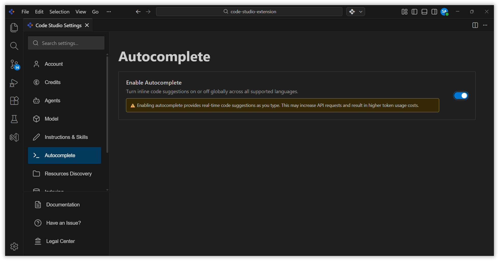

### Indexing

- When enabled, Code Studio will start an indexing process to scan and embed workspace files for accurate search results. 

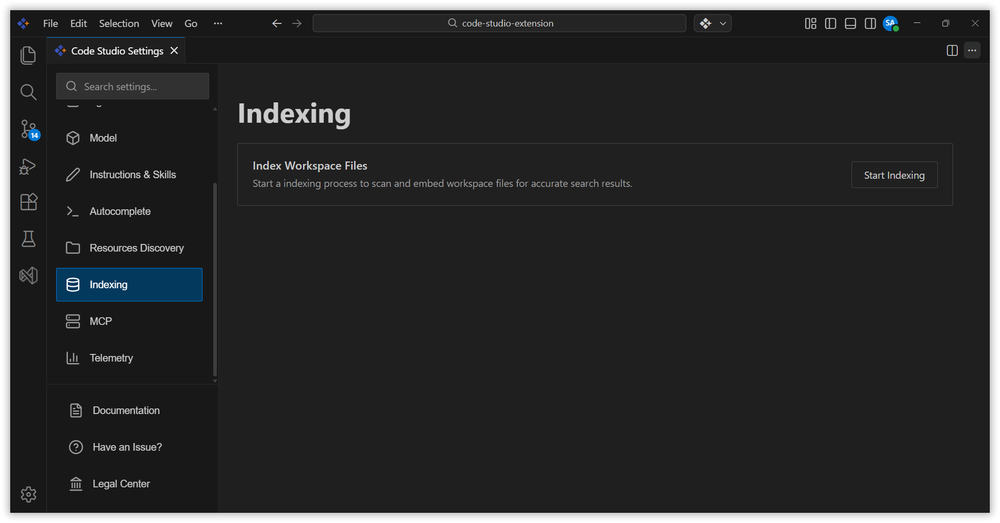

### Telemetry

- When enabled, it allows Code Studio to collect anonymous telemetry data to improve the product. 

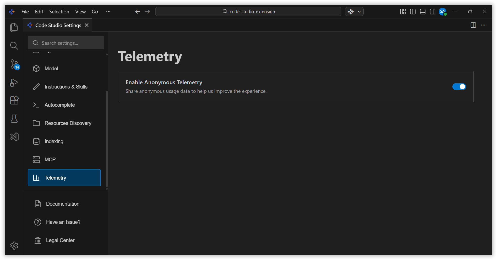

### Help & Support

- **Documentation**  
  Access the official Syncfusion Code Studio documentation for configuration guidance and usage instructions.

- **Have an Issue?**  
  If you encounter any problems, you can easily reach out to our support team at [support@syncfusion.com](https://support.syncfusion.com).

- **Legal Center**  
  Review our transparent legal policies and agreements in the Legal Center. This ensures you fully understand and comply with Syncfusion’s terms and conditions. 
