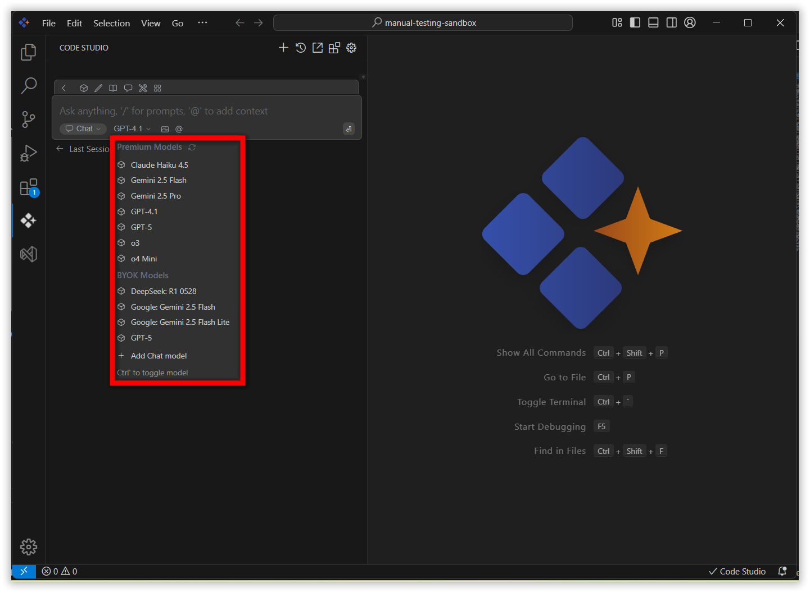
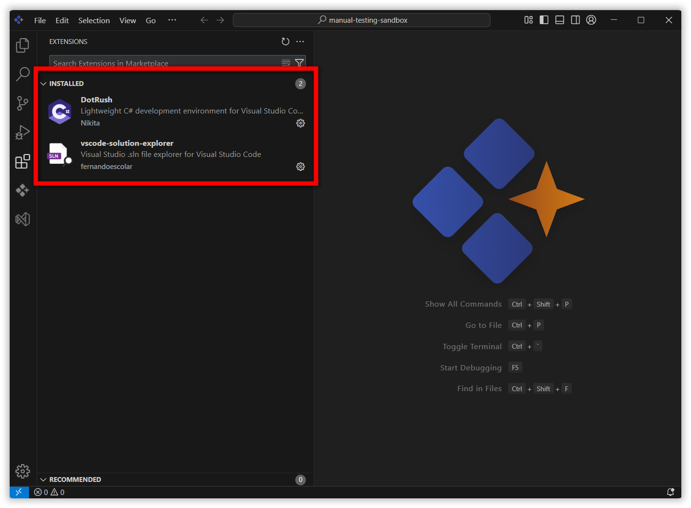
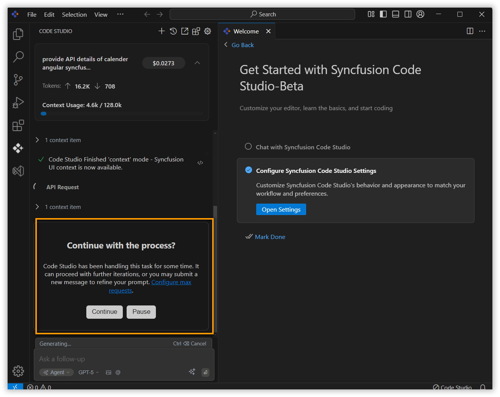

## What's New in v1.0.0

- **Code Studio built for enterprise:** Confidently scale AI development across your organization with centralized control, security, and visibility. For more details, please refer to our documentation on [enterprise server](/code-studio/enterprise-server/getting-started).
  - **LLM connections & model management:** Connect to any provider with your own keys (BYO-key), manage models from one control plane, set access rules, and monitor usage with built-in analytics.
  - **User & team management:** Invite users via SSO, organize them into teams, assign roles, set budgets and quotas, and track detailed usage per user and team.
  - **Resilient by design**: Define a fallback order, and Code Studio will automatically handle retries and failovers to keep development uninterrupted.
  - **Team & user budgets:** Set budgets for users and teams, receive alerts on threshold breaches, and view trends to manage costs proactively.
  - **Analytics & observability dashboard:** Monitor token usage, costs, latency, and success rates in real-time with powerful filters and insights by team, user, or model.
  
  

- **UI Builder improvements**
  - **UI Builder mode support:** The UI Builder has been significantly enhanced with new modes:
    - **supportedControls mode:** Returns all available controls for your target Syncfusion platform.
    - **Context mode:** Provides comprehensive metadata, including platform prompts and layout plans (JSON), and controls JSON context.

    

  - **Expanded platform support:** Added support for 10 new platforms, including TypeScript, Pure React, Vue, .NET Core, .NET MAUI, Flutter, WinForms, WPF, WinUI, and Java.
  - **Platform optimization:** Enhanced prompts and metadata for existing platforms (JavaScript, React, Angular, and Blazor).
  - **User experience improvements:** Added a warning pop-up window when the UI Builder receives more than 15 components in context mode to prevent performance issues.

  

- **MCP marketplace and custom servers:** A new MCP marketplace is now available, providing a centralized platform where users can easily discover, install, and connect MCP servers through an intuitive interface. Explore a wide range of available servers and set them up with just one click. Installation is fully automated and integrates directly with the Code Studio extension. Custom server support lets you effortlessly connect any custom MCP server, giving you greater flexibility and control when accessing servers within the Code Studio extension. For more details, refer to our documentation on the [MCP marketplace](/code-studio/reference/configure-properties/mcp/marketplace) and [custom servers](/code-studio/reference/configure-properties/mcp/customservers).

- **Context usage UI in session header:** A new context usage UI has been introduced in the session header, providing users with clear insights into the context consumed by each request and across the entire session. This feature helps users monitor and manage their context usage with ease.

- **Built-in DotRush and VSCode Solution Explorer extensions:** The IDE now automatically installs DotRush and VSCode Solution Explorer extensions on launch, equipping developers with advanced C# development tools, IntelliSense, debugging, profiling features, and a solution tree for streamlined .NET project management, similar to Visual Studio.

- **Agent max request confirmation:** User settings now request confirmation to continue or stop streaming after reaching the maximum allowed requests.For more details, please refer to our documentation on [user settings](/code-studio/reference/configure-properties/usersettings).

- **Info icon in user settings:** An info icon has been added to the user settings options, allowing users to access detailed information about each setting directly from the interface.For more details, please refer to our documentation on [user settings](/code-studio/reference/configure-properties/usersettings).

- **Context length optimization:** Implemented automatic summarization to maintain context usage within set limits throughout the session. When the context length approaches its limit, previous user and assistant conversations are summarized to manage resource consumption efficiently.For more details, please refer to our documentation on [summarization](/code-studio/features/summarize).

- **Session spending warning:** A warning message is now displayed to users who exceed $5 in a single session, assisting in cost awareness and budget management.
- **Feedback section:** A new feedback section is available under the help menu in the title bar, linking directly to the Syncfusion Code Studio feedback page.
- **Image and agent mode support:** Introduced generic image handling and expanded agent mode compatibility for a more versatile workflow.
- **Generic new model support:** Introduced a new generic model support in the add chat model option in the user settings. 
- **Tools improvements:** Tools have been updated for greater reliability and flexibility, including the run terminal tool, which now enables the move to background feature only for development commands (with clear tooltips for others), removes unnecessary visual clutter from the terminal output, and executes shell commands more reliably by running them as terminal code. Additional tool enhancements include better handling of multiple file creations, improved accuracy in file and directory listings, more precise searching and file reading, smarter change detection in diffs, and enhanced support for processing specific file ranges and handling malformed input. For more details, refer to our documentation on [tools](/code-studio/reference/configure-properties/toolssupport).
- **Improved indexing performance:** Improved performance issues where local indexing caused the extension UI to lag in larger workspaces. The extension UI now remains responsive during local indexing, even for large projects. 
- **Error handling:** Improved error handling API key issues, request errors and server-side errors. 
- **Improved EACCESS error handling for MCP server installation for Mac users:** Improved error handling for cached EACCESS issues during MCP server installation for Mac users. Added informative error messages with direct links to relevant solution documentation. 
- **Security enhancements:** Enhanced system security by updating the AI system prompt to prevent the exposure of internal system prompts and built-in tool information. 
- **Streaming support for GPT-5 and other models:** Streaming is now supported for high-end models, including OpenAI GPT-5, O1, O3 Mini, and O4-Mini.
- **Bug fixes and performance improvements:**
  - Resolved UI Builder tool execution problems triggered by specific user prompts.
  - Enhanced stability and reliability across all features for a smoother user experience.