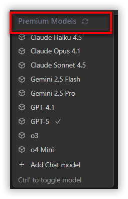

## What's New in v1.0.1

## Improvements:

## Premium Models
Use Premium AI Models Instantly – No Setup Needed! Experience the power of top-tier AI models right inside Code Studio Enterprise Server. No need to bring your own API keys — just recharge your credits and start using premium models like GPT-5, Claude, and Gemini instantly. Fast, reliable, and fully managed by Code Studio — so you can focus on building, not configuring.

 

## New Pricing Plans
We've introduced new pricing tiers in Code Studio to provide flexibility for different user needs:

- **Free Plan** ($0/user/month): For individuals exploring the platform.  
- **Basic Plan** ($20/user/month): For small teams starting with AI-powered development.  
- **Pro Plan** ($30/user/month): For growing teams needing more credits and capacity.  
- **Enterprise Plan** ($40/user/month): For large organizations requiring advanced governance and reliability.  
- **BYOK Unlimited Plan** ($15/user/month): For teams running their own AI models and managing provider costs directly.

## Credits Management
We've added a new Credits option in Code Studio to help you easily manage your usage balance and top up credits directly from your account.

**Key highlights**:
- View your remaining credits balance in real time.  
- Add credits instantly with preset options ($50, $100, $500) or enter a custom amount.  
- Payment history section to track all your past transactions and credit top-ups.  

This update makes it easier to monitor your credits and maintain uninterrupted access to Code Studio features.

## Model Modes and Default Settings

### Modes Option in Add Model:
Choose operation modes (Chat, Edit, Apply, Autocomplete) when adding a model to specify where it will be used in the IDE.  

### Default Model Settings:
Configure and manage default models for each operation type — Chat, Edit, Apply, and Autocomplete — under the new Manage Default Settings dialog.  

These updates make Code Studio's AI model configuration more flexible, consistent, and tailored to your workflow.

## Bug fixes: 
### Azure Provider Deployment Issue:
For Azure Open AI models, the deployment value was not being added to the config file, causing the model's name to be used as the default deployment value. This has been resolved. Now, when a user specifies a deployment value, it is correctly added to the config file and used as the deployment value.

## Removed Features
The Enhanced Prompt and Automatic Memory features have been removed to simplify the user experience and improve overall performance.