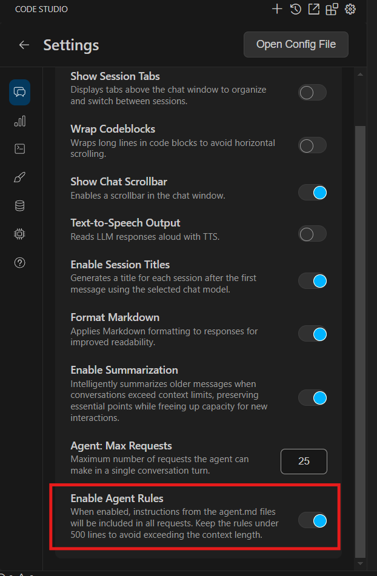
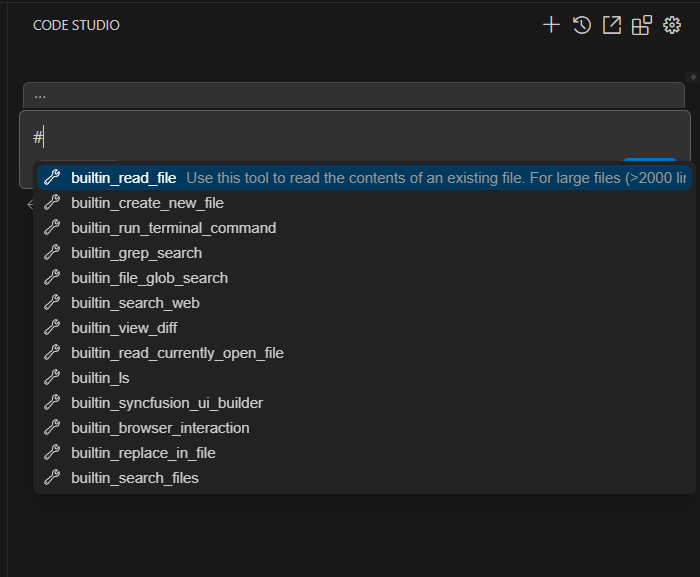
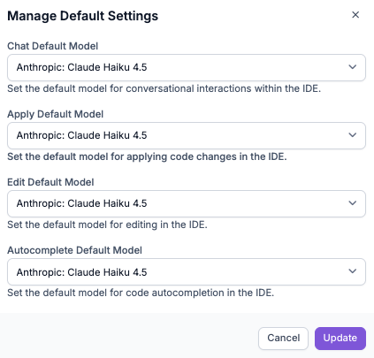

# What’s New in v1.0.3

# Improvements

## Global Agent Rules
Global Agent Rules are now supported in Code Studio. Introduce them via a plain **AGENTS.md** Markdown file—simply drop it in your project root or subdirectories for easy, readable instructions that guide AI code generation and tasks. Unlike structured Project Rules, this lightweight approach requires no metadata or complex setup, making it ideal for maintaining consistent guidelines across your project without repeating context in every chat.

### Key Notes
- The total lines across all **AGENTS.md** files (including nested and root files) should be fewer than 500 to avoid context length issues.  
- Enable **AGENTS.md** from the settings menu to apply it automatically to all chats.  

## Quick Tool Access with # Suggestions in Chat
We've supercharged your chat experience with inline tool suggestions: type `#` to open a dropdown of available tools, select one, and it auto-inserts as `#{ToolName}` followed by your prompt for seamless integration. Building on our `@` context providers, this `#` trigger keeps things distinct and speedy, ensuring consistent tool selection and sharper AI responses by eliminating guesswork. It sends a structured request that enhances response accuracy—no extra setup needed; just type and go!  

# Bug Fixes
- Fixed an issue where relevant controls were missing from UI Builder's Context Mode responses. The tool now intelligently selects and adds only the most fitting components, ensuring outputs remain focused, efficient, and aligned with your query for smoother UI builds.  
- Now you can select **Default BYOK model** from the dashboard's **Manage Default Settings**. This now flows through correctly, appearing as the default in the Code Studio Extension for a unified AI setup across your tools.  

