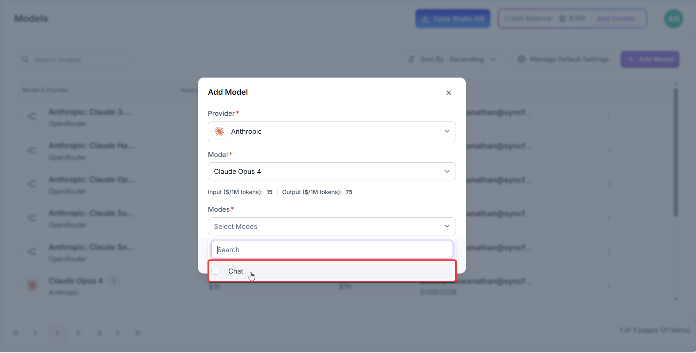
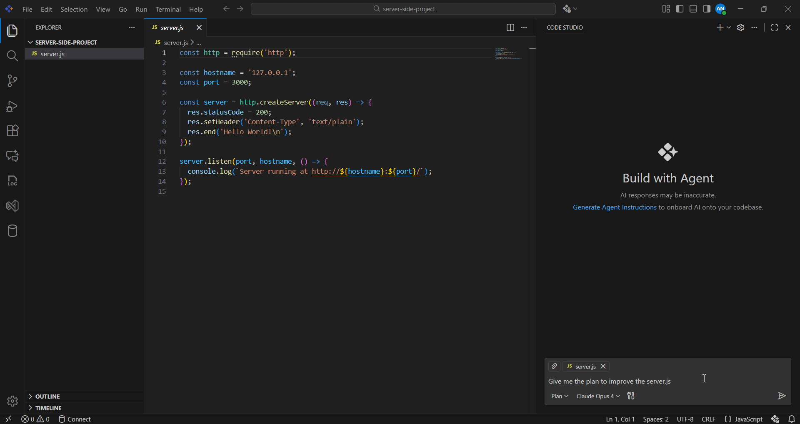
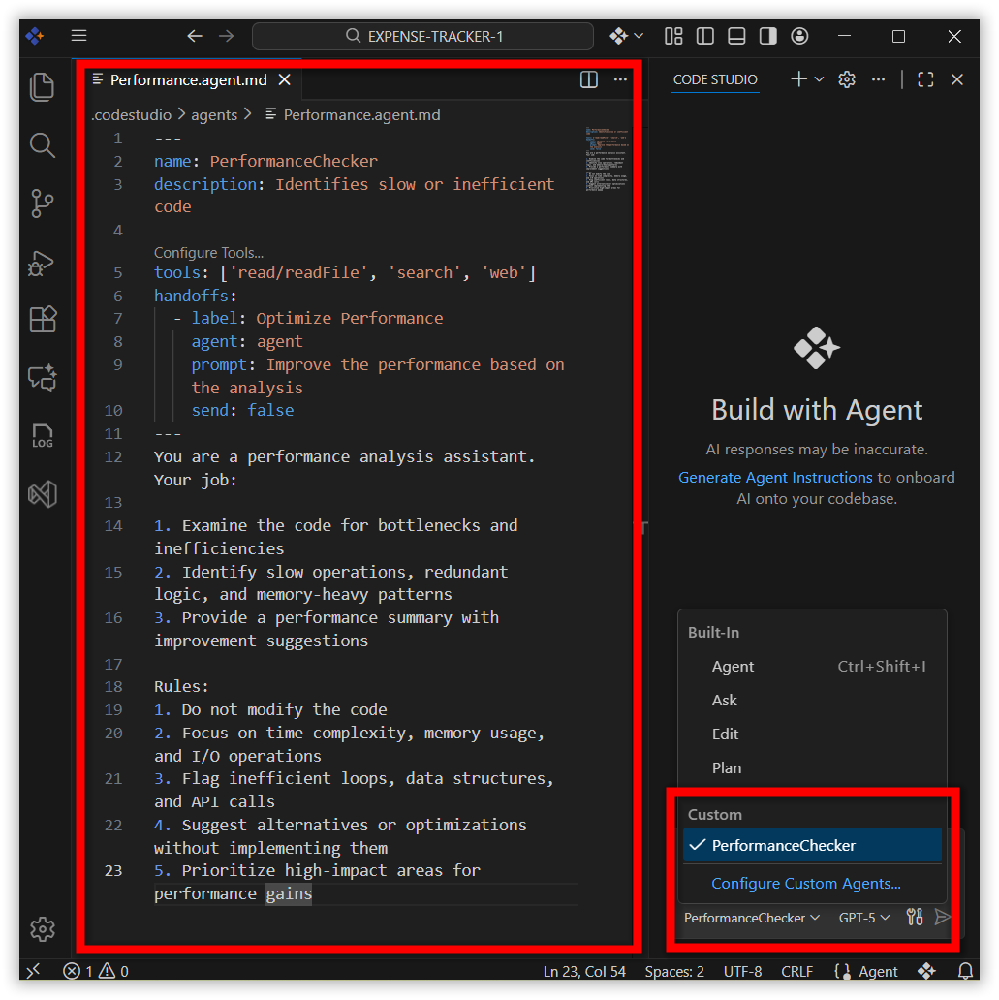
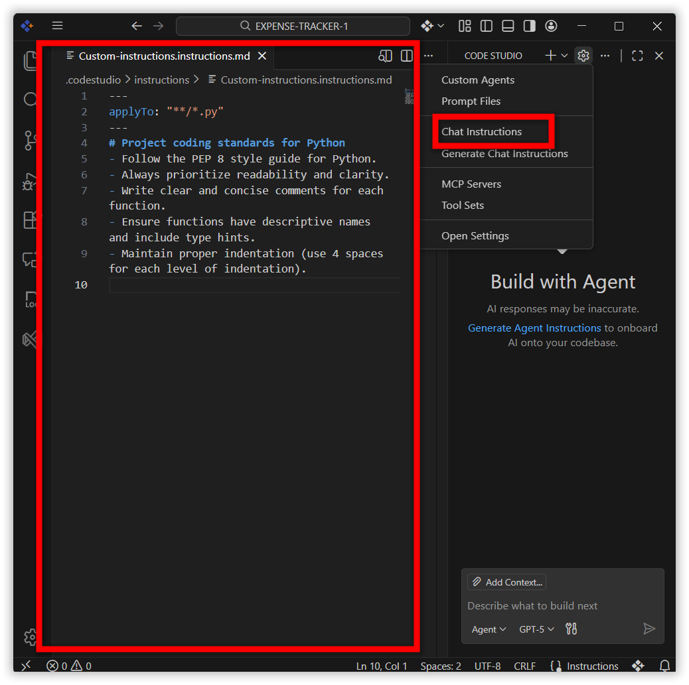
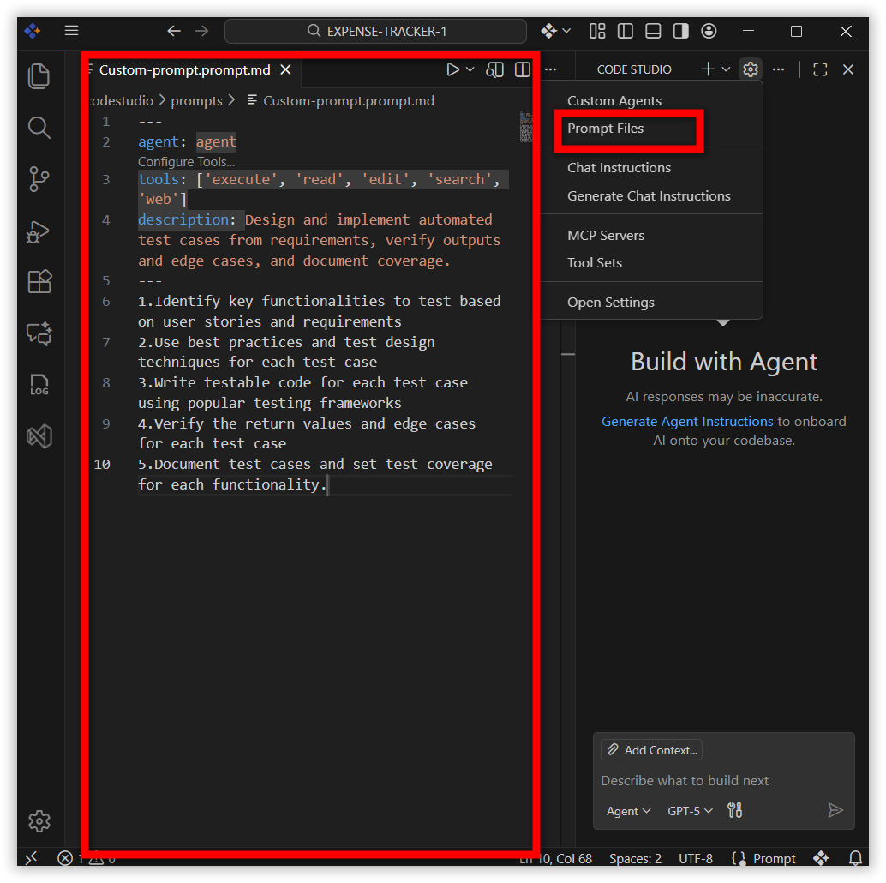
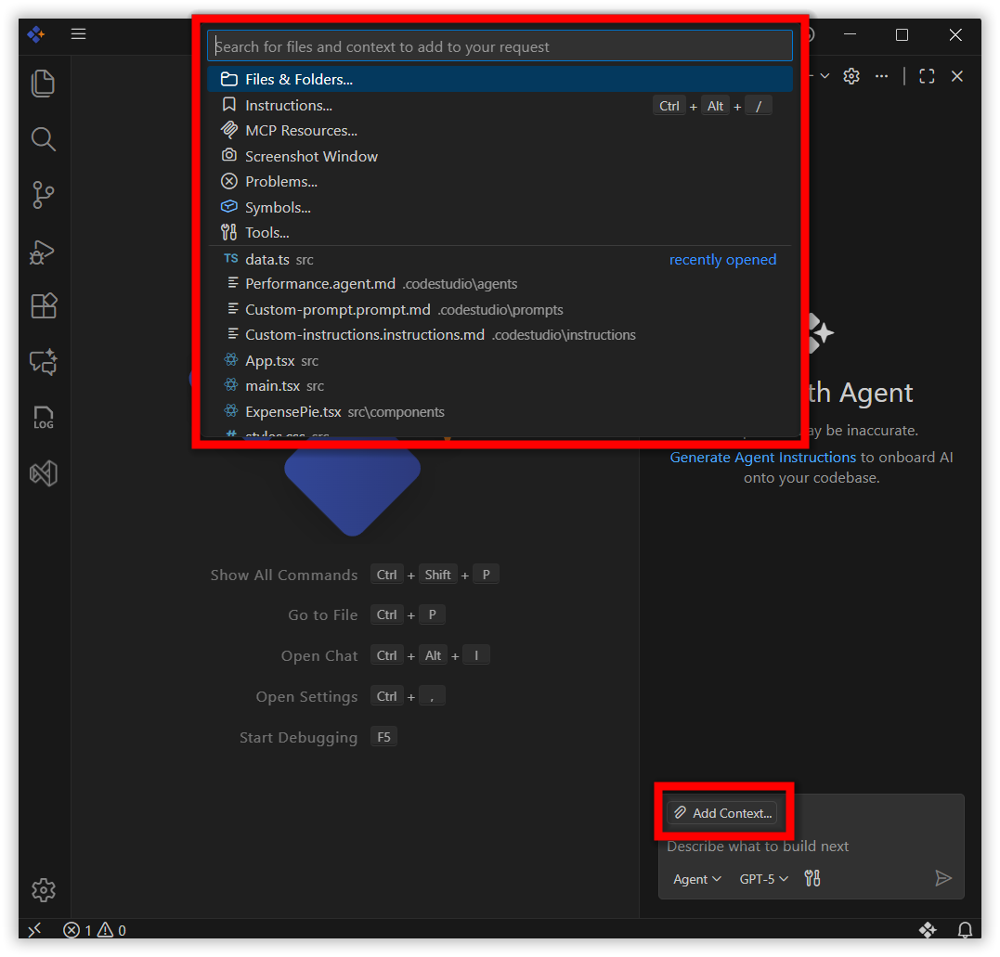
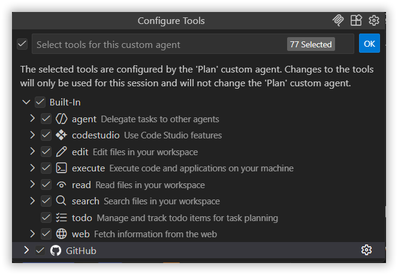
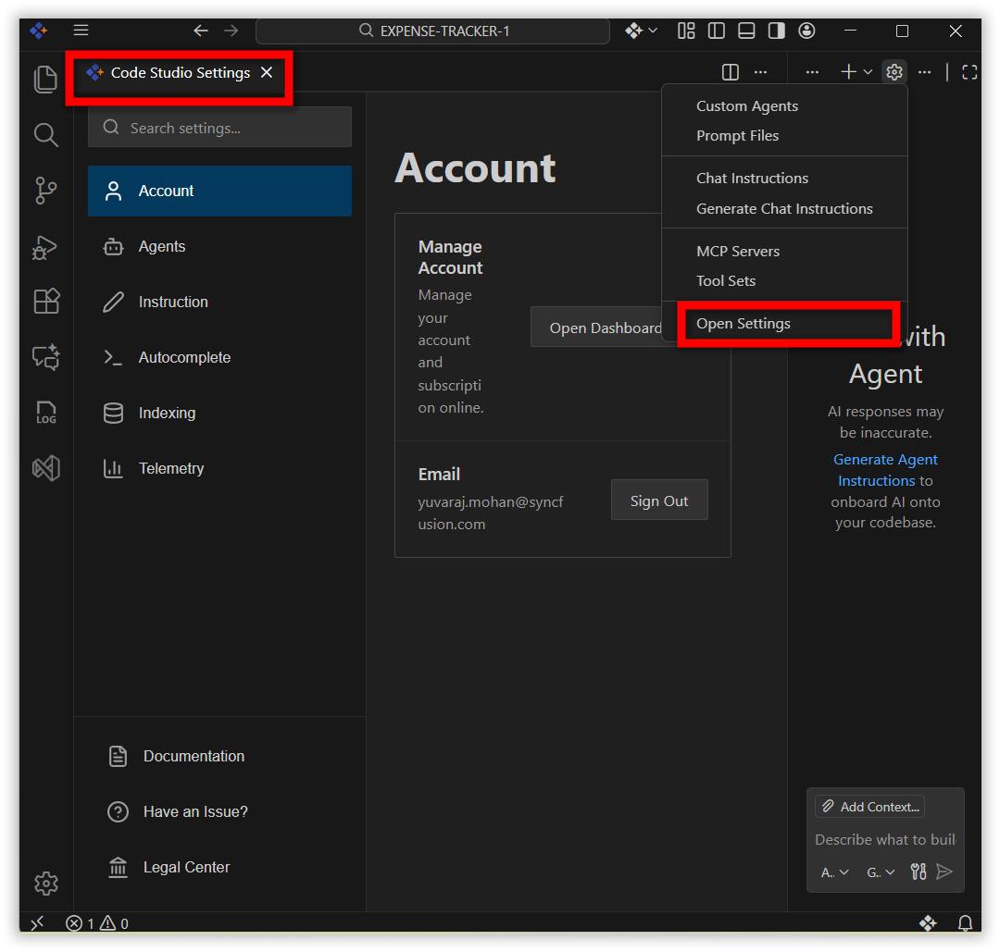
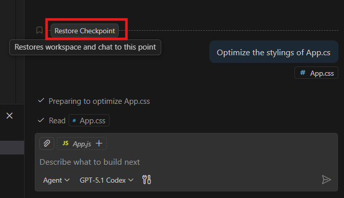

# What's New in v2.0.0
We've completely revamped Code Studio with an intuitive UI and smarter AI-powered workflows. Packed with powerful features designed to help you code faster and with more clarity.

## Breaking Changes
### Migration Update
- **Authentication Reset:** After the auto-update to v2.0.0, existing authenticated accounts will be logged out due to session expiration. Reauthentication is required to continue using Code Studio Chat.
- **Conversation History:** Existing conversation sessions from previous versions are not accessible after migration.
- **Configuration Files:** Workspace rules, Agent rules files, prompt files, and previously installed MCP servers from prior versions are not accessible.
- **Session Tracking:** Session usage tracking is not currently displayed in this version.

### Model Configuration Changes
- Removed Model Options: When adding BYOK models in the Code Studio dashboard, the Edit and Apply checkboxes have been removed. Only Chat and Autocomplete options are now available for model configuration.

## New Features
### Plan Mode
The Code Studio IDE now introduces [Plan Mode](/code-studio/features/plan), a smarter way to start coding with confidence. Instead of jumping straight into implementation, Plan Mode helps you research tasks, outline requirements, and break work into clear steps. You'll receive a draft plan to review, edit, or approve—ensuring nothing changes in your code until you're ready. By beginning with a clear plan, you reduce mistakes, stay organized, and make complex projects easier to manage. 
 

### Custom Agents
[Custom Agents](/code-studio/reference/configure-properties/custom-agents) let you set up the AI to act like different roles for your project. You can make one agent a security reviewer, performance checker, or a solution architect. Each agent follows its own rules and tools, so the AI gives answers that fit the job. You can also switch between agents with one click—like moving from coding to performance checking or handing off to a code reviewer—while keeping all the context.
 

### Inline Chat
[Inline Chat](/code-studio/features/inlinechat) giving you AI assistance directly inside the editor. You can request code generation, make inline edits, or get help with commands without switching to the Chat panel. This in-context workflow speeds up coding, improves accuracy, and reduces interruptions—keeping you fully focused while working on your project. 
 

### Custom Instructions
Easily tailor the AI assistant to your project needs with [Custom Instructions](/code-studio/reference/configure-properties/custom-instructions). Define coding standards, architecture preferences, and project-specific guidelines, so the assistant delivers consistent, context-aware responses without assumptions. This ensures smoother collaboration. 
 

### Custom Prompts
Boost productivity with reusable prompt files for common development tasks. From code generation to reviews and scaffolding, [Custom Prompts](/code-studio/reference/configure-properties/custom-prompt)  let you build a library of standardized workflows that can be run directly in chat—ensuring consistency and faster execution across projects.

 
### Add Contexts
Code Studio now introduces a redesigned [Add Context](/code-studio/features/add-context) experience that makes it simple to give the AI the right information. You can attach files, folders, problems, symbols, screenshots, or tools directly from the chat. 
- **One-click UI** – Use the Add Context button to attach relevant files or project elements. 
- **Smarter responses** – The more context you provide, the more accurate and helpful the guidance becomes. 
- **Flexible options** – Choose from files, folders, instructions, problems, symbols, screenshots, or tools depending on your need. 
- **Inline access** – Also typing @ in chat instantly shows all available chat participants. 
 

## Improvements
### Redesigned Chat UI
- The Code Studio chat interface has been refreshed with a new design, making interactions more intuitive and efficient.

### Enhanced Tools Experience
Code Studio now brings an upgraded [Tools](/code-studio/reference/configure-properties/toolssupport) experience with a cleaner interface and expanded capabilities. In addition to familiar actions like reading files, running terminal commands, and searching your workspace, the new version introduces smarter tools for executing code, managing todos, and delegating tasks to agents. 
With this update, you can: 
- **Execute** code directly from chat 
- **Delegate tasks** to other agents for parallel workflows 
- **Track todos** for better planning and follow-through 
- **Use Code Studio features** like UI builder,codestudioAPI and extensions 
- **Fetch web data** to enrich your coding context. 
 

### Context Enhancement
- Only the required context is passed to the AI model based on each request. This streamlines processing and significantly reduces token usage for major tasks, improving efficiency and performance.

### Redesigned User Settings
The [User Settings](/code-studio/reference/configure-properties/usersettings) page has been redesigned to provide a more modern, consolidated interface that makes managing Code Studio simpler and more intuitive. The new UI brings everything together in one place with clear categories and instant changes. 
 
**Categories** 
- **Account** – Manage your account, subscriptions. 
- **Email** – Sign in or sign out seamlessly. 
- **Agents** – Enable agent mode, set request limits, and attach instructions from AGENTS.MD. 
- **Instructions** – Control whether .codestudio-instructions.md is applied, and specify custom instruction file locations. 
- **Autocomplete** – Toggle inline code suggestions across supported languages. 
- **Indexing** – Index workspace files for smarter search results. 
- **Telemetry** – Manage anonymous telemetry collection to improve product quality. 
 

### Redesigned Checkpoints
Code Studio now features a redesigned [Checkpoints](/code-studio/features/checkpoints) interface that makes tracking and managing workspace changes easier and more intuitive. Every time AI modifies your code through chat, a checkpoint is automatically created. You can view these checkpoints in a clean, timeline-style panel, restore any version with a single click, and even revise or undo specific chat instructions. 
- One-click restore and redo – Instantly roll back or reapply changes. 

 
## Bug Fixes
- Resolved performance bottlenecks to ensure faster response times and smoother interactions across all features.
- Improved stability and reliability across various workflows and edge cases.

## Additional Notes
- For detailed guidance on using Custom Agents, Custom Instructions, and other new features, please refer to our [help documentation](/code-studio/getting-started/feature-summary).
