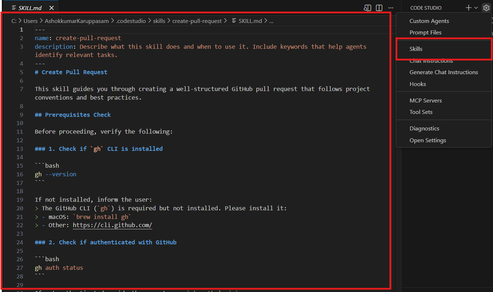
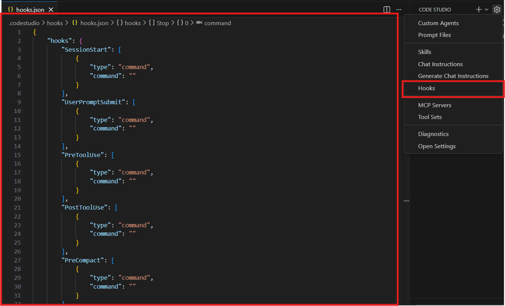
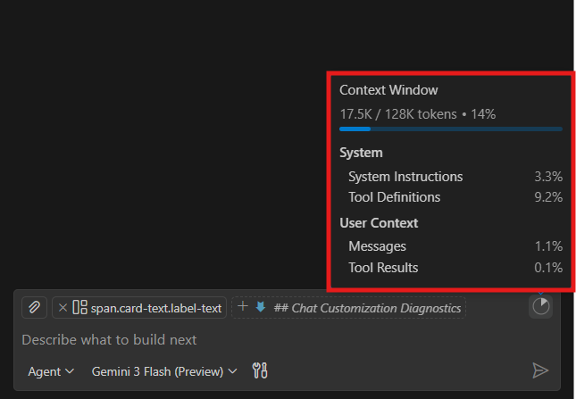
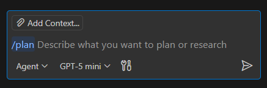
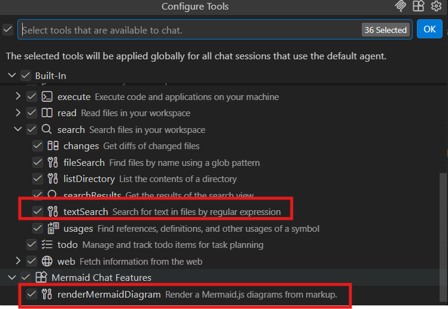
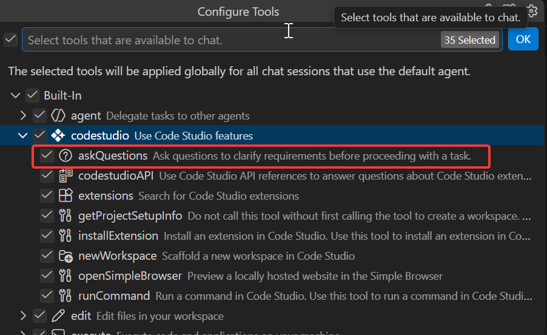
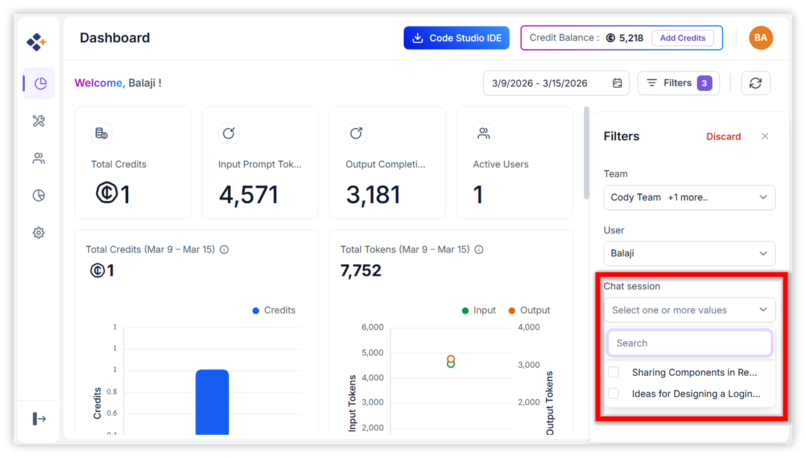
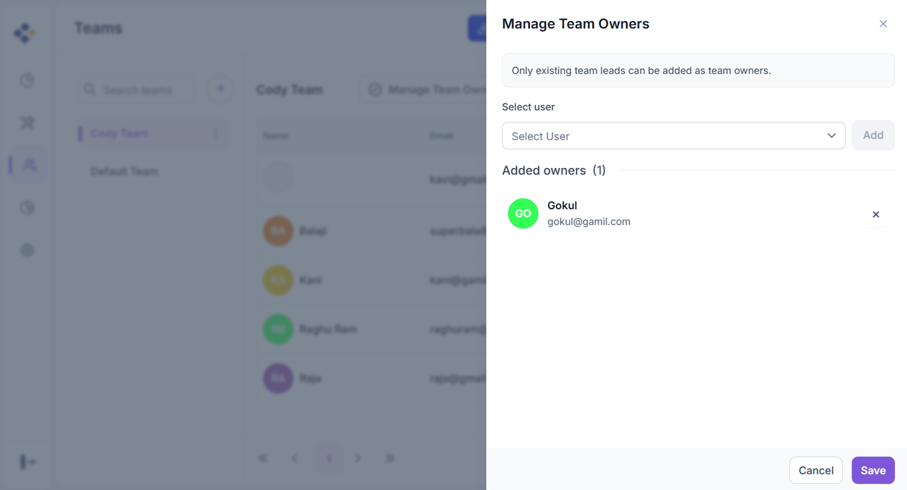
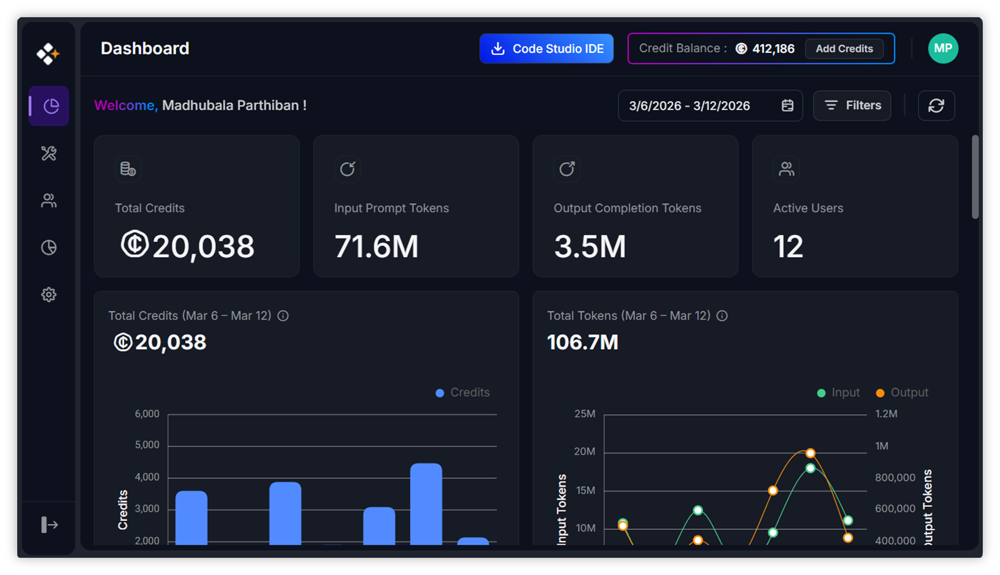

# What's New in v2.0.1
We've enhanced Code Studio with powerful new agent customization capabilities, including Agent Skills, Agent Hooks, and an integrated browser experience. Each update is designed to help you build faster, enforce standards consistently, and deliver higher-quality outcomes.

## Breaking Changes
### Semantic Tool Removed
Due to slow latency in semantic queries, the semantic tool has been fully removed from Code Studio.

### UI Builder Tool Removed
The UI Builder tool has been removed from Code Studio.

### Byok Removed
- Since BYOK models are no longer in use, BYOK has been removed.
- If BYOK is required in the future, it will be enabled only for the specific user who needs it.

### Add Existing User Removed
- Due to a user can belong to only one team, not in multiple teams, the add existing user option has been removed.

## New Features
### Agent Skills
Agent Skills let you teach the AI coding agent new capabilities and provide it with domain-specific knowledge. You can package specialized expertise (testing strategies, API design, performance optimization, etc.) into reusable skill files that the agent automatically loads when relevant to your task.

### Agent Hooks
Agent Hooks execute custom shell commands at key lifecycle points during agent sessions with guaranteed, deterministic outcomes. Unlike agent instructions or prompts that guide behavior, hooks actually run your code with predetermined results—making them ideal for enforcing policies and automating quality checks.

### Integrated Browser
Browse web applications without leaving Code Studio. The new integrated browser overcomes limitations of the Simple Browser by providing full authentication support, DevTools, and seamless AI integration.

### New Themes
Fresh new themes designed with modern aesthetics and improved visual hierarchy:
- **VS Code Dark (Experimental):** Enhanced contrast, clarity, and elevated visual design.
- **VS Code Light:** Bright contemporary aesthetics and improved focus through visual elevation.

### Context Window UI
A new indicator in the chat input tracks model context usage and reveals a detailed breakdown on hover, helping you stay aware of token consumption.

### Plan Agent Mode
Invoke the enhanced Plan agent directly in chat by typing `/plan` followed by your task. It delivers a structured, multi-phase implementation plan for complex requirements.

### New Tools
- **`#renderMermaidDiagram`:** Renders interactive, zoomable Mermaid diagrams directly in chat responses.
- **`#askQuestions`:** Allows agents to ask clarifying questions with selectable/free-text options.
- **`#textSearch`:** Can optionally include matches from `files.exclude`, `search.exclude`, or `.gitignore`-listed paths.

### Chat UX Improvements
- **Inline Chat Revamp:** Less intrusive design with easier text-selection triggering.
- **Model Picker Enhancements:** Hover on a model to reveal its full description instantly.
- Access all Chat Sessions directly from the chat UI with full side-by-side viewing.
- Track live agent progress in session history even after closing the session.

### Chat Customization Diagnostics
Right-click in the Chat view and select **Diagnostics** to view a Markdown report of all loaded custom agents, prompts, instructions, and skills—complete with status and loading errors.

### New Chat Models
- **Gemini 3.1 Flash Lite (Preview):** A cost-efficient multimodal model built for high-volume, low-latency tasks.
- **GPT-5.3 Codex:** An advanced agentic coding model that runs 25% faster than GPT-5.2 Codex.
- **GPT-5.4:** A flagship general-purpose model unifying advanced coding, reasoning, and agentic capabilities. Features a 1M token context window, built-in computer use, and intelligent tool selection.

### Dashboard - Filter Option:
The **Dashboard Filter** feature allows users to refine and analyze dashboard metrics with precision. It allows you to drill down into data by chat session to analyze session-level usage.

### Manage Team Owners
The **Manage Team Owners** feature allows administrators to assign selected team leaders as Team Owners so they can monitor work, manage editable access, maintain team structure, and support operations more effectively. 

### Dark Mode Support
The **Dark Mode Support feature** in Code Studio Enterprise Server introduces a unified dark themed interface designed for developers and administrators who prefer working in low light or visually minimal environments. This theme applies consistently to Dashboard, User and Teams, Fallback Policy, Budget and Settings.

## Improvements
### Code Studio Usage UI Update
- Improved the Code Studio usage interface to display users' remaining credits for better tracking.

### Agent Status Indicator
- A new status indicator in the command center shows which sessions need attention, have unread responses, or are actively processing.

### Worktrees in Source Control View
- Manage Git worktrees directly from the Source Control Repositories view without switching tools.

### Breakpoints Organized by File
- A tree view groups breakpoints by their containing file for easier navigation.

### Language Model Editor
- A centralized interface for managing and configuring all language models with support for multiple configurations per provider.

### Output Channel Filter Improvements
- More powerful filtering with support for complex patterns and exclusions.

### MCP Server Page Updates
- Added clear icon to search input and progress indication during Custom Server installation.
- Implemented Workspace and Global scope options for MCP Server installation.
- Added support to enable or disable Marketplace and Custom Server options based on MCP access settings.

### `#runInTerminal` Tool Improvements
- Type directly in the embedded chat terminal for responding to command prompts and interactive input.

### Improved Inline Suggestions Performance
- Inline suggestions now better preserve code indentation structure on acceptance.

### Agent Improvements
- Agents can now read files and list directories outside your current workspace with explicit permission.
- Agents can run custom agents as subagents, delegating complex subtasks efficiently.
- Custom agents support fine-grained control with attributes like `user-invokable`, `disable-model-invocation`, and `agents`.
- `/init` slash command generates or updates AI workspace instructions based on your codebase.
- Anthropic models now support extended thinking for compatible models.

## Bug Fixes
- Fixed an issue where the Simple Browser's **Select an Element** feature could select elements outside the web page.
- Fixed the issue with configuring the maximum number input via the keyboard.
- Resolved the active tab issue on the Settings page.
- Ensured Code Studio themes are properly applied across the Settings page and MCP sections.
