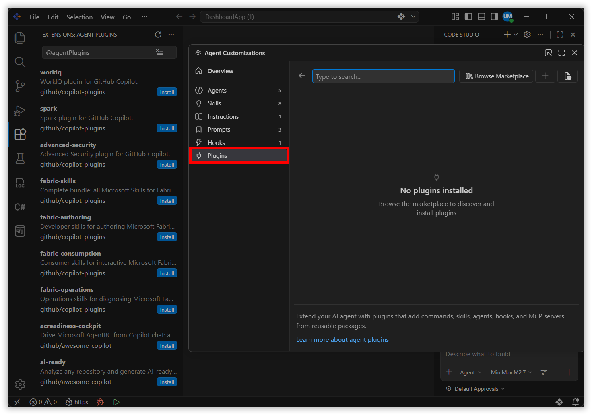
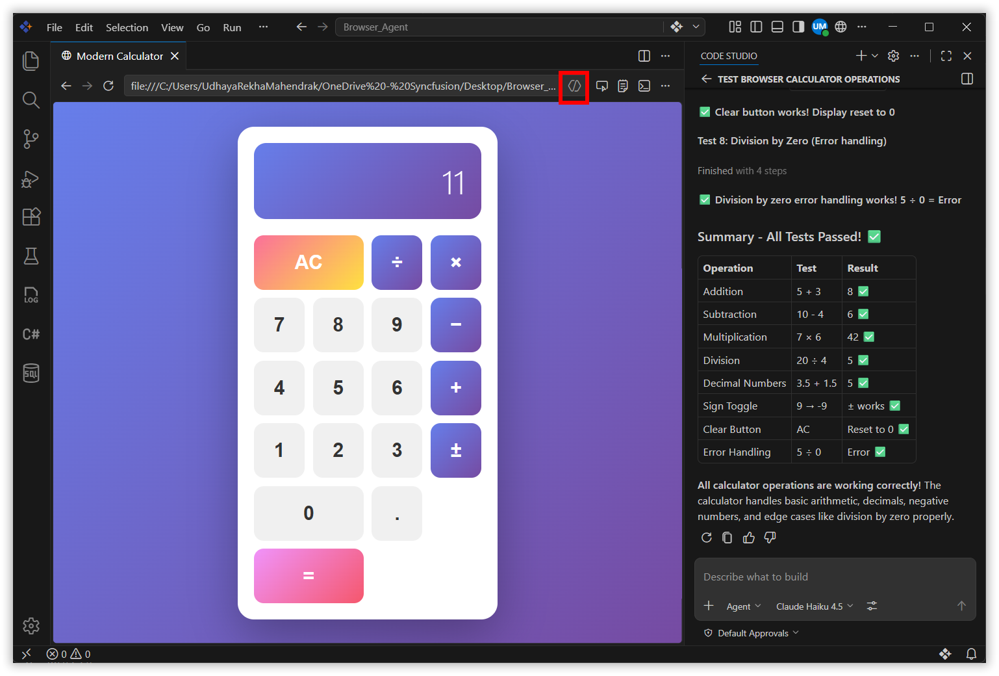
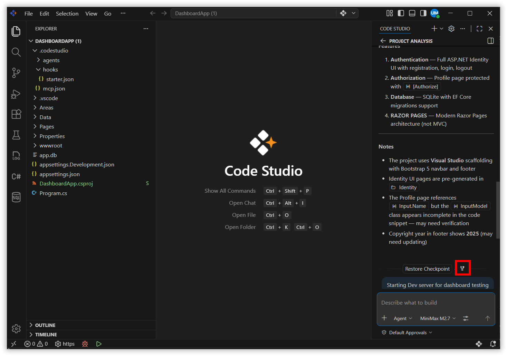
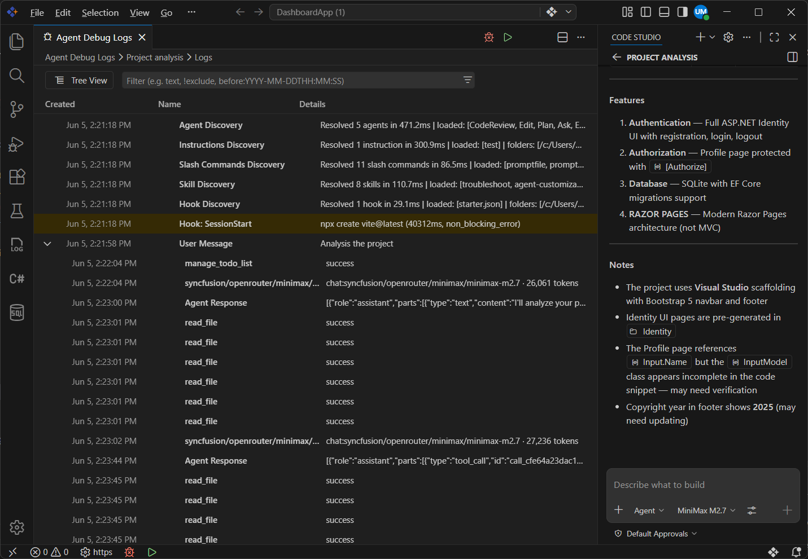
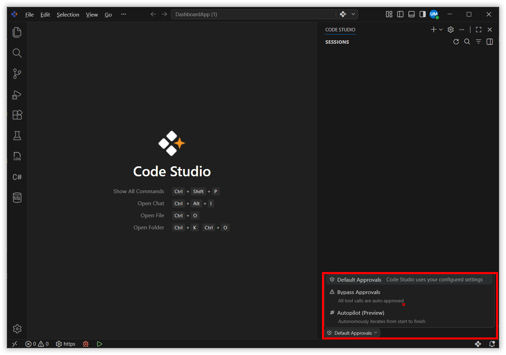
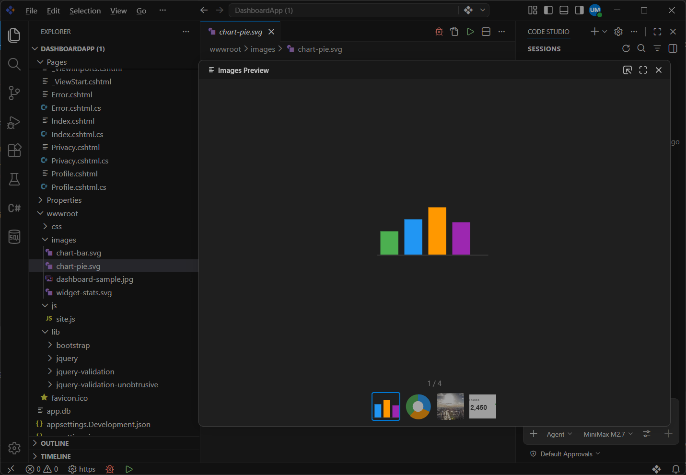
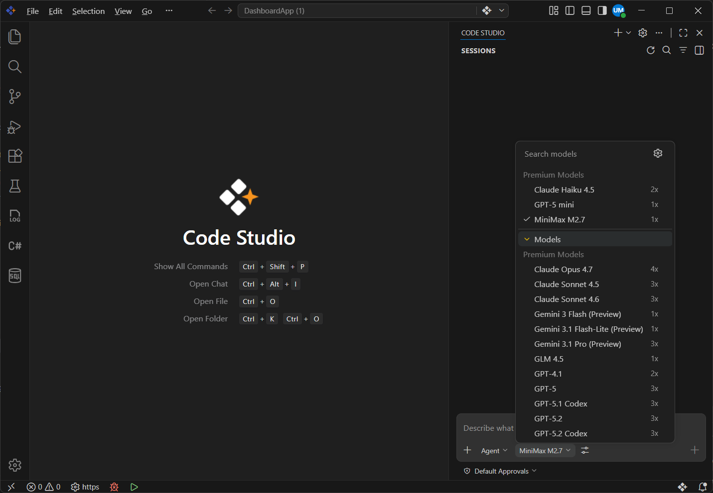

# What's New in v2.0.3
We've enhanced Code Studio with powerful new capabilities, including Agent Plugins, Agentic Browser Tools, and Session Memory. Each update is designed to extend AI-driven workflows, improve session continuity, and deliver more autonomous and flexible development experiences.

## Breaking Changes
### Context Providers Removed
The following context providers have been removed from Code Studio:
- `@Workspace`
- `@Workspace/explain`
- `@Workspace/fix`
- `@Workspace/new`
- `@Workspace/newNotebook`
- `@Workspace/setuptests`
- `@Workspace/tests`

### Removed Extensions:

The dotrush extension has been removed.
The vscode-solution-explorer extension has been removed.

### Open Simple Browser Tool Removed
The Open Simple Browser tool has been removed from Code Studio.

### Codebase Removed
The Codebase feature has been removed from Code Studio.

### New Tooling Introduced:

Added C# Development Tools to provide enhanced support for .NET and C# development.
Added MS SQL Manager for improved database management and integration.

Previously, agent features such as skills, instructions, prompts, custom agents, and hooks were accessible through the gear icon inside Chat. Now, all these capabilities are unified within the Agent customization UI, offering a centralized interface with improved usability and a more streamlined experience for managing agent configurations. Note: The Agent customization UI itself can be accessed directly by clicking the gear icon.

### Bug Fix:
Fixed claude no response issue 

## New Features
### Agent Plugins
Agent Plugins are prepackaged bundles of chat customizations that extend AI-driven workflows. Plugins can include skills, commands, agents, MCP servers, and hooks. Search and install plugins directly from the Extensions view by entering `@agentPlugins` in the search box or by running the Chat: Plugins command from the Command Palette.

### Agentic Browser Tools
Agents can now autonomously interact with the integrated browser, reading and manipulating web pages, observing content updates, and capturing console errors without additional dependencies. Capabilities include page navigation, content inspection, user interaction, and custom automation through `runPlaywrightCode`, enabling simultaneous authoring and verification of web applications.

### Session Memory
Plans created by the Plan agent now persist in session memory, remaining available across conversation turns for continuous refinement. Plans remain accessible even when older conversation history is compacted, providing consistency throughout the development process.

### Context Compaction
Context Compaction summarizes conversation history to free space while preserving essential details, allowing continued work within the same session. Compaction occurs automatically when the context window reaches its limit, and can be triggered manually by typing `/compact` in the chat input field.

### Fork a Chat Session
Session Forking allows the creation of new, independent chat sessions that inherit conversation history from the original, facilitating exploration of alternative approaches while preserving context. Type `/fork` in the chat input box to create a session with complete history, or select Fork Conversation from any chat request to include only the conversation up to that point.

### Agent Debug Panel
The Agent Debug Panel provides deeper visibility into chat sessions, displaying chat events in real time, including customization events, system prompts, tool calls, and other interactions. It shows exactly which prompt files, skills, hooks, and custom agents are active in a session, replacing the previous Diagnostics chat action with a richer view that includes a visual chart hierarchy.

### Agent Permissions
A new permissions picker in the Chat view provides control over the level of autonomy granted to agents within a session. Three options are available: **Default Approvals** (follow configured settings with confirmation dialogs), **Bypass Approvals** (auto-approve all tool calls), and **Autopilot (Preview)** (extends autonomy with auto-approvals, error retries, and automatic task continuation).

### Agent Scoped Hooks
Agent-scoped hooks can be defined directly in a custom agent's YAML front matter. These hooks run only when the specific agent is active and operate alongside workspace- or user-level hooks, enabling pre- and post-processing logic for individual agents.

### Integrated Browser Debugging
Web applications can now be debugged directly within Code Studio while setting breakpoints, stepping through code, and inspecting variables without leaving the editor. A new editor-browser debug type supports debugging of integrated browser tabs with both Launch and Attach configurations.

### Agent Image Support
Agents now support image and binary files, enabling tasks such as analyzing screenshots and reading data from binary formats. Images generated by agents or tools are selectable within chat responses and can be opened in a dedicated image carousel view.

### Monorepo Customizations
Code Studio now supports improved customization discovery in parent repositories, making it easier to apply repository-wide guidance across packages in monorepo setups. With the new `chat.useCustomizationsInParentRepositories` setting, customization files can be discovered from parent folders up to the repository root.

## Improvements
### Model Picker Enhancements
The model selection dialog features a visual redesign with better categorization of available models, making it easier to browse and select the right model for your task.

## Bug Fixes
Fixed an issue where Claude would intermittently fail to return responses. 

The system now ensures stable communication and reliable output generation.