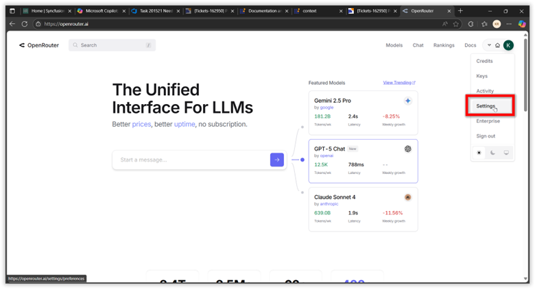
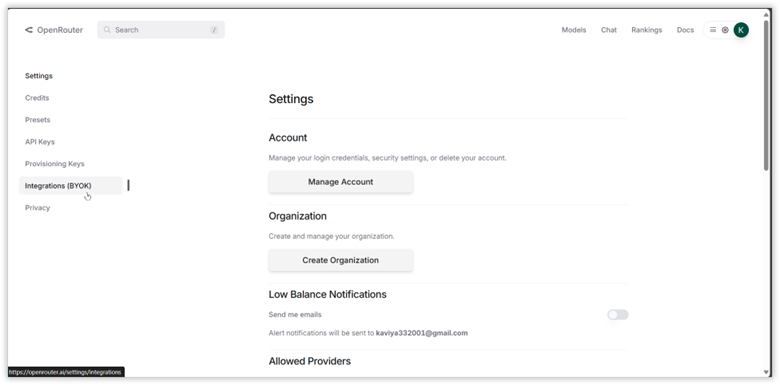
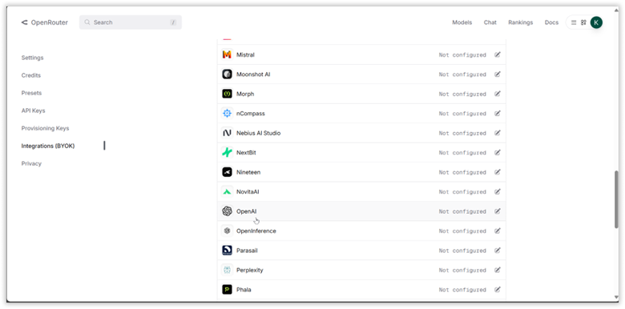
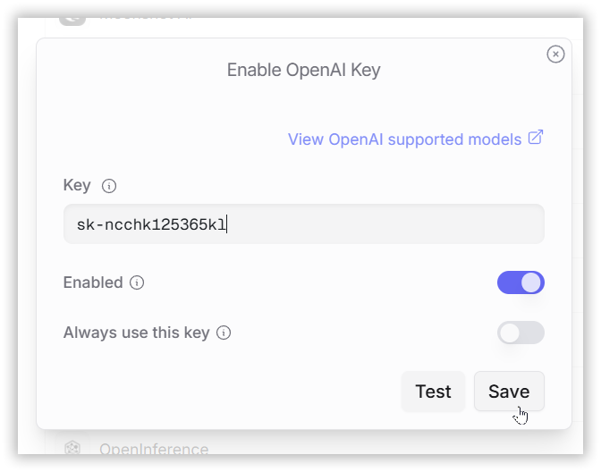

# How to Resolve Error (Status Code 403) for O3 model in OpenAI Integration via OpenRouter

This guide will help you easily set up and use the OpenAI o3 model through OpenRouter’s platform with your own OpenAI API key. Follow these simple steps to get started and make the most of this powerful integration.

---

## What You Need to Know

- The OpenAI o3 model requires your own OpenAI API key (**Bring Your Own Key - BYOK**) to work with OpenRouter.
- You’ll need an OpenAI account and an OpenRouter account to proceed.

---

## Prerequisites

- An active OpenAI account with a valid API key (**Tier 3 or higher** is required for the o3 model).
- An OpenRouter account to connect and manage your API key.

---

## Step-by-Step Setup

### 1. Obtain an OpenAI API Key

- **Log in to OpenAI**  
  - Visit [OpenAI Platform](https://platform.openai.com/) and sign in to your account.

- **Generate an API Key**  
  - Navigate to the API keys section in the OpenAI dashboard.  
  - Click **Create API Key** and give it a descriptive name (e.g., `OpenRouter o3 Key`).  
  - Copy the generated key and store it securely. **Do not share it publicly.**

---

### 2. Configure OpenRouter with Your OpenAI API Key

- **Sign Up for OpenRouter**  
  - Go to [OpenRouter](https://openrouter.ai/) and create an account if you don’t already have one.  
  - Log in to your OpenRouter dashboard.

- **Access OpenRouter Integrations**  
  - Navigate to [Settings > Integrations](https://openrouter.ai/settings/integrations)
  
    

    

  - Choose **OpenAI** as the provider for the o3 model.
    

    

  - Paste your OpenAI API key into the provided field.  
  - Make sure it’s a valid **Tier 3 or higher** key.  

    
    
  - Click **Save** to link your key to OpenRouter. The platform will verify your key and set it up for o3 model requests.

---

## Monitor Your Usage

- **Check Usage Limits:** Free accounts on OpenRouter have a limit of 50 requests per day. If you’ve purchased 10+ credits, this increases to 1,000 requests per day
- **Track Costs:** OpenRouter’s dashboard shows your token usage and costs based on your OpenAI API key activity.

---

## Best Practices

- **Secure Your API Keys**: Never expose your OpenAI or OpenRouter API keys in public repositories. OpenRouter is a GitHub secret scanning partner to detect exposed keys.

- **Error Handling:** Implement error handling for cases like “Forbidden” errors, which may indicate an invalid or insufficient-tier API key.

- **Test the Integration:** After setup, test with a simple request to ensure your API key and configuration work correctly. If errors occur (e.g., “OpenAI is temporarily requiring a Tier 3 API key”), verify your OpenAI account tier.

---

## Additional Resources

- [OpenRouter Documentation](https://openrouter.ai/docs) – Detailed API specifications  
- [OpenRouter Integrations](https://openrouter.ai/settings/integrations) – Manage API keys  
- [OpenAI Dashboard](https://platform.openai.com/) – API key management and tier status  
- [OpenRouter Model Details](https://openrouter.ai/docs#models) – Info on o3 and other models
