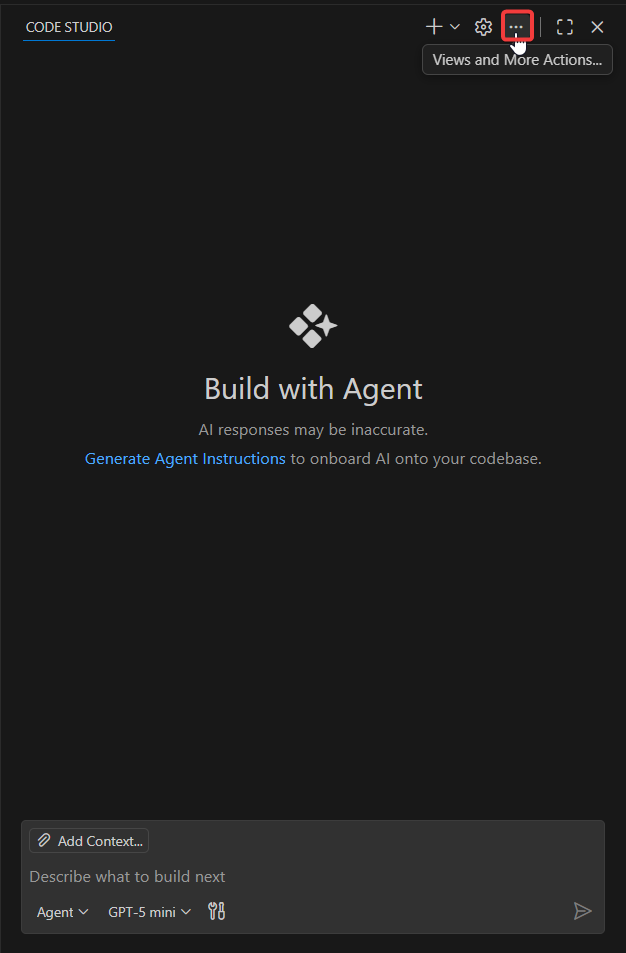
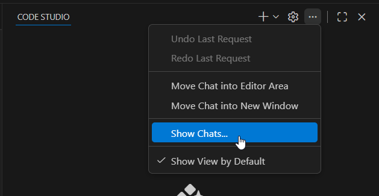
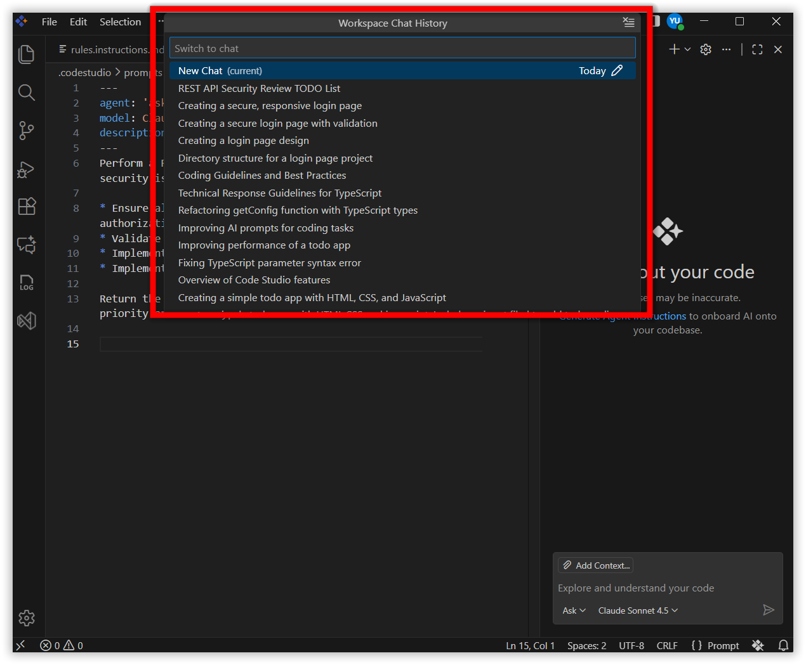

# How to access session history files in the revamped CodeStudio

This guide explains how to view session history after upgrading to CodeStudio v2.0.0+.

## Problem Summary
After upgrading to the current release version 2.0.0, chat sessions from versions prior to **2.0.0** may not appear in the session history.

## Resolution Steps

After upgrading to the current release version, existing conversation sessions from versions prior to 2.0.0 are not accessible.

## Accessing Session History in Current Version

To view your session history in the current version of CodeStudio, follow these steps:

1. Click the **three dots icon** (⋯) labeled "View and More Actions".

2. Select **Show Chats** from the menu.

3. Your **Sessions History** will be displayed, showing all conversations made in the that particular workspace from the current version.

