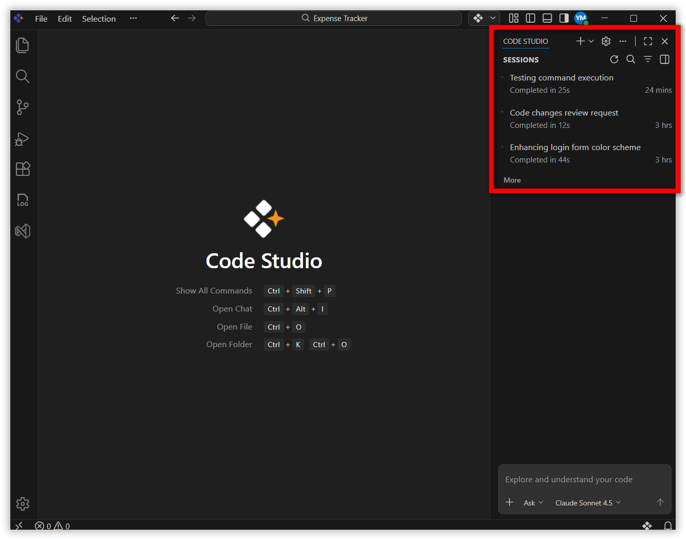
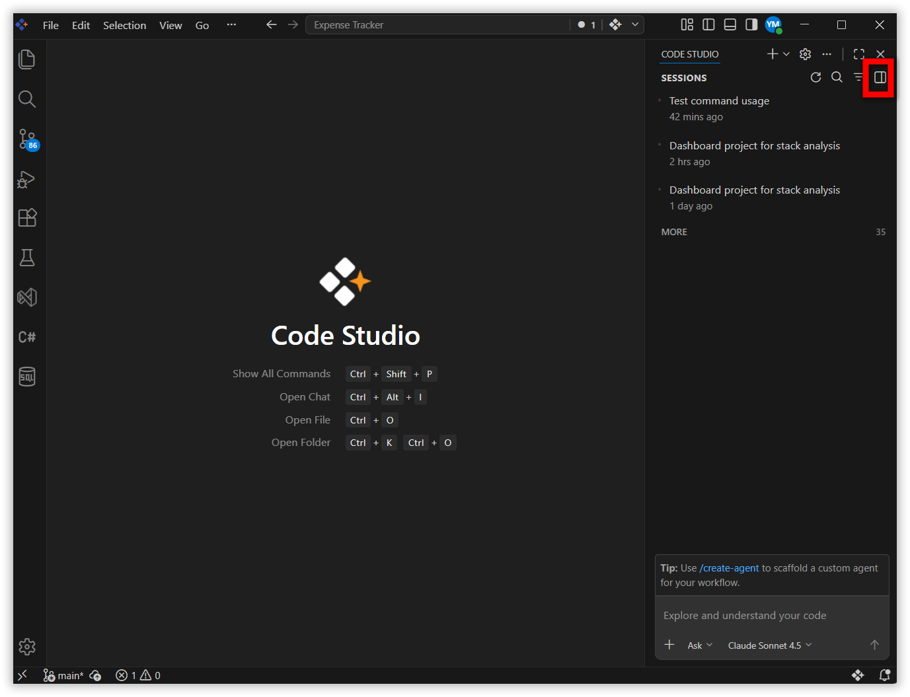
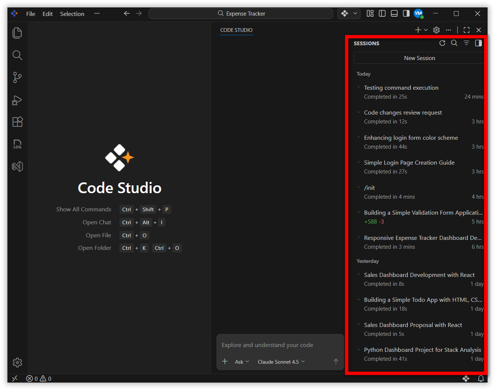

# How to access session history files in Code Studio

This guide explains how to view and manage session history after upgrading to Code Studio v2.0.0+.

## Problem Summary

After upgrading to Code Studio v2.0.0+, chat sessions from earlier versions (before v2.0.0) may not appear in the session history.

> **Note:** Session history created prior to v2.0.0 cannot be migrated to the Code Studio v2.0.0+ session history. Refer to the [v2.0.0 release notes](/code-studio/release-notes/v2.0.0) for migration details.

## Accessing Session History

The Chat view provides a unified view to manage all your agent sessions, regardless of where they run. By default, it shows your recent sessions along with information about their status, type, and file changes. Expand the list to view and filter all your agent sessions.

The sessions list is scoped to your current workspace. If no workspace is open, the list shows sessions across all your workspaces. Sessions are grouped by time period — for example, **Today** or **Last Week**.

## Sessions List Views

The Chat view operates in two display modes: **Compact** and **Side-by-side**. Use the toggle control in the top-right corner of the Chat view to switch between them.

**Compact**

The sessions list is embedded within the Chat view. Selecting a session switches the Chat view to that session. Use the back button to return to the sessions list.

**Side-by-side**

The sessions list is displayed alongside the Chat view. To enable this mode:

1. Click the **Show Agents Session Sidebar** button.

2. The sessions list appears side-by-side with the Chat view. Select any session from the list to view its full conversation details.

