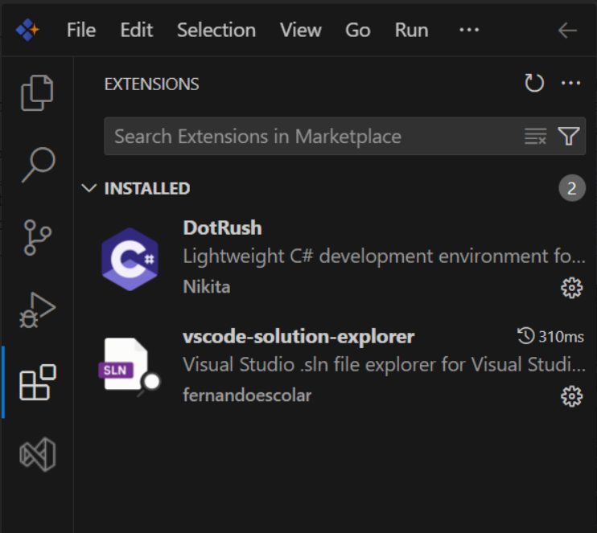

# Built-in Extensions of Syncfusion Code Studio

Syncfusion Code Studio includes a comprehensive suite of pre-installed extensions designed to provide professional-grade development and debugging capabilities. These extensions are carefully integrated to deliver an enhanced development experience across multiple platforms and technologies without requiring additional configuration.

## DotRush Extension

**DotRush** is a comprehensive, lightweight C# development environment that transforms Code Studio into a powerful .NET development platform. This extension serves as the foundation for efficient .NET project management and development workflows.

### Core Capabilities:

- **Advanced Roslyn-based IntelliSense** - Provides intelligent code completion, syntax highlighting, and real-time error detection
- **Integrated Solution Explorer** - Manages complex multi-project solutions with Visual Studio-compatible functionality
- **Multi-platform debugging support** - Unified debugging experience for .NET Core, ASP.NET Core, Blazor WebAssembly, Unity, and Godot projects
- **Comprehensive test integration** - Built-in support for NUnit, xUnit, and MSTest frameworks with test discovery and execution
- **Advanced performance profiling** - Real-time performance analysis and optimization tools
- **Code decompilation and analysis** - Reverse engineering capabilities for .NET assemblies
- **Multi-target diagnostics** - Cross-platform build and deployment diagnostics
- **WebAssembly debugging integration** - Specialized debugging for Blazor WebAssembly applications

**Learn More:** [JaneySprings/DotRush: Lightweight C# development environment for VSCode](https://github.com/JaneySprings/DotRush)

## vscode-solution-explorer Extension

**vscode-solution-explorer** brings the familiar Visual Studio Solution Explorer experience to Code Studio, providing professional project management capabilities for complex .NET solutions. This extension ensures seamless workflow continuity for development teams.

### Professional Features:

- **Comprehensive solution file support** - Full compatibility with .sln and .slnx formats
- **Visual Studio-compatible interface** - Familiar hierarchical project structure and navigation
- **Enterprise-grade project optimization** - Enhanced performance for large .NET Core and .NET Framework solutions
- **Advanced project organization** - Drag-and-drop functionality with automatic dependency resolution
- **Scalable multi-project management** - Efficiently handles enterprise-level solutions with dozens of projects
- **Intelligent dependency visualization** - Clear project reference mapping and dependency analysis

### Developer Experience Benefits:

This extension significantly reduces the learning curve for developers migrating from Visual Studio while providing enhanced productivity features specifically optimized for Code Studio's lightweight architecture.

**Learn More:** [fernandoescolar/vscode-solution-explorer: Visual Studio Solution explorer panel for VS Code](https://github.com/fernandoescolar/vscode-solution-explorer)

## Visual Reference

*Built-in extensions showcase in Syncfusion Code Studio for enhanced development experience*

---

**Important:** These extensions are pre-installed and automatically activated in Code Studio. No additional installation, licensing, or configuration is required to access these professional development tools.