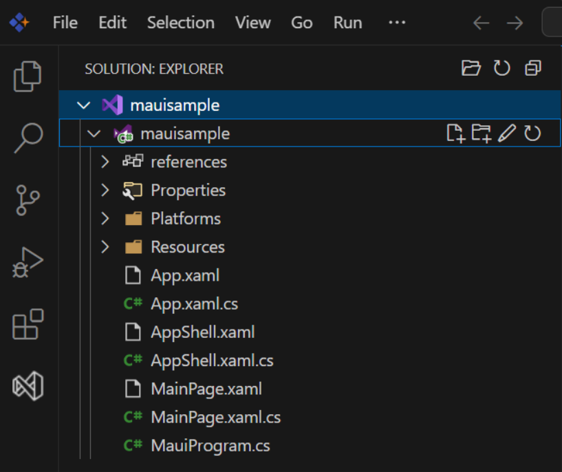

# Debugging .NET MAUI Applications in Syncfusion Code Studio

## Overview

Debugging is an essential part of the development process that helps identify and fix issues in your .NET MAUI applications. **Syncfusion Code Studio** provides comprehensive debugging tools and features to streamline this process. This guide provides step-by-step instructions for effectively debugging your .NET MAUI applications.

## Prerequisites

- **Syncfusion Code Studio** installed on your system.
- **.NET SDK 9.0 or latest version** installed based on your platform (Windows, macOS, or Linux). Download from the [.NET Website](https://dotnet.microsoft.com/).
- **Verify .NET SDK installation** by running the following commands in terminal:
  - Check version: `dotnet --version`
  - Get detailed information: `dotnet --info`
- **Check existing workloads** installed in the system: `dotnet workload list`
- **Install .NET MAUI Workload:**

  **Windows:**
  ```bash
  dotnet workload install maui
  ```

  **macOS:**
  ```bash
  sudo dotnet workload install maui
  ```

  **Linux:**
  ```bash
  dotnet workload install maui-android
  ```

  **Verify Installation:**
  ```bash
  dotnet workload list
  ```

- **Platform-specific requirements:**
  - **Android development:** Android Studio for Android emulator
  - **iOS development:** Xcode for iOS emulator (macOS only)

**Additional Resources:** For detailed installation guidance, watch this video - [.NET MAUI Development in VS Code - Complete Setup Guide](https://www.youtube.com/watch?v=1t2zzoW4D98&t=547s)

## Built-in Extensions of Code Studio

Syncfusion Code Studio comes with pre-installed extensions that enhance .NET MAUI development and debugging capabilities:

### DotRush Extension

**DotRush** is a lightweight C# development environment that enables efficient .NET project management. This extension provides:

- **Roslyn-based IntelliSense** for code completion and navigation
- **Solution Explorer** for handling multiple projects and solutions
- **Integrated debugging** support (including .NET Core, Unity, and Godot)
- **Test exploration** for running NUnit/xUnit tests
- **Performance profiling** tools
- **Code decompilation** capabilities
- **Multi-target diagnostics**

This extension is ideal for seamless .NET and game development across Windows, macOS, and Linux platforms.

**Learn More:** [JaneySprings/DotRush: Lightweight C# development environment for VSCode](https://github.com/JaneySprings/DotRush)

### vscode-solution-explorer Extension

**vscode-solution-explorer** adds a Solution Explorer panel for managing .sln files, mimicking Visual Studio's familiar structure. Key features include:

- **Solution file management** (.sln and .slnx support)
- **Visual Studio-like interface** for project navigation
- **Optimized for .NET Core projects**
- **Seamless project organization**

**Learn More:** [fernandoescolar/vscode-solution-explorer: Visual Studio Solution explorer panel for VS Code](https://github.com/fernandoescolar/vscode-solution-explorer)


## Create a .NET MAUI Project

Before you can debug a .NET MAUI application, you need to set up a project. Follow these steps to create a new .NET MAUI project in Syncfusion Code Studio:

### Step 1: Create a Solution
1. Open Syncfusion Code Studio.
2. Navigate to **Solution** > **Create New Solution**.
3. Create a new solution by specifying:
   - **Solution name**


### Step 2: Add a .NET MAUI Project to the Solution
1. Right-click on the solution in the **Solution Explorer** panel.
2. Select **Add New Project** from the context menu.

3. In the project template selection:
   - Choose **.NET MAUI App** template
   - Specify your **application name**
   - Set the **project location**




## Steps to Run and Debug a .NET MAUI Application in Code Studio

Once you have created your .NET MAUI project, follow these comprehensive steps to configure, build, and debug your application effectively.

### Configure Code Studio for Building the Project

#### Step 1: Set Up Debug Configuration Files

1. **Navigate to the Run and Debug section** and create the `launch.json` file using the **.NET Core Debugger**.


2. **Create a `tasks.json` file** within the `.vscode` folder.


#### Step 2: Configure tasks.json

Create the following `tasks.json` file in your `.vscode` folder:

```json
{
   "version": "2.0.0",
   "tasks": [
       {
           "label": "build-android",
           "command": "dotnet",
           "type": "process",
           "args": [
               "build",
               "${workspaceFolder}/FinanceTracker/FinanceTracker.csproj",
               "-f",
               "net9.0-android",
               "-c",
               "Debug"
           ],
           "problemMatcher": "$msCompile",
           "group": {
               "kind": "build",
               "isDefault": true
           }
       },
       {
           "label": "run-android",
           "command": "dotnet",
           "type": "process",
           "args": [
               "build",
               "-t:Run",
               "${workspaceFolder}/FinanceTracker/FinanceTracker.csproj",
               "-f",
               "net9.0-android",
               "-c",
               "Debug"
           ],
           "dependsOn": "build-android",
           "problemMatcher": "$msCompile"
       },
       {
           "label": "install-android-workload",
           "command": "dotnet",
           "type": "process",
           "args": [
               "workload",
               "install",
               "maui-android"
           ],
           "problemMatcher": "$msCompile"
       },
       {
           "label": "build-windows",
           "command": "dotnet",
           "type": "process",
           "args": [
               "build",
               "${workspaceFolder}/FinanceTracker/FinanceTracker.csproj",
               "-f",
               "net9.0-windows10.0.19041.0",
               "-c",
               "Debug",
               "/p:EnableWindowsTargeting=true"
           ],
           "problemMatcher": "$msCompile"
       },
       {
           "label": "clean",
           "command": "dotnet",
           "type": "process",
           "args": [
               "clean",
               "${workspaceFolder}/FinanceTracker/FinanceTracker.csproj"
           ],
           "problemMatcher": "$msCompile"
       },
       {
           "label": "rebuild-windows",
           "dependsOn": ["clean", "build-windows"],
           "dependsOrder": "sequence",
           "problemMatcher": "$msCompile",
           "group": "build"
       }
   ]
}
```

#### Step 3: Configure launch.json

Create the following `launch.json` file in your `.vscode` folder:

```json
{
   "version": "0.2.0",
   "configurations": [
       {
           "name": "Debug Android",
           "type": "coreclr",
           "request": "launch",
           "preLaunchTask": "run-android",
           "program": "${workspaceFolder}/FinanceTracker/bin/Debug/net9.0-android/com.companyname.financetracker.apk",
           "cwd": "${workspaceFolder}/FinanceTracker",
           "stopAtEntry": false,
           "console": "internalConsole",
           "pipeTransport": {
               "pipeCwd": "${workspaceFolder}",
               "pipeProgram": "adb",
               "pipeArgs": [
                   "shell"
               ],
               "debuggerPath": "/data/local/tmp/vsdbg/vsdbg"
           },
           "postDebugTask": "clean"
       },
       {
           "name": "Debug Windows",
           "type": "coreclr",
           "request": "launch",
           "preLaunchTask": "rebuild-windows",
           "program": "dotnet",
           "args": [
               "run",
               "--project",
               "${workspaceFolder}/FinanceTracker/FinanceTracker.csproj",
               "-f",
               "net9.0-windows10.0.19041.0",
               "--no-build"
           ],
           "cwd": "${workspaceFolder}/FinanceTracker",
           "stopAtEntry": false,
           "console": "internalConsole"
       }
   ]
}
```

#### Step 4: Verify File Structure

Your project structure should look like this:

```
YourSolution/
├── .vscode/
│   ├── tasks.json
│   └── launch.json
└── YourMauiApp/
    ├── Platforms/
    ├── Resources/
    ├── App.xaml
    ├── App.xaml.cs
    └── YourMauiApp.csproj
```

### Build the Project

Before running the application, build your project to ensure all dependencies are properly configured.


### Running the Application

#### For Windows:
1. Go to **"Run and Debug"** in the Activity Bar
2. Select **"Debug Windows"** from the dropdown
3. Click the **Start Debugging** button or press `F5`


#### For Android:

1. **Set up Android Emulator:**
   - Open Command Prompt from this path: `C:\Program Files (x86)\Android\android-sdk\emulator`
   - Check available emulators: `emulator -list-avds`
   - Start the emulator: `emulator -avd pixel_7_-_api_35` (replace with your emulator name)

2. **Start Debugging:**
   - Go to **"Run and Debug"** in the Activity Bar
   - Select **"Debug Android"** from the dropdown
   - Click the **Start Debugging** button or press `F5`

### Build and Run via Terminal

For quick building and running without debugging, use these terminal commands:

```bash
# Build the project
dotnet build

# Run the application
dotnet run
```

**Note:** Make sure to replace `FinanceTracker` with your actual project name in the configuration files above.

## Important Notes

Before proceeding with debugging your .NET MAUI application in Code Studio, please consider these critical points:

- **File Structure:** The `.vscode` folder should be at the same level as your MAUI project folder to ensure proper configuration loading.

- **Relative Paths:** All file paths in the configuration files are relative to the workspace root. Ensure your workspace is properly set up.

- **Project Name Matching:** The project name in configuration files must exactly match your `.csproj` file name. Any mismatch will cause build failures.

- **Android Emulator:** Always start the Android emulator before launching the debug session. The debugger cannot connect to a stopped emulator.

- **Platform Limitations:** This configuration is specifically designed for **Android and Windows platforms only**. Other platforms require different setup procedures.

- **iOS and macOS:** iOS and macOS debugging requires additional configuration not covered in this setup. Refer to platform-specific documentation for these targets.

- **Breakpoint Limitations:** Please note that breakpoints might not get hit in Code Studio with this configuration due to debugging limitations in the current setup.

## Video Tutorial

For a comprehensive visual guide on application creation and debugging in .NET MAUI, refer to this detailed video tutorial that demonstrates the entire process step-by-step.

**Video Reference:** [Application Creation and Debug in .NET MAUI](https://www.youtube.com/watch?v=1t2zzoW4D98&t=547s)

## Conclusion

Debugging .NET MAUI applications in Syncfusion Code Studio is a comprehensive process that requires proper setup, configuration, and understanding of platform-specific requirements. This guide has covered the essential aspects of debugging, from initial project setup to advanced debugging techniques.