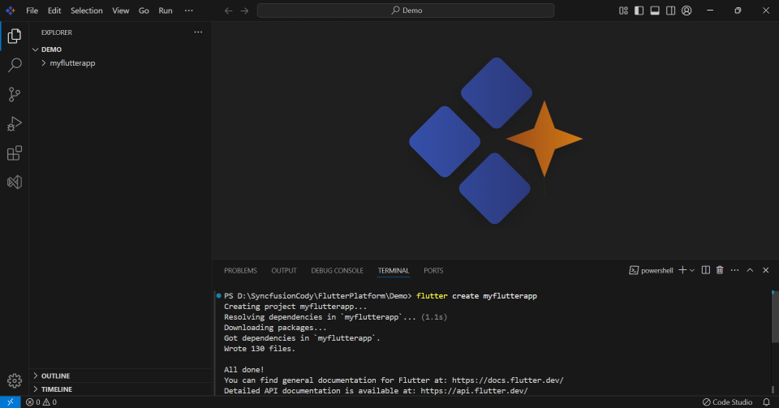
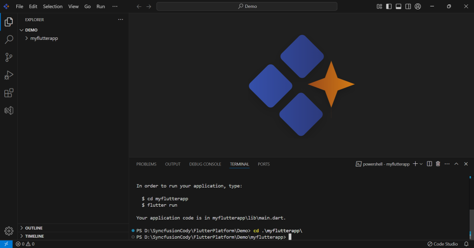
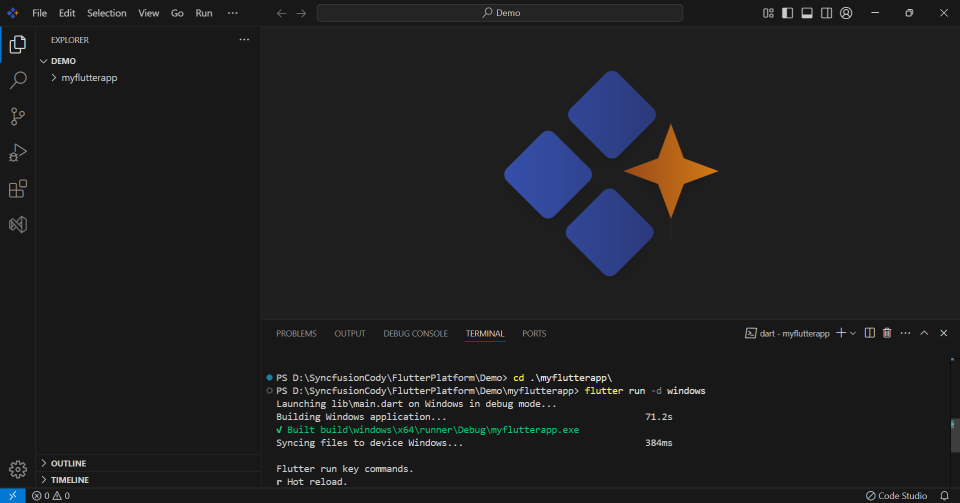
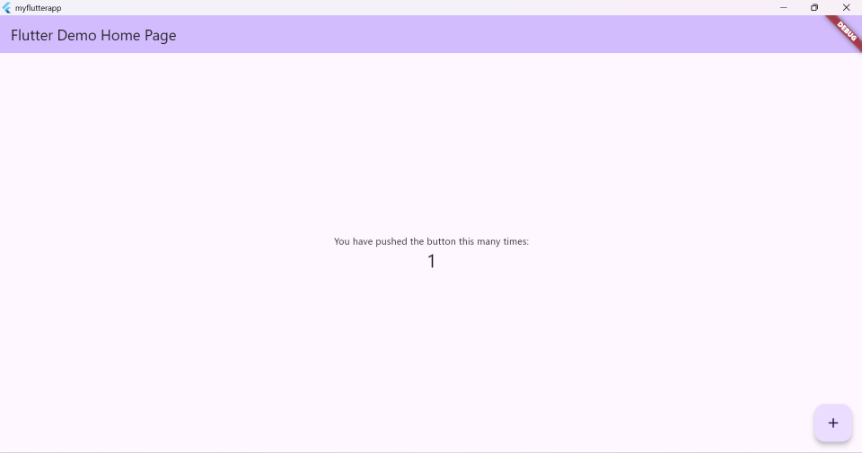
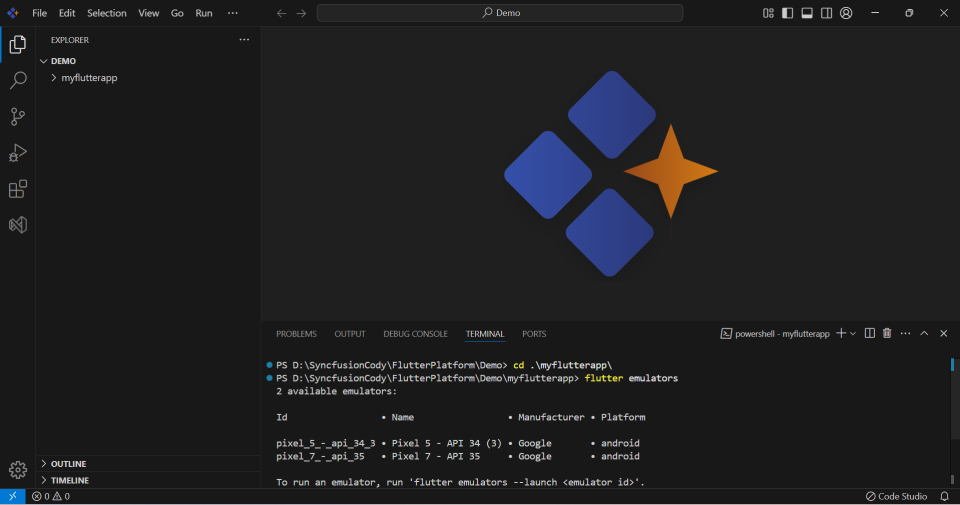
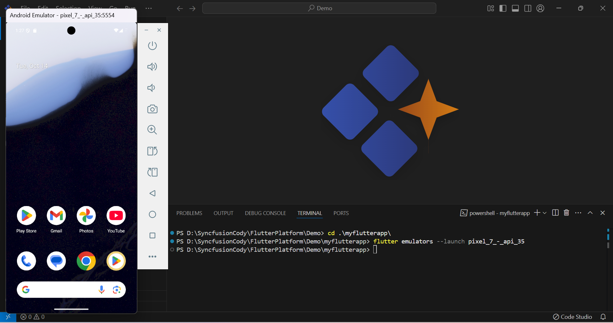
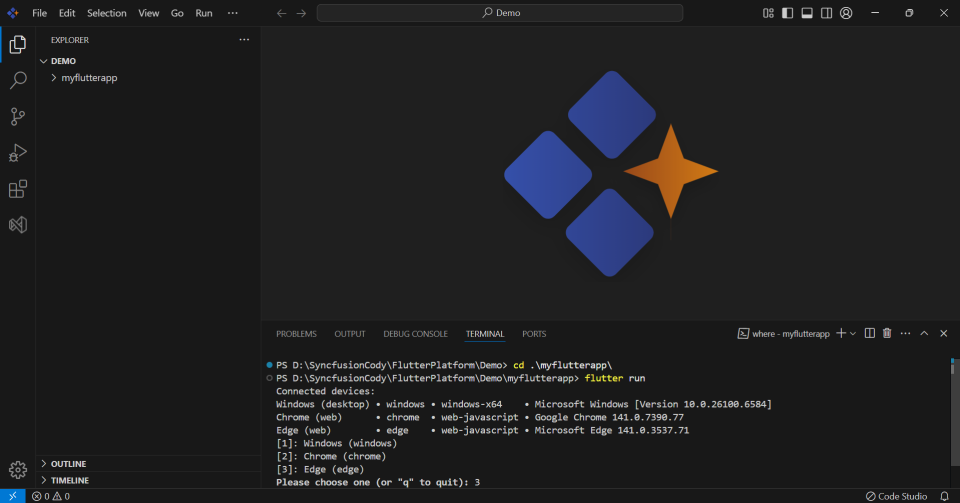
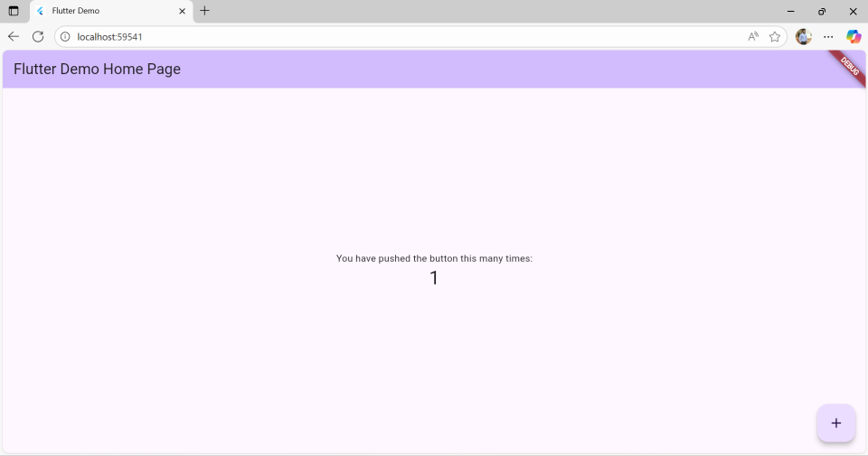

# This guide provides step-by-step instructions for debugging a Flutter application using Code Studio

## Prerequisites

**Install Flutter SDK:**

- Windows:

    - Download the Flutter SDK from https://docs.flutter.dev/install/manual

    - Select Windows and Download the zip file.

    - Extract the zip file to a location like `C:flutter\src\`

    - Add Flutter to your PATH:

    - Search for "Environment Variables" in Windows search

    - Click "Environment Variables"

    - Under "User variables", find PATH and click "Edit"

    - Click "New" and add the full path to `flutter\bin`

    - Click "OK" to save

- macOS:

    - Follow the instruction from https://docs.flutter.dev/get-started/install/macos 

- Linux:
    - Follow the instruction from https://docs.flutter.dev/get-started/install/linux 

 

## Steps to Run and Debug a Flutter Application in Code Studio

### Step 1: Create a Flutter Project
- Create a New Flutter Project:
Open a terminal (e.g., Command Prompt, PowerShell, or Code Studio’s integrated terminal). 
`flutter create myflutterapp`



- Navigate to the project folder: `cd myflutterapp`



### Step 2: Running the Application
#### For Windows:

- To deploy the Flutter application on Windows by running this command: `flutter run -d windows`





#### For Android:

- Check available emulators by running this command: `flutter emulators`



- To open the emulator, run this command: `flutter emulators --launch pixel_7_-_api_35`



- To deploy the Flutter application on Android by running this command: `flutter run`

#### For Web:

- To deploy the Flutter application on the Web by running this command: `flutter run`





#### For macOS:

- To deploy the Flutter application on macOS, refer this link for more details: [macOS | Flutter](https://docs.flutter.dev/deployment/macos)

#### For iOS:

- Open the simulator on macOS.

- To deploy the Flutter application on iOS by running this command: [iOS | Flutter](https://docs.flutter.dev/deployment/ios)

Run the commands in the Code Studio terminal.
 
## Quick Commands Reference 
```bash
# Essential Commands
flutter doctor              # Check your setup
flutter devices             # See available devices
flutter create my_app       # Create new project
flutter run                 # Run your app
flutter build apk --release # Build Android APK
flutter build web --release # Build for web


# Troubleshooting
flutter clean               # Clean build files
flutter pub get             # Get dependencies
```