# This Guide provides Step-By-Step Instructions for Setting-Up and Debugging a Desktop Application using Code Studio

## Prerequisites

- Install the .NET SDK (version 8.0 or 9.0, depending on your project requirements) from [dotnet-sdk](https://dotnet.microsoft.com/en-us/download)
- Install the Windows App SDK (version 1.8.x) from [windows-app-sdk](https://learn.microsoft.com/en-us/windows/apps/windows-app-sdk/downloads) (Required only for WinUI applications)

## Pre-Installed Extensions of Code Studio

Refer this page to know more about [Pre-Installed Extensions of Code Studio](../../pre-installed-extensions)

## Steps to Setup a Desktop Application in Code Studio

### Step 1: Create a Solution
Navigate to the solution and create a new solution.

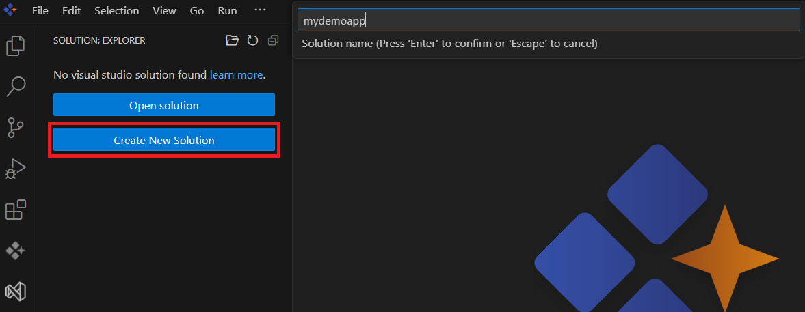

### Add a Project to the Solution:

Step 1: Include the new project in the solution.
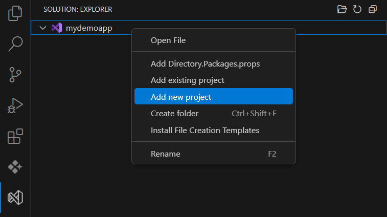

Step 2:

**WinForms** - Create a WinForms project by selecting the WinForms template

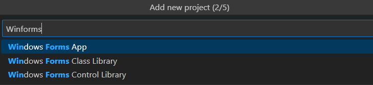

**WPF** - Create a WPF project by selecting the WPF template

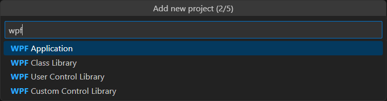

**WinUI** - Create a WinUI project by selecting the WPF template

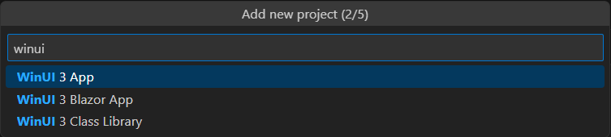

Step 3: Specify the Programming language (Skip this step for WinUI  )

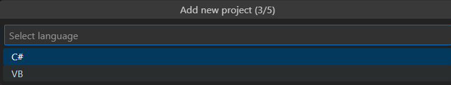

Step 4: Specify the Project Name

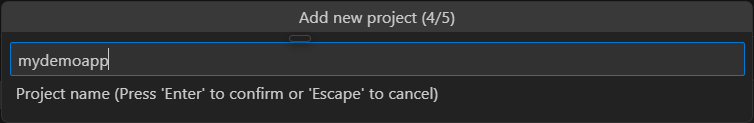

Step 5: Specify the Folder Name

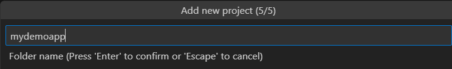

New Project will be created in the solution

**Winforms**

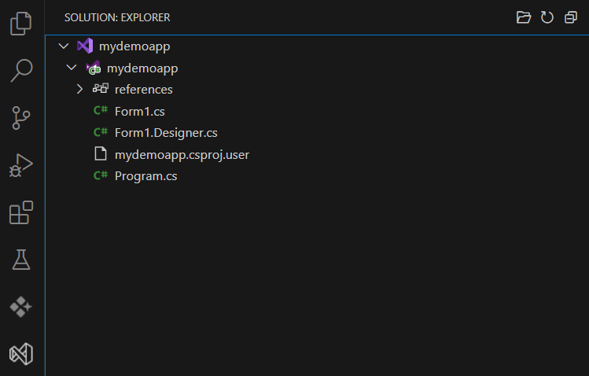 

**WPF**

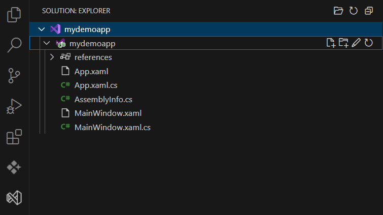

**WinUI**

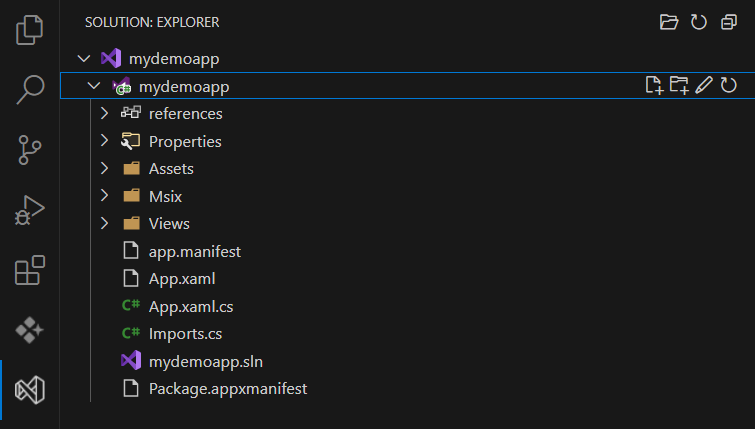

### Set Up Tasks for Building:

Create a launch.json file to configure the build process

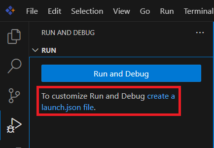

Select .NET Core Debugger

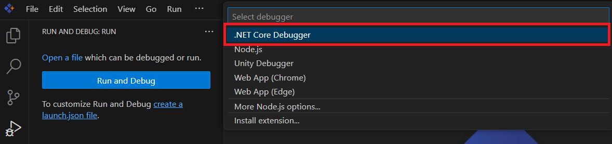

### Build the Project

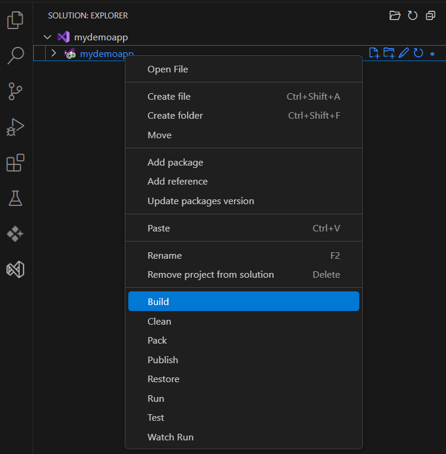

### Run the Application

Go to "Run and Debug"and select ".NET Core Debugger (launch)"

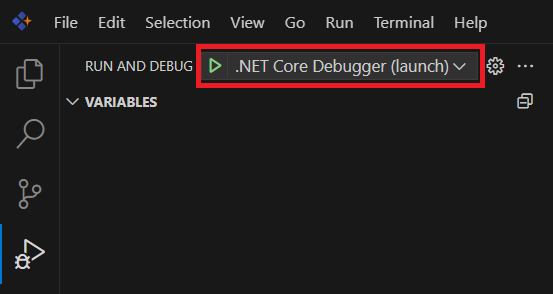

## Debugging in Action & Features

The Debugging in Action walkthrough and the complete debugging feature reference have been moved to the [Debugging Steps Reference](debugging-steps). Please refer to that page for:

- Platform-independent debugging workflows
- Debugging keyboard shortcuts
- Feature tables and descriptions for all supported desktop UI frameworks

This ensures that you always have a single, up-to-date reference for all debugging actions in WinForms, WPF, and WinUI projects.