# This guide provides step-by-step instructions for debugging a Desktop application using Code Studio

## Prerequisites

- Install the .NET SDK (version 8.0 or 9.0, depending on your project requirements) from [dotnet-sdk](https://dotnet.microsoft.com/en-us/download)
- Install the Windows App SDK (version 1.8.x) from [windows-app-sdk](https://learn.microsoft.com/en-us/windows/apps/windows-app-sdk/downloads)

## Built-in Extensions of Code Studio
 - **DotRush** is a lightweight C# development environment for Visual Studio Code, enabling efficient .NET project management. It provides Roslyn-based IntelliSense for code completion and navigation, a solution explorer for handling multiple projects/solutions, integrated debugging (including .NET Core, Unity, and Godot), test exploration for running NUnit/xUnit tests, performance profiling tools, code decompilation, and multi-target diagnostics. Ideal for seamless .NET and game development on Windows, macOS, and Linux. For more details, visit: https://github.com/JaneySprings/DotRush
 
- **vscode-solution-explorer** is a Visual Studio Code extension that adds a Solution Explorer panel for managing .sln file, mimicking Visual Studio's structure. It is designed for .NET Core projects. For more details, visit: https://github.com/fernandoescolar/vscode-solution-explorer

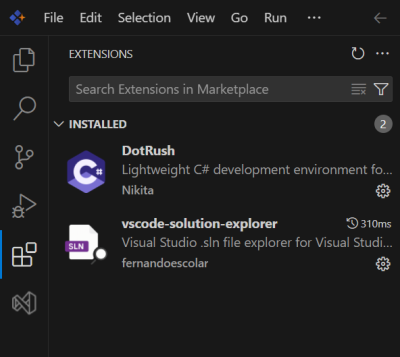

## Steps to Setup a Desktop Application in Code Studio

### Step 1: Create a Solution
Navigate to the solution and create a new solution.

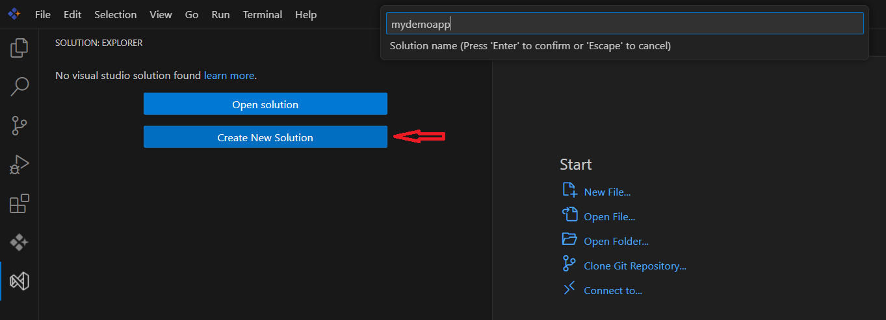

### Add a Project to the Solution:

Step 1: Include the new project in the solution.
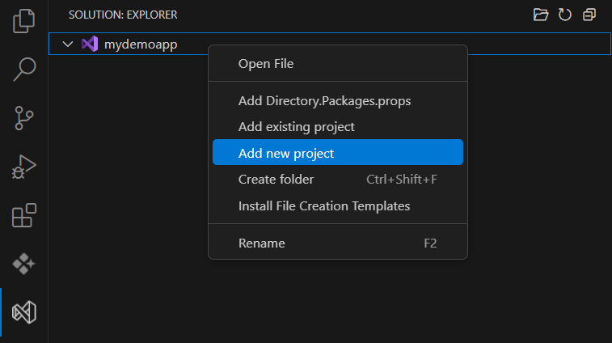

Step 2:

**WinForms** - Create a WinForms project by selecting the WinForms template

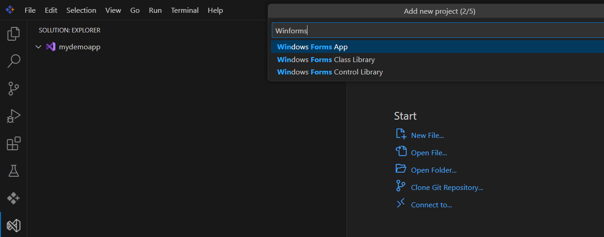

**WPF** - Create a WPF project by selecting the WPF template

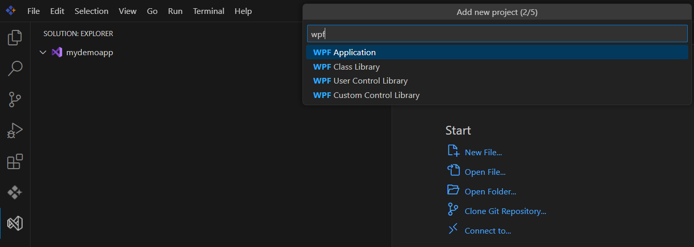

**WinUI** - Create a WinUI project by selecting the WPF template

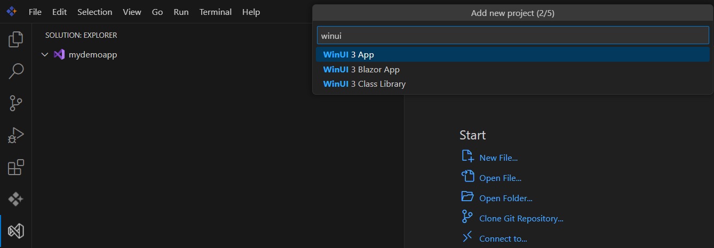

Step 2A: Specify the Programming language (For WinForms and WPF)

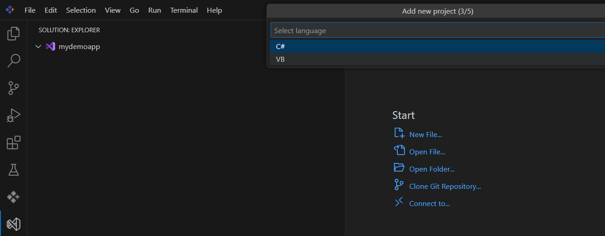

Step 3: Specify the Project Name

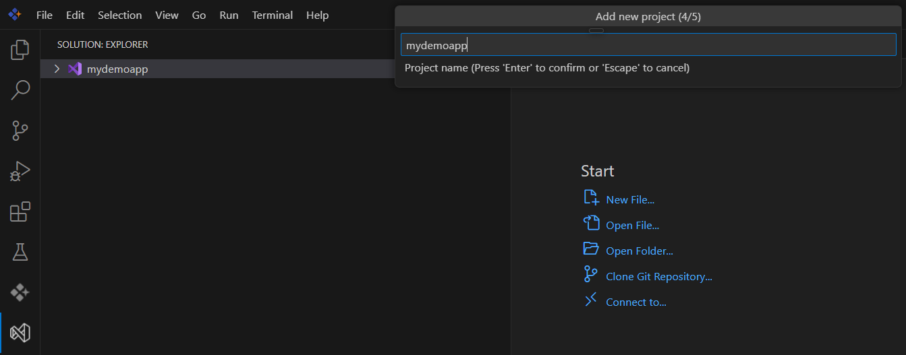

Step 3: Specify the Folder Name

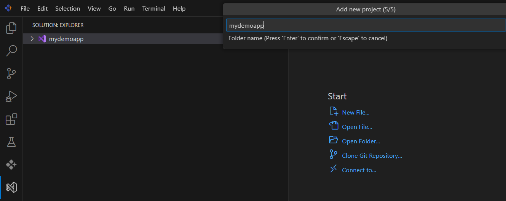

New Project will be created in the solution

**Winforms**

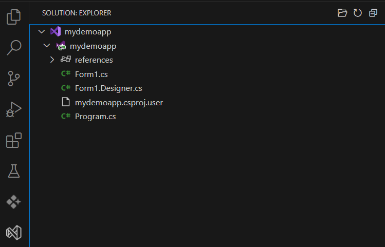 

**WPF**

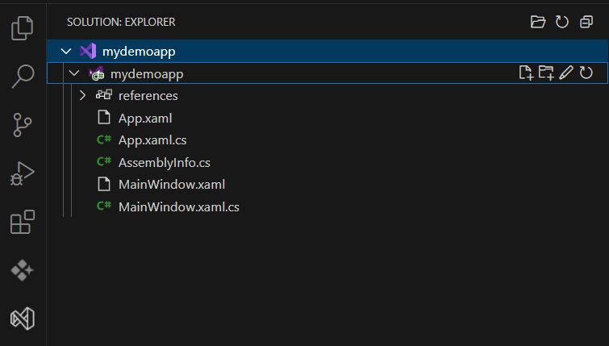

**WinUI**

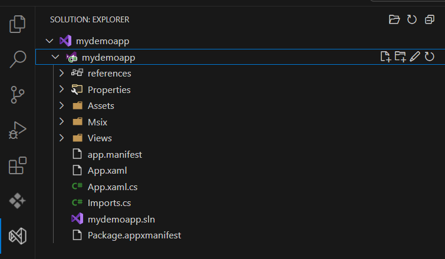

### Set Up Tasks for Building:

Create a launch.json file to configure the build process

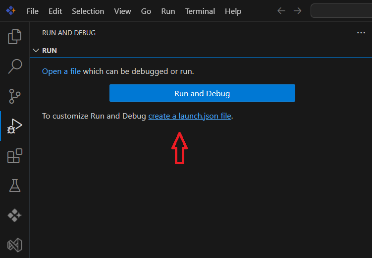

Select .NET Core Debugger

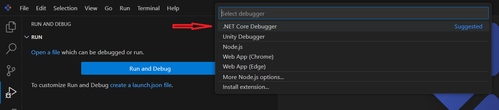

### Build the Project

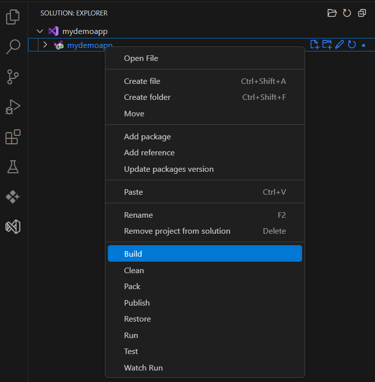

### Run the Application

Go to "Run and Debug"and select ".NET Core Debugger (launch)"

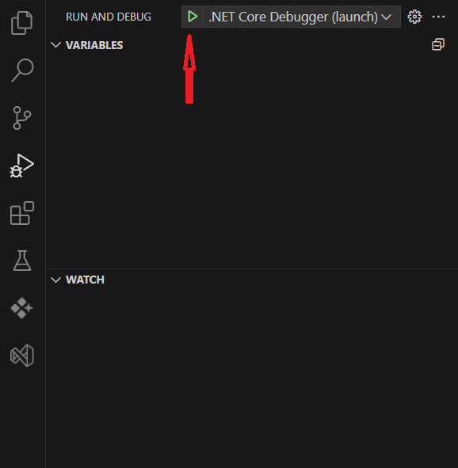

The application will launch, and the debugger will attach. If a breakpoint is hit, execution pauses, and you can inspect variables in the Debug panel (Autos, Locals, or Watch windows).