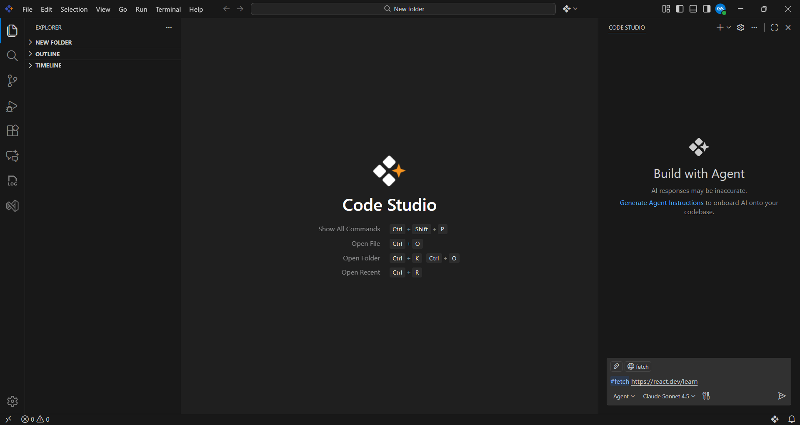
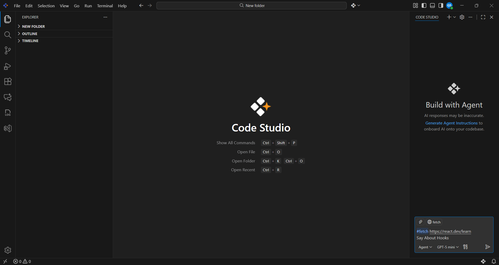

# How to Enable Legacy Docs Indexing Within the Updated Platform

## Problem Summary
Starting with version **2.0.0**, Code Studio no longer uses the legacy **Docs Context Provider**.  In earlier versions prior to 2.0.0, users could add documentation URLs through the **@** menu, which generated local embeddings for contextual responses.  The latest release replaces this with the Realtime **Fetch Tool**, introducing a new approach to documentation indexing.

## Possible Causes

### 1. Deprecated Legacy Behavior
- The previous system relied on locally stored embeddings created from documentation URLs.  This functionality and the ability to index documentation has been removed.

### 2. New System Depends on Real-Time Fetching
- The updated **Fetch Tool** retrieves webpage content live instead of indexing and storing it locally.

### 3. Previously Indexed Docs Can’t Be Accessed
- Since local embedding and legacy indexing have been removed, any documentation indexed before **version 2.0.0** is no longer accessible.

## Resolution Steps

### Step 1 : Open the Code Studio Chat Interface

### Step 2 : Type `#fetch` Followed by a Valid URL
This triggers the Fetch Tool to pull content from the specified page.

### Step 3 : Enter Your Query
After adding the URL, type your actual query referencing the fetched documentation.  

### Step 4 : Let the Tool Retrieve Content
The Fetch Tool retrieves webpage content instantly and uses it as reference material for your query.  
